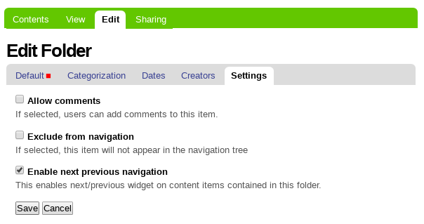
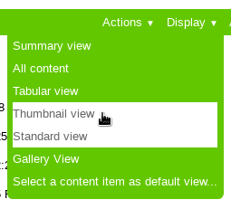
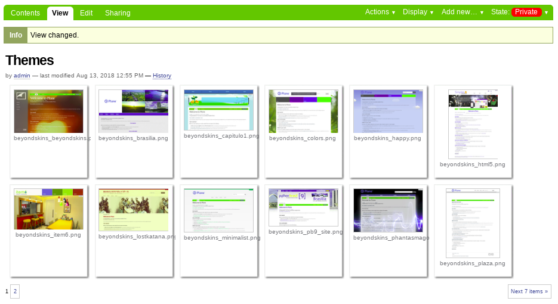
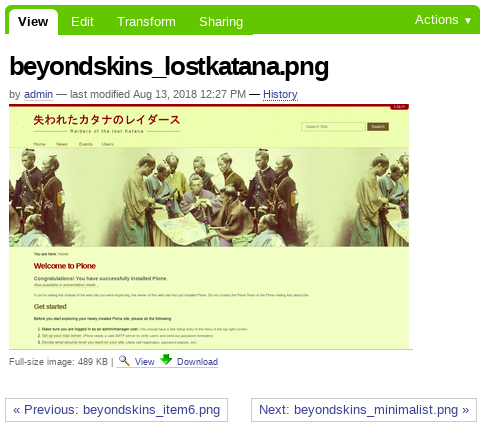
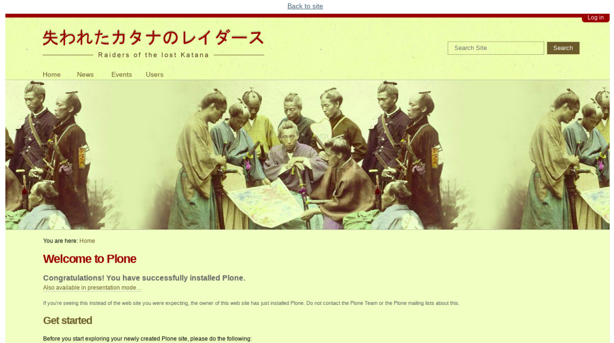

.. _gallery-view-default:

Gallery view default
--------------------

The *Gallery view default* is a set of configurations for any ``Folder`` or ``Collection`` 
content type that you need enable for have a Gallery view behavior ships with Plone.

Enable next previous navigation
^^^^^^^^^^^^^^^^^^^^^^^^^^^^^^^

For for any ``Folder`` or ``Collection`` content type you can edit it and set the ``Settings`` 
tab the option ``Enable next previous navigation``, this enables next/previous widget on content 
items contained in this folder.

  The ``Enable next previous`` from the ``Settings`` tab when you editing a Folder.

Thumbnail view
^^^^^^^^^^^^^^

All you need to do is select the ``Thumbnail view`` from the ``Display`` drop down
item for any Folder or Collection content type. Once that is done, a
``Gallery Settings`` tab is enabled for the type. With this, you can customize
the various settings for the Gallery.

  The ``Thumbnail view`` from the ``Display`` drop down item for a Folder.

The ``Thumbnail view`` looks like the following picture:

  The ``Thumbnail view`` from a Folder.

The *Gallery view* behavior by default in Plone works clicking a specific thumbnail 
view and this show a image view, like this:

  The ``Thumbnail view`` from a Image.

Later you can click on *"Image view"* or at :guilabel:`View` link down the *"Image view"* for show 
a *image view fullscreen*, like this:

  The ``image view fullscreen`` from a Image.

That way you have enabled a Gallery view behavior ships with Plone.
