.. _plonetruegallery:

Plone True Gallery
------------------

The `collective.plonetruegallery`_ package is a Plone product that implements a 
very customizable and sophisticated gallery/slideshow from the *default* ``Image`` 
content type included by the *Content User(s)* at a Plone site or integrates your 
*Photos* from the **Picasa** service (add :ref:`collective.ptg.picasa <collective-ptg-picasa>`) 
and **Flickr** service (add :ref:`collective.ptg.flickr <collective-ptg-flickr>`).


Features
^^^^^^^^

* :ref:`Picasa <collective-ptg-picasa>` and :ref:`Flickr <collective-ptg-flickr>`
  Support!

* Works with ``Image``, ``News Item`` and other content types that has a *Image Field* 
  (provides ``IImageContent``). 

* Also works with `redturtle.smartlink`_ and 
  :ref:`collective.contentleadimage <collective-contentleadimage>` 
  (install :ref:`collective.ptg.contentleadimage <collective-ptg-contentleadimage>`) 
  packages.

* Customize gallery size, transition (limited transitions right now), timed and
  other settings.

* Can use nested galleries.

* Searching and category selection for nested galleries.

* `Galleria`_, `Galleriffic`_, `Highslide JS`_, `s3Slider`_, 
  Pikachoose, `FancyBox`_ and others display types.

* :ref:`Display gallery inline <displaying-gallery-inline>`.

* `Products.Collage <https://pypi.org/project/Products.Collage>`_ integration.

* Compatible with new-style Plone ``Collections`` content type.

* Provides a :ref:`base settings configlet <ptg-default-settings>`.


How It Works
^^^^^^^^^^^^

All you need to do is select the :guilabel:`Gallery View` from the :guilabel:`Display` 
drop down item for any ``Folder`` or ``Collection`` content type, this view looks like 
the following picture:

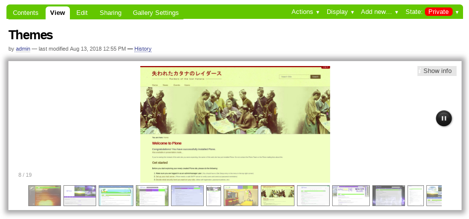

  The "Gallery View" default from a Folder.

Once that is done, a :guilabel:`Gallery Settings` tab is enabled for the type. With this, 
you can customize the various settings for the Gallery.

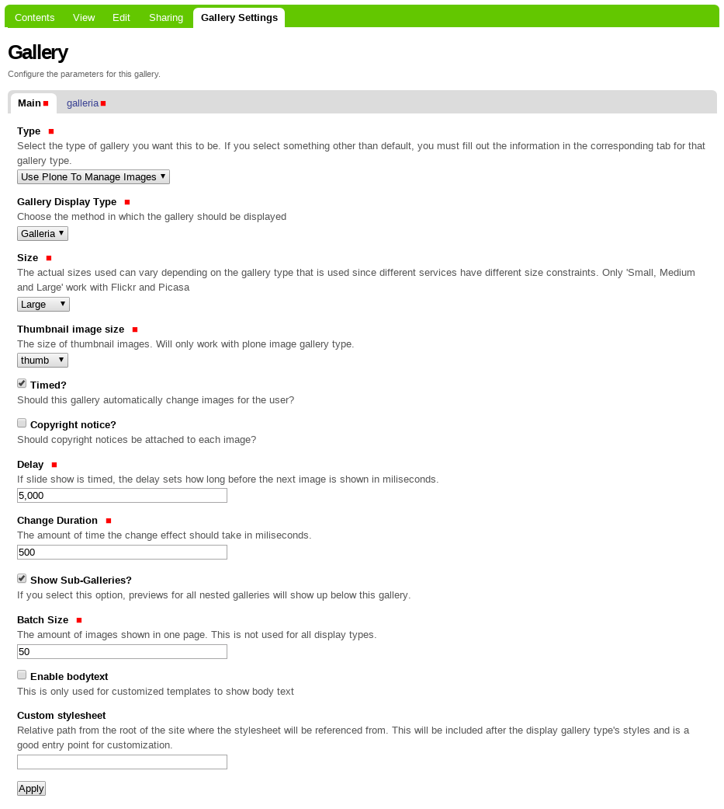

  The "Gallery Settings" locally for a Folder.


.. _ptg-default-settings:

Global control panel
^^^^^^^^^^^^^^^^^^^^

The ``collective.plonetruegallery`` package included a global control panel for custom 
the global settings. To access to the :guilabel:`PloneTruegallery Default Settings` 
control panel follow the steps:

- at the top right corner of the page click on the :guilabel:`Admin` drop down menu 
- choose :guilabel:`Site Setup`
- at the :guilabel:`Add-on Configuration` 
- click on :guilabel:`Plone True Gallery settings` section

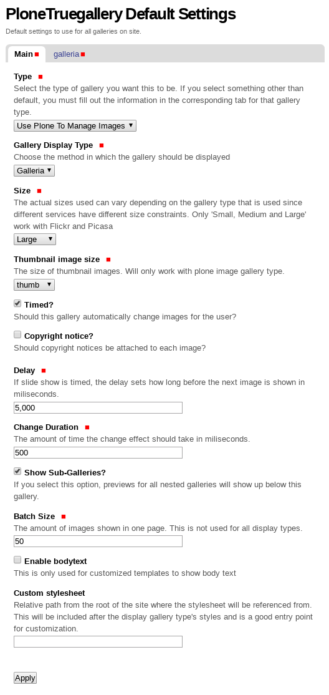

  The ``PloneTruegallery Default Settings`` control panel.

By default the ``collective.plonetruegallery`` package include the gallery called 
``galleria`` via :ref:`collective.ptg.galleria <collective-ptg-galleria>` package.


.. _displaying-gallery-inline:

Displaying Gallery inline
^^^^^^^^^^^^^^^^^^^^^^^^^

A view (``@@placegalleryview``) can be used to place the gallery inside of
other content.


Pop-up effect
^^^^^^^^^^^^^

you could do this:

#. Install `collective.prettyphoto`_ package
#. Mark the link to the gallery with "prettyPhoto" style (which 
   has now been added) from your WYSIWYG editor


Inline Gallery
^^^^^^^^^^^^^^

For showing a gallery in another page, try something like this:

::

  <object data="path/to/gallery/@@placegalleryview" height="400" width="500">
    <param name="data" value="path/to/gallery" />
  </object>

Notes for successful inline object tag usage:

* You will have to "whitelist" ``<object>`` and ``<param>`` HTML elements in 
  ``safe_html`` from the ``portal_transforms`` tool.

* When editing in Plone 4.2 you will have to switch your editor to Kupu since TinyMCE 
  fracks up the object tag into a flash item.

* If testing without Apache in front of your Plone you will need to make sure that 
  the "path/to/gallery" path from the example above includes any levels above the 
  Plone object in the Zope instance (eg. if your Plone object is inside of a folder 
  named "version1", and the name of your gallery is "mygallery", then the path should 
  read "/version1/Plone/mygallery".
  Of course, you will need to remove the "/version1/Plone" part when you put Apache 
  in front of your Plone.

Or you can do the same with an ``iframe`` HTML element


Troubleshouting safe-html
^^^^^^^^^^^^^^^^^^^^^^^^^

If you have trouble, do this:
Go to ``safe_html`` in the ``portal_transforms`` tool
Make sure ``param`` and ``object`` HTML elements are ``valid tags`` (not ``nasty tag``).

After that, you should flush the cache of ZODB by going to

#. Zope root app ZMI
#. ``Control Panel``
#. ``Database``
#. ``main`` (or whatever zodb you have)
#. ``Flush Cache`` tab
#. Press "``Minimize``" button

This will remove from ZODB cache all cooked texts. This procedure is mentioned
at the top of ``safe_html`` in ``portal_transforms`` tool.


Fetching of Images Explained
^^^^^^^^^^^^^^^^^^^^^^^^^^^^

* When rendering a :ref:`Picasa <collective-ptg-picasa>` or :ref:`Flickr <collective-ptg-flickr>`
  gallery, it checks if the images have been fetched within a day. If they have not, then it 
  re-fetches the images for the gallery.

* You can also force a specific gallery to be re-fetched by appending
  ``@@refresh`` to the gallery url

* You can manually refresh all galleries on the site by typing in a url like
  ``mysite.com/@@refresh_all_galleries``  This means you can also setup a
  cron-like job to refresh all the galleries whenever you want to, just
  so it isn't done while a user is trying to render a page.


.. note::
    This package is available at https://pypi.org/project/collective.plonetruegallery.

.. _display-types-supported:

Display Types Supported
^^^^^^^^^^^^^^^^^^^^^^^

To install any of the various extra display types, you need to install
the dependant package in buildout

- bootstrap carousel (:ref:`collective.ptg.bootstrapcarousel <collective-ptg-bootstrapcarousel>`)

- carousel (:ref:`collective.ptg.carousel <collective-ptg-carousel>`)

..
  - contact sheep (:ref:`collective.ptg.contactsheep <collective-ptg-contactsheep>`)

- contact sheet (:ref:`collective.ptg.contactsheet <collective-ptg-contactsheet>`)

- content flow (:ref:`collective.ptg.contentflow <collective-ptg-contentflow>`)

- easyslider (:ref:`collective.ptg.easyslider <collective-ptg-easyslider>`)

- fancybox (:ref:`collective.ptg.fancybox <collective-ptg-fancybox>`)

- galleria (ships with :ref:`collective.ptg.galleria <collective-ptg-galleria>`)

- galleriffic (:ref:`collective.ptg.galleriffic <collective-ptg-galleriffic>`)

- garagedoor (:ref:`collective.ptg.garagedoor <collective-ptg-garagedoor>`)

- highslide (:ref:`collective.ptg.highslide <collective-ptg-highslide>`)

- nivo gallery (:ref:`collective.ptg.nivogallery <collective-ptg-nivogallery>`)

- nivo slider (:ref:`collective.ptg.nivoslider <collective-ptg-nivoslider>`)

- pikachoose (:ref:`collective.ptg.pikachoose <collective-ptg-pikachoose>`)

- presentation (:ref:`collective.ptg.presentation <collective-ptg-presentation>`)

- s3slider (:ref:`collective.ptg.s3slider <collective-ptg-s3slider>`)

- scrollable (:ref:`collective.ptg.scrollable <collective-ptg-scrollable>`)

- sheetgallery (:ref:`collective.ptg.sheetgallery <collective-ptg-sheetgallery>`)

- shufflegallery (:ref:`collective.ptg.shufflegallery <collective-ptg-shufflegallery>`)

- simplegallery (:ref:`collective.ptg.simplegallery <collective-ptg-simplegallery>`)

- supersized (:ref:`collective.ptg.supersized <collective-ptg-supersized>`)

- thumbnail zoom gallery (:ref:`collective.ptg.thumbnailzoom <collective-ptg-thumbnailzoom>`)

- uigallery (:ref:`collective.ptg.uigallery <collective-ptg-uigallery>`)


----

.. _collective-ptg-bootstrapcarousel:

collective.ptg.bootstrapcarousel
`````````````````````````````````

The `collective.ptg.bootstrapcarousel`_ package add Basic integration of the Twitter 
Bootstrap Carousel to :ref:`collective.plonetruegallery <plonetruegallery>` package.

.. warning::
    This add-on will only work with Plone >= 4.3  as :ref:`jQuery <jquery-library>` 1.7 
    is not supported on previous versions of Plone. 

.. note::
    Bootstrap's carousel needs :ref:`jQuery <jquery-library>` 1.7 or higher

You can enabled the ``Bootstrap Carousel`` gallery display type follow the steps:

- at the top right corner of the page click on the :guilabel:`Admin` drop down menu 
- choose :guilabel:`Site Setup`
- at the :guilabel:`Add-on Configuration` 
- click on :guilabel:`Plone True Gallery settings` section
- at the :guilabel:`Main` tab changes the :guilabel:`Gallery Display Type` option with 
  the ``Bootstrap Carousel`` value

The ``collective.ptg.bootstrapcarousel`` package include the gallery display type 
called ``Bootstrap Carousel`` and this have a configlet like the following:

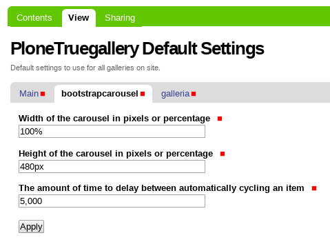

  The ``bootstrapcarousel`` configlet from the ``PloneTruegallery Default Settings`` control panel.

Them, you can see how looks like the ``Bootstrap Carousel`` gallery display type from a Folder 
as the following:


  The ``Bootstrap Carousel`` gallery display type from a Folder.

.. note::
    More information of the 
    `Twitter Bootstrap Carousel <http://twitter.github.io/bootstrap/javascript.html#carousel>`_.

----

.. _collective-ptg-carousel:

collective.ptg.carousel
````````````````````````

The `collective.ptg.carousel`_ package add a carousel gallery display type using the 
`jCarousel`_ library for the :ref:`collective.plonetruegallery <plonetruegallery>` package.

``jCarousel`` is Built on top of the :ref:`jQuery <jquery-library>` library and It was inspired 
by the "`Carousel Component <http://billwscott.com/carousel/>`_" by Bill Scott.

You can enabled the ``Carousel`` gallery display type follow the steps:

- at the top right corner of the page click on the :guilabel:`Admin` drop down menu 
- choose :guilabel:`Site Setup`
- at the :guilabel:`Add-on Configuration` 
- click on :guilabel:`Plone True Gallery settings` section
- at the :guilabel:`Main` tab changes the :guilabel:`Gallery Display Type` option with 
  the ``Carousel`` value

The ``collective.ptg.carousel`` package include the gallery display type 
called ``Carousel`` and this have a configlet like the following:

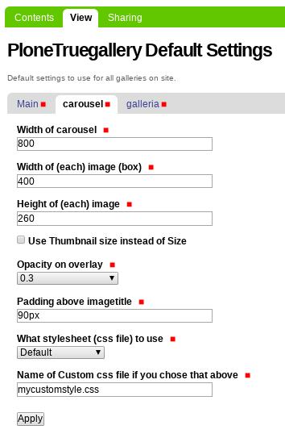

  The ``carousel`` configlet from the ``PloneTruegallery Default Settings`` control panel.

Them, you can see how looks like the ``Carousel`` gallery display type from a Folder 
as the following:

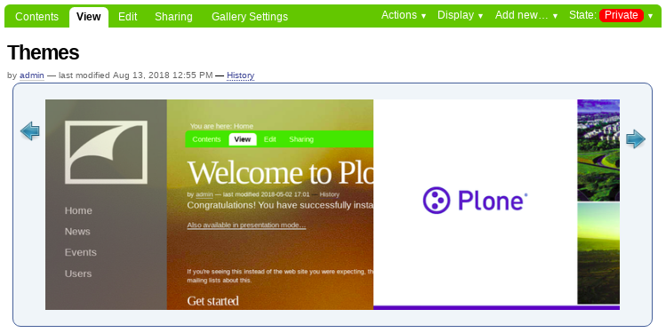

  The ``Carousel`` gallery display type from a Folder.

.. note::
    `jCarousel`_ is a Riding carousels with :ref:`jQuery <jquery-library>`.


----

.. _collective-ptg-contactsheet:

collective.ptg.contactsheet
````````````````````````````

The `collective.ptg.contactsheet`_ package add a ``Contactsheet`` gallery display type for the 
:ref:`collective.plonetruegallery <plonetruegallery>` package.

You can enabled the ``Contactsheet`` gallery display type follow the steps:

- at the top right corner of the page click on the :guilabel:`Admin` drop down menu 
- choose :guilabel:`Site Setup`
- at the :guilabel:`Add-on Configuration` 
- click on :guilabel:`Plone True Gallery settings` section
- at the :guilabel:`Main` tab changes the :guilabel:`Gallery Display Type` option with 
  the ``Contactsheet`` value

The ``collective.ptg.contactsheet`` package include the gallery display type 
called ``Contactsheet`` and this have a configlet like the following:

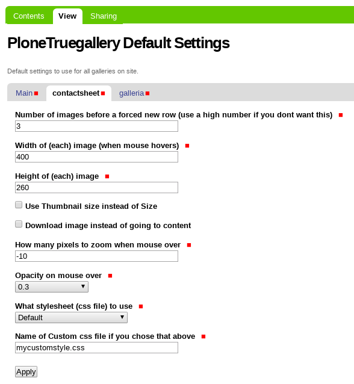

  The ``contactsheet`` configlet from the ``PloneTruegallery Default Settings`` control panel.

Them, you can see how looks like the ``Contactsheet`` gallery display type from a Folder 
as the following:

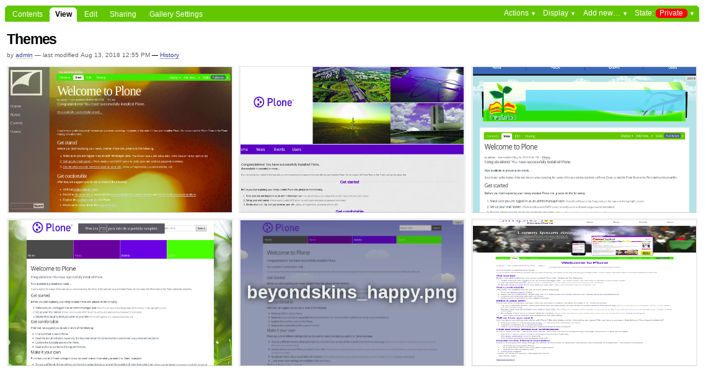

  The ``Contactsheet`` gallery display type from a Folder.


----

.. _collective-ptg-contentflow:

collective.ptg.contentflow
````````````````````````````

The `collective.ptg.contentflow`_ package add a ``Content Flow`` gallery display type using 
the `ContentFlow <http://www.jacksasylum.eu/ContentFlow/>`_ library version 1.0.2 for the 
:ref:`collective.plonetruegallery <plonetruegallery>` package.

.. note::
    ``ContentFlow`` includes support for `Lightbox JS <http://huddletogether.com/projects/lightbox/>`_: Fullsize Image Overlays.

You can enabled the ``Content Flow`` gallery display type follow the steps:

- at the top right corner of the page click on the :guilabel:`Admin` drop down menu 
- choose :guilabel:`Site Setup`
- at the :guilabel:`Add-on Configuration` 
- click on :guilabel:`Plone True Gallery settings` section
- at the :guilabel:`Main` tab changes the :guilabel:`Gallery Display Type` option with 
  the ``Content Flow`` value

The ``collective.ptg.contentflow`` package include the gallery display type 
called ``Content Flow`` and this have a configlet like the following:

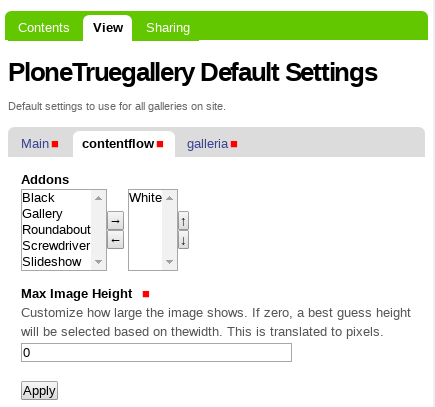

  The ``contentflow`` configlet from the ``PloneTruegallery Default Settings`` control panel.

Them, you can see how looks like the ``Content Flow`` gallery display type from a Folder 
as the following:

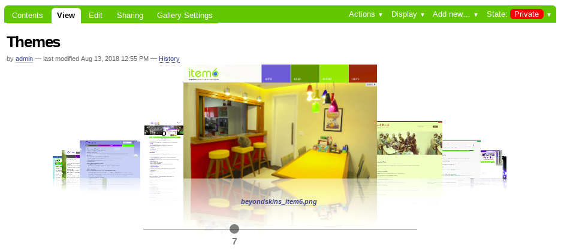

  The ``Content Flow`` gallery display type from a Folder.

.. note::
   ``ContentFlow`` is distributed under the terms of the 
   `MIT license <http://www.jacksasylum.eu/ContentFlow/LICENSE>`_.


----

.. _collective-ptg-easyslider:

collective.ptg.easyslider
````````````````````````````

The `collective.ptg.easyslider`_ package add a ``Easyslider`` gallery display type using 
the `Easy Slider`_ :ref:`jQuery <jquery-library>` plugin version 1.7 for the 
:ref:`collective.plonetruegallery <plonetruegallery>` package.

Another option could be to use :ref:`collective.easyslider <collective-easyslider>` 
package which has some more options, but:

- you don't have to install another product if you are already using 
  :ref:`collective.plonetruegallery <plonetruegallery>` on your site
- I find it easier to integrate truegalleries in other templates
- :ref:`collective.plonetruegallery <plonetruegallery>` works with `redturtle.smartlink`_ 
  package etc.
- ``collective.ptg.easyslider`` package can show several slides at the same time

You can enabled the ``Easyslider`` gallery display type follow the steps:

- at the top right corner of the page click on the :guilabel:`Admin` drop down menu 
- choose :guilabel:`Site Setup`
- at the :guilabel:`Add-on Configuration` 
- click on :guilabel:`Plone True Gallery settings` section
- at the :guilabel:`Main` tab changes the :guilabel:`Gallery Display Type` option with 
  the ``Easyslider`` value

The ``collective.ptg.easyslider`` package include the gallery display type 
called ``Easyslider`` and this have a configlet like the following:

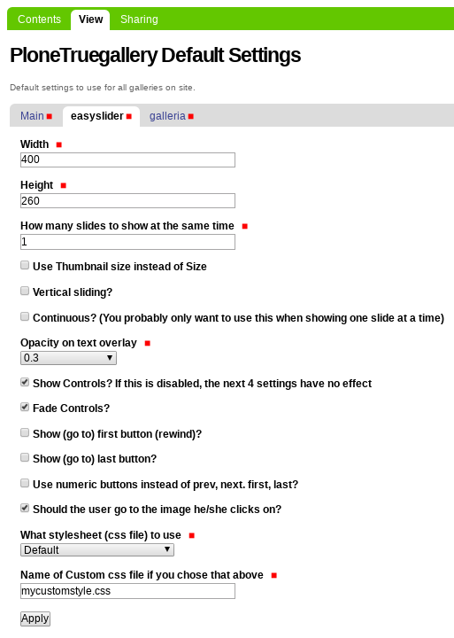

  The ``easyslider`` configlet from the ``PloneTruegallery Default Settings`` control panel.

Them, you can see how looks like the ``Easyslider`` gallery display type from a Folder 
as the following:

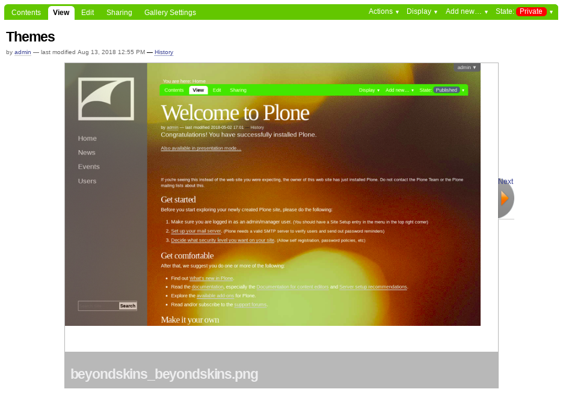

  The ``Easyslider`` gallery display type from a Folder.


----

.. _collective-ptg-fancybox:

collective.ptg.fancybox
````````````````````````

The `collective.ptg.fancybox`_ package add a ``Fancy Box`` gallery display type using 
the `FancyBox`_ :ref:`jQuery <jquery-library>` Plugin version 1.3.4 (11/11/2010) for the 
:ref:`collective.plonetruegallery <plonetruegallery>` package.

.. note::
    ``FancyBox`` is a simple and fancy lightbox alternative

.. warning::
    ``FancyBox`` requires: :ref:`jQuery <jquery-library>` v1.3+.

You can enabled the ``Fancy Box`` gallery display type follow the steps:

- at the top right corner of the page click on the :guilabel:`Admin` drop down menu 
- choose :guilabel:`Site Setup`
- at the :guilabel:`Add-on Configuration` 
- click on :guilabel:`Plone True Gallery settings` section
- at the :guilabel:`Main` tab changes the :guilabel:`Gallery Display Type` option with 
  the ``Fancy Box`` value

Them, you can see how looks like the ``Fancy Box`` gallery display type from a Folder 
as the following:

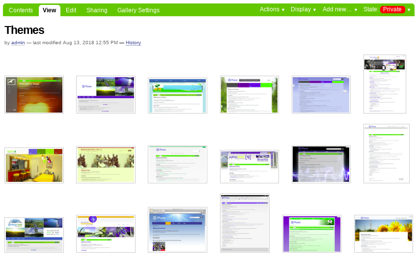

  The ``Fancy Box`` gallery display type from a Folder.

Later can be click on any image and you have a fancybox image large view like the following:

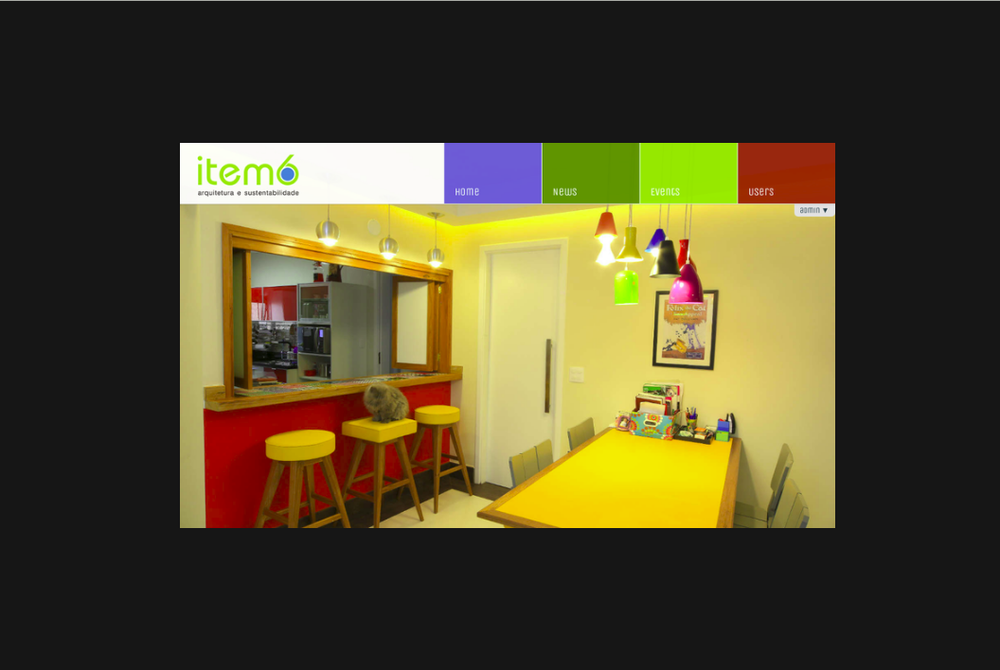

  The ``image large`` view for a image from a Folder.


----

.. _collective-ptg-flickr:

collective.ptg.flickr
`````````````````````

This Flickr Support:

* to add support for these type of galleries you must install additional
  packages

* install :ref:`collective.ptg.flickr <collective-ptg-flickr>` for Flickr support

* These can just be added to your buildout or installed with ``easy_install``
  or you can add the package to your egg section like

.. todo::
    TODO evaluates if the ``Flickr`` support for this section

.. todo::
    TODO a screenshot for this section

.. note::
    This package is available at https://pypi.org/project/collective.ptg.flickr.


----

.. _collective-ptg-galleria:

collective.ptg.galleria
````````````````````````

The `collective.ptg.galleria`_ package included basic integration of the `Galleria`_ 
javascript gallery with :ref:`collective.plonetruegallery <plonetruegallery>` package.

.. note::
    The *Galleria javascript gallery* is licensed under the 
    `MIT <https://raw.github.com/aino/galleria/master/LICENSE>`_ license.

By default the ``collective.plonetruegallery`` package include the gallery called 
``galleria`` and this have a configlet like the following:

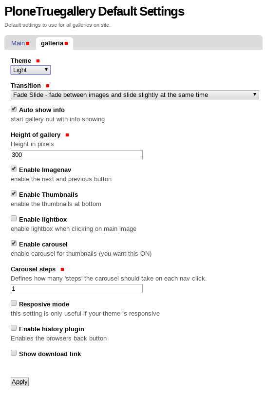

  The ``galleria`` configlet from the ``PloneTruegallery Default Settings`` control panel.


----

.. _collective-ptg-galleriffic:

collective.ptg.galleriffic
````````````````````````````

The `collective.ptg.galleriffic`_ package add a ``Galleriffic`` gallery display type using 
the `Galleriffic <http://trentacular.com>`_ :ref:`jQuery <jquery-library>` plugin version 2.0.1 for the :ref:`collective.plonetruegallery <plonetruegallery>` package.

- `history jQuery <http://www.mikage.to/jquery/jquery_history.html>`_ plugin

- `Opacity Rollover <http://trentacular.com>`_ :ref:`jQuery <jquery-library>` plugin

You can enabled the ``Galleriffic`` gallery display type follow the steps:

- at the top right corner of the page click on the :guilabel:`Admin` drop down menu 
- choose :guilabel:`Site Setup`
- at the :guilabel:`Add-on Configuration` 
- click on :guilabel:`Plone True Gallery settings` section
- at the :guilabel:`Main` tab changes the :guilabel:`Gallery Display Type` option with 
  the ``Galleriffic`` value

The ``collective.ptg.galleriffic`` package include the gallery display type 
called ``Galleriffic`` and this have a configlet like the following:

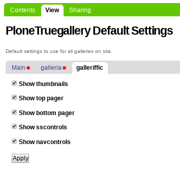

  The ``galleriffic`` configlet from the ``PloneTruegallery Default Settings`` control panel.

Them, you can see how looks like the ``Galleriffic`` gallery display type from a Folder 
as the following:


  The ``Galleriffic`` gallery display type from a Folder.


----

.. _collective-ptg-garagedoor:

collective.ptg.garagedoor
`````````````````````````

The `collective.ptg.garagedoor`_ package add a ``Garagedoor`` gallery display type using 
for the :ref:`collective.plonetruegallery <plonetruegallery>` package.

Comes with the ":ref:`jquery.ui <jquery-ui-library>`" effects (most of them are pretty useless, though)

You can enabled the ``Garagedoor`` gallery display type follow the steps:

- at the top right corner of the page click on the :guilabel:`Admin` drop down menu 
- choose :guilabel:`Site Setup`
- at the :guilabel:`Add-on Configuration` 
- click on :guilabel:`Plone True Gallery settings` section
- at the :guilabel:`Main` tab changes the :guilabel:`Gallery Display Type` option with 
  the ``Garagedoor`` value

The ``collective.ptg.garagedoor`` package include the gallery display type 
called ``Garagedoor`` and this have a configlet like the following:

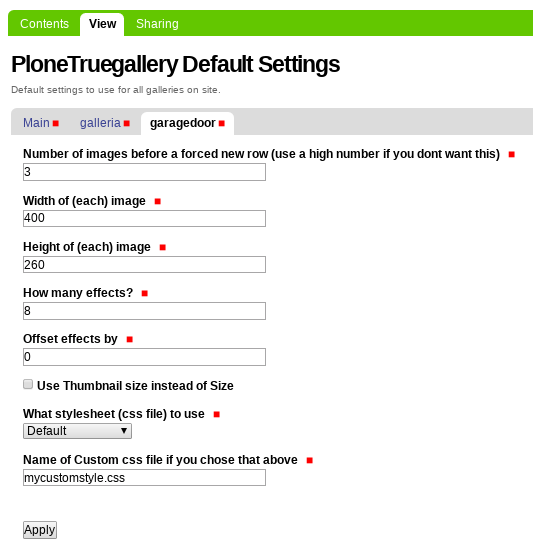

  The ``garagedoor`` configlet from the ``PloneTruegallery Default Settings`` control panel.

Them, you can see how looks like the ``Garagedoor`` gallery display type from a Folder 
as the following:


  The ``Garagedoor`` gallery display type from a Folder.

Later can be click on any image and you have a fancybox image large view like the following:


  The ``image large`` view from a ``Garagedoor`` gallery display view.


----

.. _collective-ptg-highslide:

collective.ptg.highslide
````````````````````````

The `collective.ptg.highslide`_ package add a ``Highslide`` gallery display type using 
the `Highslide JS`_ :ref:`jQuery <jquery-library>` plugin version 4.1.8 (October 27 2009) 
for the :ref:`collective.plonetruegallery <plonetruegallery>` package.

You can enabled the ``Highslide`` gallery display type follow the steps:

- at the top right corner of the page click on the :guilabel:`Admin` drop down menu 
- choose :guilabel:`Site Setup`
- at the :guilabel:`Add-on Configuration` 
- click on :guilabel:`Plone True Gallery settings` section
- at the :guilabel:`Main` tab changes the :guilabel:`Gallery Display Type` option with 
  the ``Highslide`` value

The ``collective.ptg.highslide`` package include the gallery display type 
called ``Highslide`` and this have a configlet like the following:

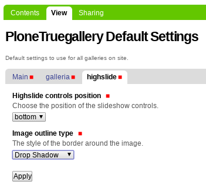

  The ``highslide`` configlet from the ``PloneTruegallery Default Settings`` control panel.

Them, you can see how looks like the ``Highslide`` gallery display type from a Folder 
as the following:

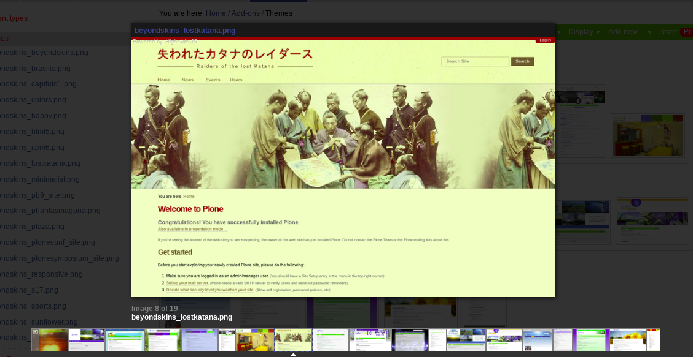

  The ``Highslide`` gallery display type from a Folder.


----

.. _collective-ptg-nivogallery:

collective.ptg.nivogallery
````````````````````````````

The `collective.ptg.nivogallery`_ package add a ``Nivo gallery`` gallery display type using 
the `jQuery Nivo Gallery <http://dev7studios.com/>`_ version 0.7.1 (October 2011) for the :ref:`collective.plonetruegallery <plonetruegallery>` package.

You can enabled the ``Nivogallery`` gallery display type follow the steps:

- at the top right corner of the page click on the :guilabel:`Admin` drop down menu 
- choose :guilabel:`Site Setup`
- at the :guilabel:`Add-on Configuration` 
- click on :guilabel:`Plone True Gallery settings` section
- at the :guilabel:`Main` tab changes the :guilabel:`Gallery Display Type` option with 
  the ``Nivogallery`` value

The ``collective.ptg.nivogallery`` package include the gallery display type 
called ``Nivogallery`` and this have a configlet like the following:

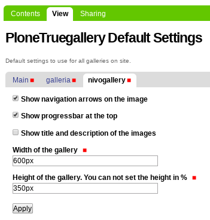

  The ``nivogallery`` configlet from the ``PloneTruegallery Default Settings`` control panel.

Them, you can see how looks like the ``Nivogallery`` gallery display type from a Folder 
as the following:

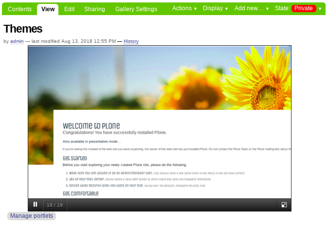

  The ``Nivogallery`` gallery display type from a Folder.


----

.. _collective-ptg-nivoslider:

collective.ptg.nivoslider
`````````````````````````

The `collective.ptg.nivoslider`_ package add a ``Nivoslider`` gallery display type using 
the `jQuery Nivo Slider <http://nivo.dev7studios.com/>`_ version 2.7.1 (March 2010) for the :ref:`collective.plonetruegallery <plonetruegallery>` package.

You can enabled the ``Nivoslider`` gallery display type follow the steps:

- at the top right corner of the page click on the :guilabel:`Admin` drop down menu 
- choose :guilabel:`Site Setup`
- at the :guilabel:`Add-on Configuration` 
- click on :guilabel:`Plone True Gallery settings` section
- at the :guilabel:`Main` tab changes the :guilabel:`Gallery Display Type` option with 
  the ``Nivoslider`` value

The ``collective.ptg.nivoslider`` package include the gallery display type 
called ``Nivoslider`` and this have a configlet like the following:

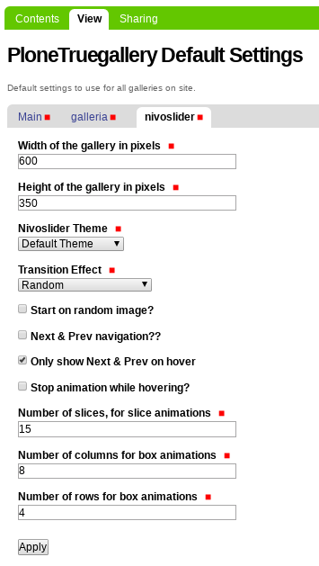

  The ``nivoslider`` configlet from the ``PloneTruegallery Default Settings`` control panel.

Them, you can see how looks like the ``Nivoslider`` gallery display type from a Folder 
as the following:

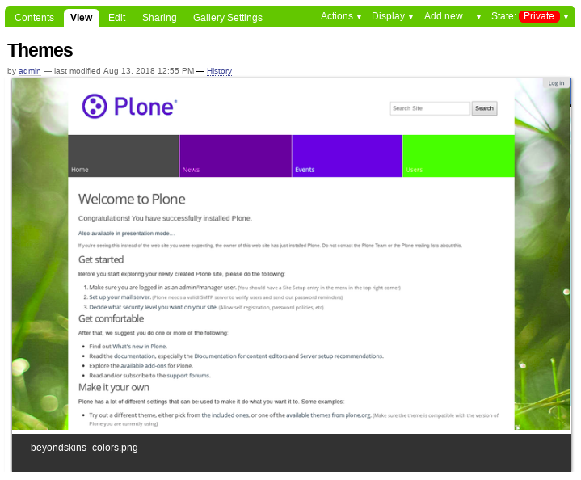

  The ``Nivoslider`` gallery display type from a Folder.


----

.. _collective-ptg-picasa:

collective.ptg.picasa
`````````````````````

The Picasa Support

* to add support for these type of galleries you must install additional
  packages

* install :ref:`collective.ptg.picasa <collective-ptg-picasa>` for Picasa Web Album
  Support (tested with 1.3.3 and 2.0.12)

* On Plone 3.x you must also manually install `hashlib`_ package for Picasa support

* These can just be added to your buildout or installed with ``easy_install``
  or you can add the package to your egg section like

.. todo::
    TODO evaluates if the ``Picasa`` support for this section

.. todo::
    TODO a screenshot for this section

.. note::
    This package is available at https://pypi.org/project/collective.ptg.picasa.


----

.. _collective-ptg-pikachoose:

collective.ptg.pikachoose
`````````````````````````

The `collective.ptg.pikachoose`_ package add a ``Pikachoose`` gallery display type using the 
:ref:`jQuery <jquery-library>` plugin for *photo galleries* (1/16/2012) for the :ref:`collective.plonetruegallery <plonetruegallery>` package.

You can enabled the ``Pikachoose`` gallery display type follow the steps:

- at the top right corner of the page click on the :guilabel:`Admin` drop down menu 
- choose :guilabel:`Site Setup`
- at the :guilabel:`Add-on Configuration` 
- click on :guilabel:`Plone True Gallery settings` section
- at the :guilabel:`Main` tab changes the :guilabel:`Gallery Display Type` option with 
  the ``Pikachoose`` value

The ``collective.ptg.pikachoose`` package include the gallery display type 
called ``Pikachoose`` and this have a configlet like the following:

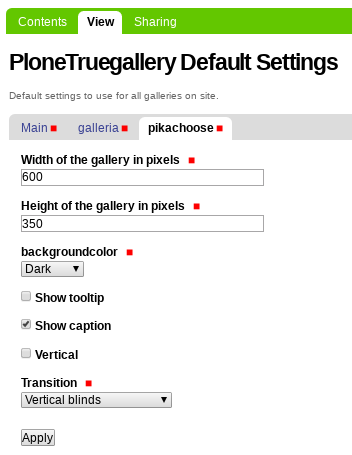

  The ``pikachoose`` configlet from the ``PloneTruegallery Default Settings`` control panel.

..
  Them, you can see how looks like the ``Pikachoose`` gallery display type from a Folder 
  as the following:

  .. figure:: ../_static/ptg_pikachoose_view.png
    :align: center
    :width: 75%
    :alt: The "Pikachoose" gallery display type from a Folder

    The ``Pikachoose`` gallery display type from a Folder.

.. todo::
    TODO fix the :ref:`jQuery <jquery-library>` error with Plone 4

.. todo::
    TODO a screenshot for ``Pikachoose`` gallery display type


----

.. _collective-ptg-presentation:

collective.ptg.presentation
````````````````````````````

The `collective.ptg.presentation`_ package add a ``Presentation`` gallery display type for 
the :ref:`collective.plonetruegallery <plonetruegallery>` package.

You can enabled the ``Presentation`` gallery display type follow the steps:

- at the top right corner of the page click on the :guilabel:`Admin` drop down menu 
- choose :guilabel:`Site Setup`
- at the :guilabel:`Add-on Configuration` 
- click on :guilabel:`Plone True Gallery settings` section
- at the :guilabel:`Main` tab changes the :guilabel:`Gallery Display Type` option with 
  the ``Presentation`` value

The ``collective.ptg.presentation`` package include the gallery display type 
called ``Presentation`` and this have a configlet like the following:

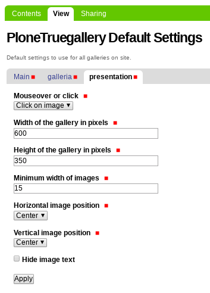

  The ``presentation`` configlet from the ``PloneTruegallery Default Settings`` control panel.

Them, you can see how looks like the ``Presentation`` gallery display type from a Folder 
as the following:

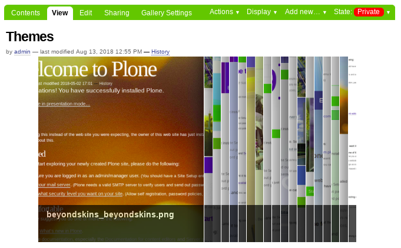

  The ``Presentation`` gallery display type from a Folder.


----

.. _collective-ptg-quicksand:

collective.ptg.quicksand
````````````````````````

The `collective.ptg.quicksand`_ package add a ``Quicksand`` gallery display type using 
the `Quicksand <http://github.com/razorjack/quicksand>`_ version 1.2.2 for the 
:ref:`collective.plonetruegallery <plonetruegallery>` package.

.. note::
    Quicksand, let you reorder and filter items with a nice shuffling animation.

You can enabled the ``Quicksand`` gallery display type follow the steps:

- at the top right corner of the page click on the :guilabel:`Admin` drop down menu 
- choose :guilabel:`Site Setup`
- at the :guilabel:`Add-on Configuration` 
- click on :guilabel:`Plone True Gallery settings` section
- at the :guilabel:`Main` tab changes the :guilabel:`Gallery Display Type` option with 
  the ``Quicksand`` value

..
  The ``collective.ptg.quicksand`` package include the gallery display type 
  called ``Quicksand`` and this have a configlet like the following:

  .. figure:: ../_static/ptg_quicksand_controlpanel.png
    :align: center
    :width: 50%
    :alt: The "quicksand" configlet from the "PloneTruegallery Default Settings" control panel

    The ``quicksand`` configlet from the ``PloneTruegallery Default Settings`` control panel.

  Them, you can see how looks like the ``Quicksand`` gallery display type from a Folder 
  as the following:

  .. figure:: ../_static/ptg_quicksand_view.png
    :align: center
    :width: 75%
    :alt: The "Quicksand" gallery display type from a Folder

    The ``Quicksand`` gallery display type from a Folder.

.. todo::
    TODO a screenshot for ``quicksand`` configlet from the ``PloneTruegallery Default Settings``
    control panel.

.. todo::
    TODO a screenshot for ``quicksand`` gallery display type


----

.. _collective-ptg-s3slider:

collective.ptg.s3slider
````````````````````````

The `collective.ptg.s3slider`_ package add a ``s3slider`` gallery display type using 
the `s3Slider`_ version 1.0 for the :ref:`collective.plonetruegallery <plonetruegallery>` package.

You can enabled the ``s3slider`` gallery display type follow the steps:

- at the top right corner of the page click on the :guilabel:`Admin` drop down menu 
- choose :guilabel:`Site Setup`
- at the :guilabel:`Add-on Configuration` 
- click on :guilabel:`Plone True Gallery settings` section
- at the :guilabel:`Main` tab changes the :guilabel:`Gallery Display Type` option with 
  the ``s3slider`` value

The ``collective.ptg.s3slider`` package include the gallery display type 
called ``s3slider`` and this have a configlet like the following:

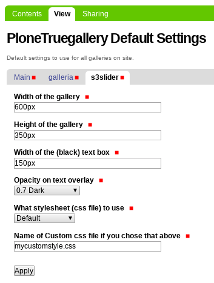

  The ``s3slider`` configlet from the ``PloneTruegallery Default Settings`` control panel.

Them, you can see how looks like the ``s3slider`` gallery display type from a Folder 
as the following:

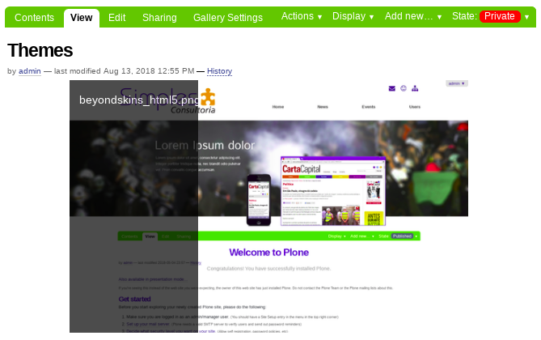

  The ``s3slider`` gallery display type from a Folder.


----

.. _collective-ptg-scrollable:

collective.ptg.scrollable
`````````````````````````

The `collective.ptg.scrollable`_ package add a ``Scrollable`` gallery display type based 
on the *scrollable* :ref:`jquery.tools <jquery-tools-library>` plugin version 1.0.0 (27 February 2012) as an 
:ref:`collective.plonetruegallery <plonetruegallery>` package extension.

You can enabled the ``Scrollable`` gallery display type follow the steps:

- at the top right corner of the page click on the :guilabel:`Admin` drop down menu 
- choose :guilabel:`Site Setup`
- at the :guilabel:`Add-on Configuration` 
- click on :guilabel:`Plone True Gallery settings` section
- at the :guilabel:`Main` tab changes the :guilabel:`Gallery Display Type` option with 
  the ``Scrollable`` value

The ``collective.ptg.scrollable`` package include the gallery display type 
called ``Scrollable`` and this have a configlet like the following:

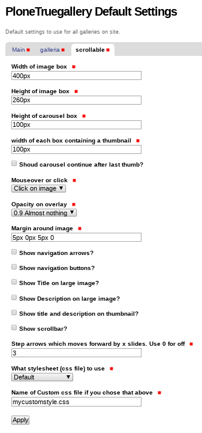

  The ``scrollable`` configlet from the ``PloneTruegallery Default Settings`` control panel.

Them, you can see how looks like the ``Scrollable`` gallery display type from a Folder 
as the following:

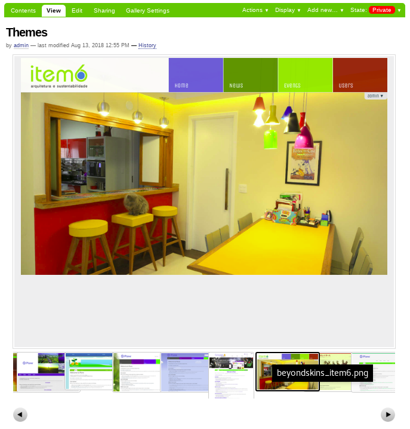

  The ``Scrollable`` gallery display type from a Folder.


----

.. _collective-ptg-sheetgallery:

collective.ptg.sheetgallery
````````````````````````````

The `collective.ptg.sheetgallery`_ package add a ``Sheet gallery`` gallery display type 
for the :ref:`collective.plonetruegallery <plonetruegallery>` package.

.. note::
    Sheet gallery is a gallery display type inspired by: http://www.fogia.se/sortiment

You can enabled the ``Sheetgallery`` gallery display type follow the steps:

- at the top right corner of the page click on the :guilabel:`Admin` drop down menu 
- choose :guilabel:`Site Setup`
- at the :guilabel:`Add-on Configuration` 
- click on :guilabel:`Plone True Gallery settings` section
- at the :guilabel:`Main` tab changes the :guilabel:`Gallery Display Type` option with 
  the ``Sheetgallery`` value

The ``collective.ptg.sheetgallery`` package include the gallery display type 
called ``Sheetgallery`` and this have a configlet like the following:

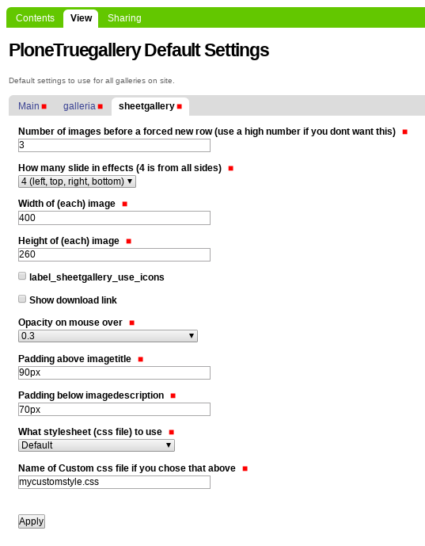

  The ``sheetgallery`` configlet from the ``PloneTruegallery Default Settings`` control panel.

Them, you can see how looks like the ``Sheetgallery`` gallery display type from a Folder 
as the following:

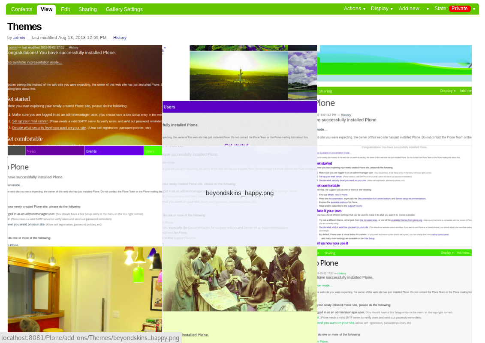

  The ``Sheetgallery`` gallery display type from a Folder.


----

.. _collective-ptg-shufflegallery:

collective.ptg.shufflegallery
`````````````````````````````

The `collective.ptg.shufflegallery`_ package add a ``shufflegallery`` gallery display type 
using the `Shufflegallery <http://www.serie3.info/shufflegallery/demonstration.html>`_ 
:ref:`jQuery <jquery-library>` Plugin as an :ref:`collective.plonetruegallery <plonetruegallery>` package extension.

You can enabled the ``shufflegallery`` gallery display type follow the steps:

- at the top right corner of the page click on the :guilabel:`Admin` drop down menu 
- choose :guilabel:`Site Setup`
- at the :guilabel:`Add-on Configuration` 
- click on :guilabel:`Plone True Gallery settings` section
- at the :guilabel:`Main` tab changes the :guilabel:`Gallery Display Type` option with 
  the ``shufflegallery`` value

The ``collective.ptg.shufflegallery`` package include the gallery display type 
called ``shufflegallery`` and this have a configlet like the following:

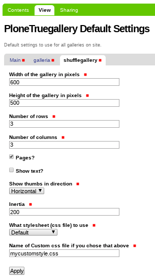

  The ``shufflegallery`` configlet from the ``PloneTruegallery Default Settings`` control panel.

Them, you can see how looks like the ``shufflegallery`` gallery display type from a Folder 
as the following:

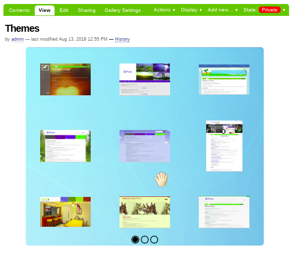

  The ``shufflegallery`` gallery display type from a Folder.


----

.. _collective-ptg-simplegallery:

collective.ptg.simplegallery
````````````````````````````

The `collective.ptg.simplegallery`_ package add a ``Simplegallery`` gallery display type 
for the :ref:`collective.plonetruegallery <plonetruegallery>` package.

You can enabled the ``simplegallery`` gallery display type follow the steps:

- at the top right corner of the page click on the :guilabel:`Admin` drop down menu 
- choose :guilabel:`Site Setup`
- at the :guilabel:`Add-on Configuration` 
- click on :guilabel:`Plone True Gallery settings` section
- at the :guilabel:`Main` tab changes the :guilabel:`Gallery Display Type` option with 
  the ``Simplegallery`` value

The ``collective.ptg.simplegallery`` package include the gallery display type 
called ``Simplegallery`` and this have a configlet like the following:

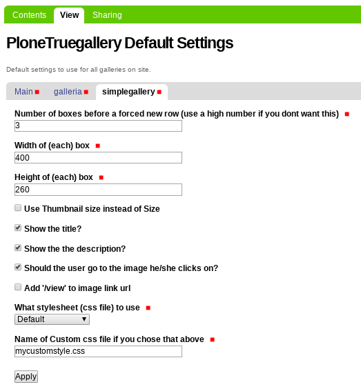

  The ``simplegallery`` configlet from the ``PloneTruegallery Default Settings`` control panel.

Them, you can see how looks like the ``Simplegallery`` gallery display type from a Folder 
as the following:

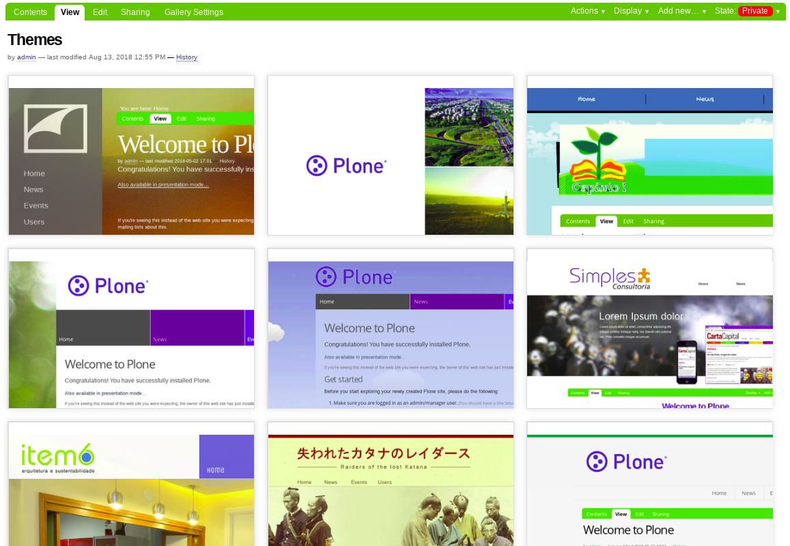

  The ``Simplegallery`` gallery display type from a Folder.

Later can be click on any image and you have a image large view like the following:


  The ``image large`` view for a image from a Folder.


----

.. _collective-ptg-supersized:

collective.ptg.supersized
`````````````````````````

The `collective.ptg.supersized`_ package add a ``Supersized`` gallery display type for 
Fullscreen Slideshow using the `Supersized <http://www.buildinternet.com/project/supersized>`_ 
:ref:`jQuery <jquery-library>` Plugin version 3.2.7 as an :ref:`collective.plonetruegallery <plonetruegallery>` package extension.

You can enabled the ``Supersized`` gallery display type follow the steps:

- at the top right corner of the page click on the :guilabel:`Admin` drop down menu 
- choose :guilabel:`Site Setup`
- at the :guilabel:`Add-on Configuration` 
- click on :guilabel:`Plone True Gallery settings` section
- at the :guilabel:`Main` tab changes the :guilabel:`Gallery Display Type` option with 
  the ``Supersized`` value

The ``collective.ptg.supersized`` package include the gallery display type 
called ``Supersized`` and this have a configlet like the following:

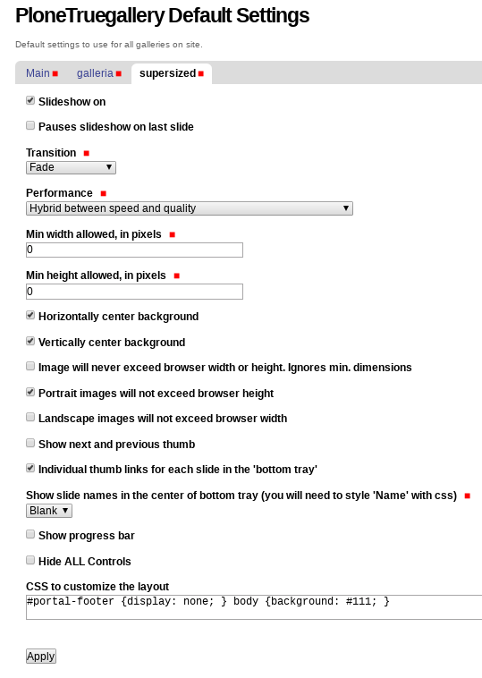

  The ``supersized`` configlet from the ``PloneTruegallery Default Settings`` control panel.

Them, you can see how looks like the ``Supersized`` gallery display type from a Folder 
as the following:


  The ``Supersized`` gallery display type from a Folder.


----

.. _collective-ptg-thumbnailzoom:

collective.ptg.thumbnailzoom
````````````````````````````

The `collective.ptg.thumbnailzoom`_ package add a ``Thumbnailzoom`` gallery display type 
using the *Thumbnail Zoom* as an :ref:`collective.plonetruegallery <plonetruegallery>` package extension.

You can enabled the ``Thumbnailzoom`` gallery display type follow the steps:

- at the top right corner of the page click on the :guilabel:`Admin` drop down menu 
- choose :guilabel:`Site Setup`
- at the :guilabel:`Add-on Configuration` 
- click on :guilabel:`Plone True Gallery settings` section
- at the :guilabel:`Main` tab changes the :guilabel:`Gallery Display Type` option with 
  the ``Thumbnailzoom`` value

The ``collective.ptg.thumbnailzoom`` package include the gallery display type 
called ``Thumbnailzoom`` and this have a configlet like the following:

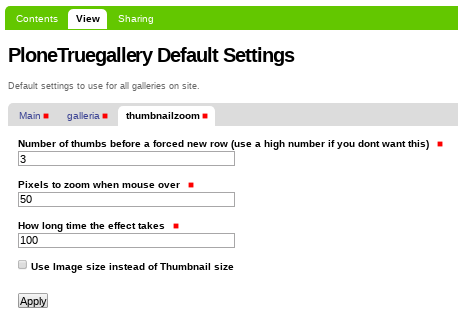

  The ``thumbnailzoom`` configlet from the ``PloneTruegallery Default Settings`` control panel.

Them, you can see how looks like the ``Thumbnailzoom`` gallery display type from a Folder 
as the following:

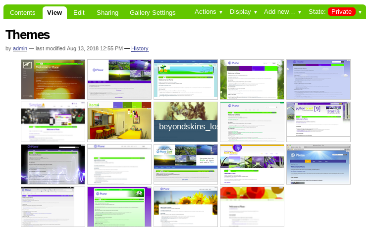

  The ``Thumbnailzoom`` gallery display type from a Folder.


----

.. _collective-ptg-uigallery:

collective.ptg.uigallery
````````````````````````

The `collective.ptg.uigallery`_ package add a ``uigallery`` gallery display type 
using the *uigallery* as an :ref:`collective.plonetruegallery <plonetruegallery>` package extension.

You can enabled the ``uigallery`` gallery display type follow the steps:

- at the top right corner of the page click on the :guilabel:`Admin` drop down menu 
- choose :guilabel:`Site Setup`
- at the :guilabel:`Add-on Configuration` 
- click on :guilabel:`Plone True Gallery settings` section
- at the :guilabel:`Main` tab changes the :guilabel:`Gallery Display Type` option with 
  the ``uigallery`` value

The ``collective.ptg.uigallery`` package include the gallery display type 
called ``uigallery`` and this have a configlet like the following:

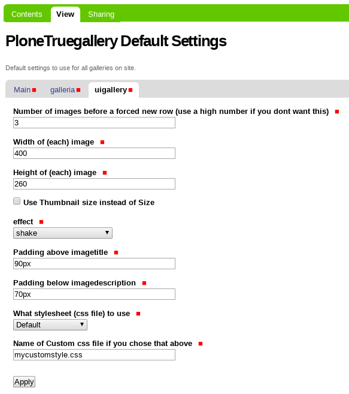

  The ``uigallery`` configlet from the ``PloneTruegallery Default Settings`` control panel.

..
  Them, you can see how looks like the ``uigallery`` gallery display type from a Folder 
  as the following:

  .. figure:: ../_static/ptg_uigallery_view.png
    :align: center
    :width: 75%
    :alt: The "uigallery" gallery display type from a Folder

    The ``uigallery`` gallery display type from a Folder.

.. todo::
    TODO fix the :ref:`jQuery <jquery-library>` error with Plone 4

.. todo::
    TODO a screenshot for ``uigallery`` gallery display type


----

.. _collective-ptg-allnewest:

collective.ptg.allnewest
````````````````````````

The `collective.ptg.allnewest`_ package installs all and the newest truegalleries 
extensions to :ref:`collective.plonetruegallery <plonetruegallery>` package. This package installs alpha 
versions, so beware.

If you want to install all available galleries, you could add to buildout's egg 
section the following:

::

  eggs = 
    ...
    collective.ptg.allnewest


.. note::
    This will also install some galleries that are "under development".

Since this product depends on ``plone.app.z3cform`` package, you'll need to add a 
few overrides for products versions in your buildout if you aren't using recent
versions of Plone. Good news is that is you're using any other product that
uses ``plone.app.z3cform`` package, you'll already be good to go.

Basically, you'll need to add these to your buildout versions section
ONLY IF you're running a Plone < 4.1.

For Plone 4.0:

::

  [versions]
  z3c.form = 2.3.2
  plone.app.z3cform = 0.5.0
  plone.z3cform = 0.6.0
  zope.schema = 3.6.0


and Plone 3.x:

::

  [versions]
  z3c.form = 1.9.0
  plone.app.z3cform = 0.4.8
  plone.z3cform = 0.5.10
  zope.i18n = 3.4.0
  zope.testing = 3.4.0
  zope.component = 3.4.0
  zope.securitypolicy = 3.4.0
  zope.app.zcmlfiles = 3.4.3


These versions are not the exact versions ``collective.plonetruegallery`` package requires, 
it's just a known working set. If you already have ``plone.app.z3cform`` package installed 
under different versions or wish to upgrade versions, you're fine doing so.

Then once you run buildout with this configuration, install ``collective.plonetruegallery`` 
package via the the add-on product configuration. Also, make sure Plone z3cform support is 
installed too. If you experience issues where no settings appear in the ``Gallery Settings`` tab,
reinstall `Plone z3cform support`.


Content Types Supported
^^^^^^^^^^^^^^^^^^^^^^^

Some Plone Content Types via add-ons extra supports the :ref:`collective.plonetruegallery <plonetruegallery>` package.

.. _collective-ptg-contentleadimage:

collective.ptg.contentleadimage
````````````````````````````````

The `collective.ptg.contentleadimage`_ package add an adapter for 
:ref:`collective.plonetruegallery <plonetruegallery>` package to display 
``contentleadimages`` from :ref:`collective.contentleadimage <collective-contentleadimage>` package.

In the weird case where an object is an image (provides ``IImageContent`` object) 
and also has a ``contentleadimage`` object, the ``contentleadimage`` is the one 
displayed in the gallery.


How It Works
~~~~~~~~~~~~

.. note::
    First you can enables the ``Content Lead Image`` and  ``Plone True Gallery`` 
    add-ons from ``Add-ons`` Plone control panel.

The ``contentleadimage`` applies on Content types object that have a Image field 
like ``News``, them you can go, for example, to the :guilabel:`News` section at 
the main navigation, this view looks like the following picture:

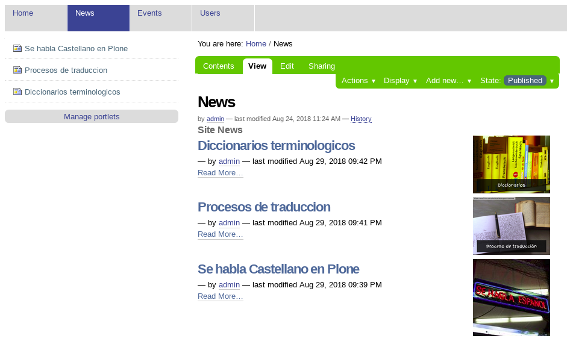

  The "Collection" default view in "News" section.

You can enabled the ``contentleadimage`` gallery type follow the steps:

- at the top right corner of the page click on the :guilabel:`Admin` drop down menu 
- choose :guilabel:`Site Setup`
- at the :guilabel:`Add-on Configuration` 
- click on :guilabel:`Plone True Gallery settings` section
- at the :guilabel:`Main` tab changes the :guilabel:`Types` option with 
  the ``Use Plone, ContentLeadImages enabled`` value

Once that is done, you can access (again) a ``Collection`` content type, 
for example go to :guilabel:`News` section at the main navigation, and changes 
the :guilabel:`Gallery View` from the :guilabel:`Display`, this view looks like 
the following picture: 

.. figure:: ../_static/ptg_contentleadimage_gallery_view.png
  :align: center
  :width: 75%
  :alt: The "Gallery View" default from the "News" section

  The "Gallery View" default from the "News" section.

By default, load the ``content lead-image`` from the ``News`` objects created into 
:guilabel:`News` section, with the *gallery display type* by default, almost always 
is the :ref:`collective.ptg.galleria <collective-ptg-galleria>` *gallery display type*.

.. note:: 
    All you need to do for works the ``contentleadimage`` adapter for 
    :ref:`collective.plonetruegallery <plonetruegallery>` package is select 
    the :guilabel:`Gallery View` from the :guilabel:`Display` drop down item 
    for any ``Folder`` or ``Collection`` content type.

----

.. _collective-contentleadimage:

Content Lead Image
~~~~~~~~~~~~~~~~~~

The `collective.contentleadimage`_ product adds complete support for adding 
descriptive image to any ``Archetypes`` based content in Plone site. Each object 
has new tab ``Edit lead image``, which allows to upload new or remove current 
image. It is similar behaviour as Plone News Item (you can add image to news 
item and this image is displayed in news item overview listing.

There is ``Folder lead-image view`` page template, which can be used to list 
all items in the folder together with images attached.

There is configuration control panel, where you can set maximum width and 
height of the uploaded images. The width and height is applied on each image 
upload (image is automatically resized). You can specify smaller width and 
height which is used as image preview in the below content title viewlet 
(next to content Description). Large image is used in the above content body 
viewlet (floated left at the top of content body).

Below content title viewlet is preffered, but Manager can easily switch
the viewlets on/off in the control panel.

There is ``FieldIndex`` and ``metadata`` in ``portal_catalog: hasContentLeadImage``
(True/False). This may help developers to create own templates optimized 
for displaying lead image.

----

..
    .. _collective-ptg-galleryfolder:

    collective.ptg.galleryfolder
    ````````````````````````````

    .. note::
        First you can enables the ``Galleryfolder default profile`` add-on from 
        ``Add-ons`` Plone control panel.

    The `collective.ptg.galleryfolder`_ package add a ``Gallery folder`` like a gallery 
    content type (basically just a folder with a new name) to be used with using for the 
    :ref:`collective.plonetruegallery <plonetruegallery>` package.

    You can add a gallery folder via a new Content Type object called :guilabel:`Galleryfolder` 
    via the :guilabel:`Add new...` dropdown menu.

    .. figure:: ../_static/ptg_galleryfolder_contenttype.png
      :align: center
      :width: 55%
      :alt: Content Type object called "Galleryfolder"

      A Content Type object called ``Galleryfolder``.

    Later that you create a ``Galleryfolder`` object, you have available to click on 
    :guilabel:`Gallery settings` tab that is the same control panel that provides from the 
    :ref:`Global control panel <ptg-default-settings>` but locally.

    ----

.. _collective-ptg-galleryimage:

collective.ptg.galleryimage
````````````````````````````

The `collective.ptg.galleryimage`_ package add a ``Gallery Image`` like a content type. 
The purpose of this field is to provide a more robust field for 
:ref:`collective.plonetruegallery <plonetruegallery>` package to utilize for some of 
it's galleries. 


How It Works
~~~~~~~~~~~~

.. note::
    First you can enables the ``Gallery Image Type`` and  ``Plone True Gallery`` 
    add-ons from ``Add-ons`` Plone control panel.

Utilizes the ``Image`` type along with `archetypes.schemaextender`_ package to create
the type. The benefit of using this approach is that there is no new persistent object 
types added to the ZODB so uninstall should be a breeze and removing the product will 
mean those existing types will behave just like the normal ``Image`` content type.

You can add a new Content Type object called :guilabel:`GalleryImage` via the 
:guilabel:`Add new...` dropdown menu, this view looks like the following picture:

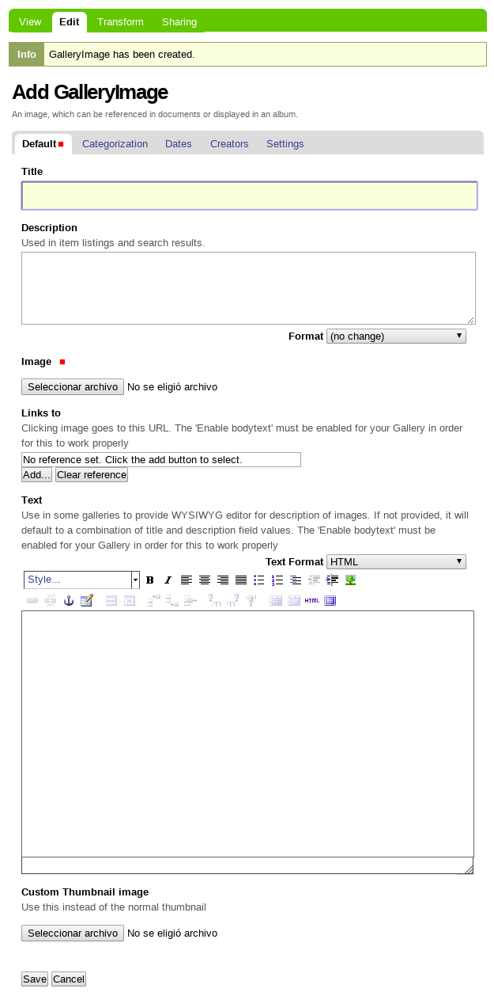

  A Content Type object called ``GalleryImage``.

.. warning::
    It's very important that add a reference :guilabel:`Links to` with a other Plone 
    content type object, for example, them when clicking image goes to this URL.

So add some new ``GalleryImage`` objects inside a ``Folder`` and changes the 
:guilabel:`Gallery View` from the :guilabel:`Display`, this view looks like 
the following picture:


  The "Gallery View" with "Content Flow" gallery display type.

Them when the user clicking on a image with reference to Plone content type object 
specific goes to this URL.

.. _`collective.plonetruegallery`: https://github.com/collective/collective.plonetruegallery
.. _`collective.prettyphoto`: https://pypi.org/project/collective.prettyphoto
.. _`collective.ptg.bootstrapcarousel`: https://pypi.org/project/collective.ptg.bootstrapcarousel
.. _`collective.ptg.carousel`: https://pypi.org/project/collective.ptg.carousel
.. _`jCarousel`: http://sorgalla.com/jcarousel/
.. _`collective.ptg.contentflow`: https://pypi.org/project/collective.ptg.contentflow
.. _`collective.contentleadimage`: https://pypi.org/project/collective.contentleadimage
.. _`collective.ptg.contactsheet`: https://pypi.org/project/collective.ptg.contactsheet
.. _`collective.ptg.easyslider`: https://pypi.org/project/collective.ptg.easyslider
.. _`Easy Slider`: http://cssglobe.com/post/4004/easy-slider-15-the-easiest-jquery-plugin-for-sliding
.. _`redturtle.smartlink`: https://pypi.org/project/redturtle.smartlink
.. _`collective.ptg.fancybox`: https://pypi.org/project/collective.ptg.fancybox
.. _`FancyBox`: http://fancybox.net/
.. _`collective.ptg.flickr`: https://pypi.org/project/collective.ptg.flickr
.. _`collective.ptg.galleria`: https://pypi.org/project/collective.ptg.galleria
.. _`Galleria`: http://galleria.io
.. _`collective.ptg.galleriffic`: https://pypi.org/project/collective.ptg.galleriffic
.. _`Galleriffic`: http://trentacular.com
.. _`collective.ptg.garagedoor`: https://pypi.org/project/collective.ptg.garagedoor
.. _`collective.ptg.highslide`: https://pypi.org/project/collective.ptg.highslide
.. _`Highslide JS`: http://highslide.com/
.. _`collective.ptg.nivogallery`: https://pypi.org/project/collective.ptg.nivogallery
.. _`collective.ptg.nivoslider`: https://pypi.org/project/collective.ptg.nivoslider
.. _`collective.ptg.picasa`: https://pypi.org/project/collective.ptg.picasa
.. _`hashlib`: https://pypi.org/project/hashlib
.. _`collective.ptg.pikachoose`: https://pypi.org/project/collective.ptg.pikachoose
.. _`collective.ptg.presentation`: https://pypi.org/project/collective.ptg.presentation
.. _`collective.ptg.quicksand`: https://pypi.org/project/collective.ptg.quicksand
.. _`collective.ptg.s3slider`: https://pypi.org/project/collective.ptg.s3slider
.. _`s3Slider`: http://www.serie3.info/s3slider/demonstration.html
.. _`collective.ptg.simplegallery`: https://pypi.org/project/collective.ptg.simplegallery
.. _`collective.ptg.supersized`: https://pypi.org/project/collective.ptg.supersized
.. _`collective.ptg.sheetgallery`: https://pypi.org/project/collective.ptg.sheetgallery
.. _`collective.ptg.scrollable`: https://pypi.org/project/collective.ptg.scrollable
.. _`collective.ptg.shufflegallery`: https://pypi.org/project/collective.ptg.shufflegallery
.. _`collective.ptg.thumbnailzoom`: https://pypi.org/project/collective.ptg.thumbnailzoom
.. _`collective.ptg.uigallery`: https://pypi.org/project/collective.ptg.uigallery
.. _`collective.ptg.allnewest`: https://pypi.org/project/collective.ptg.allnewest
.. _`collective.ptg.contentleadimage`: https://pypi.org/project/collective.ptg.contentleadimage
.. _`collective.ptg.galleryfolder`: https://pypi.org/project/collective.ptg.galleryfolder
.. _`collective.ptg.galleryimage`: https://pypi.org/project/collective.ptg.galleryimage
.. _`archetypes.schemaextender`: https://pypi.org/project/archetypes.schemaextender
