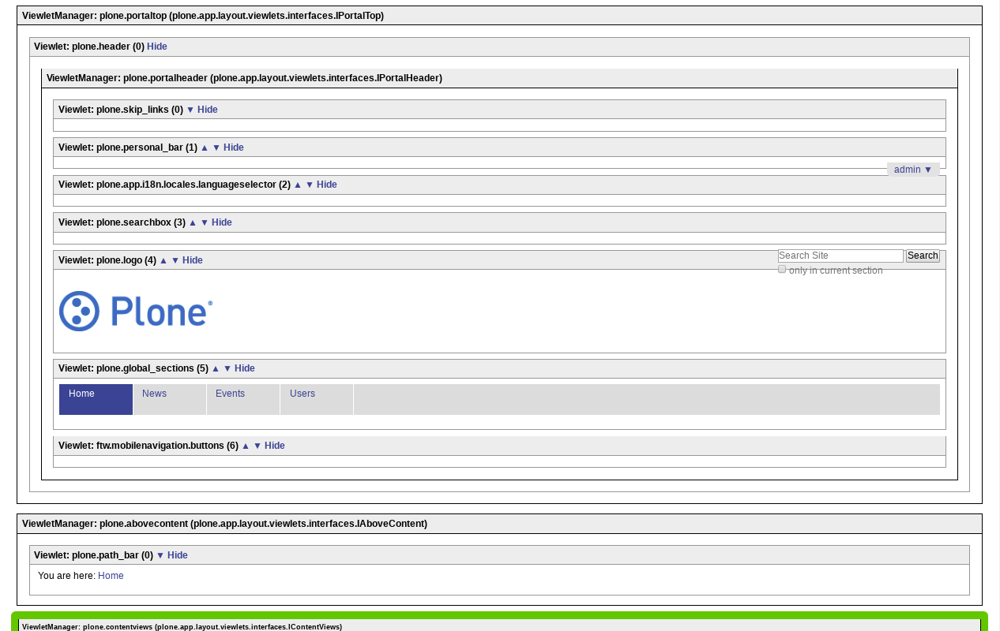
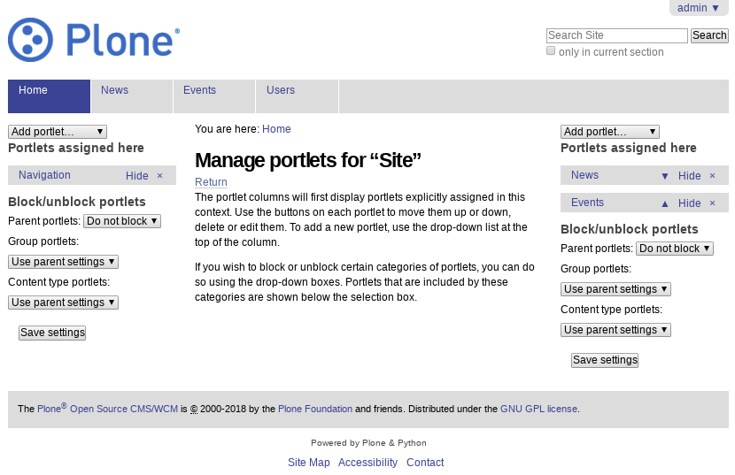
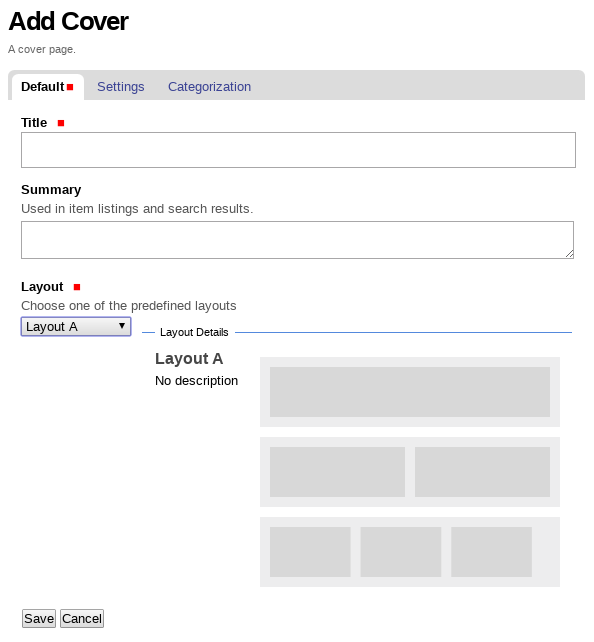
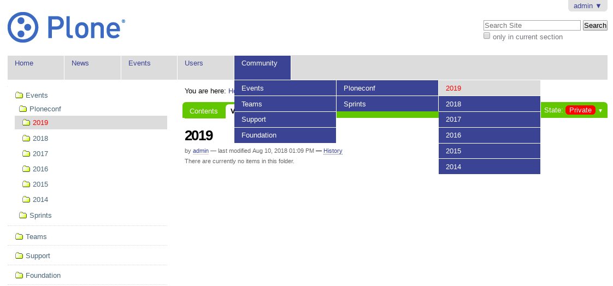
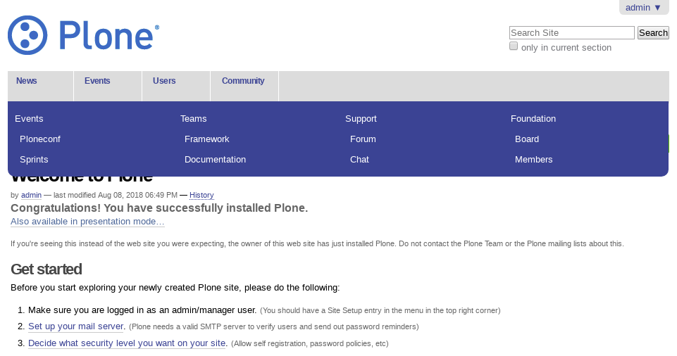
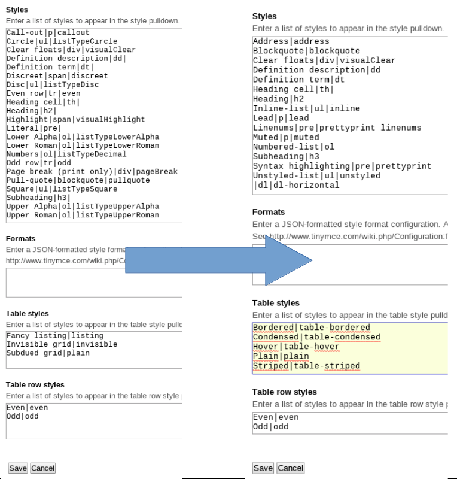
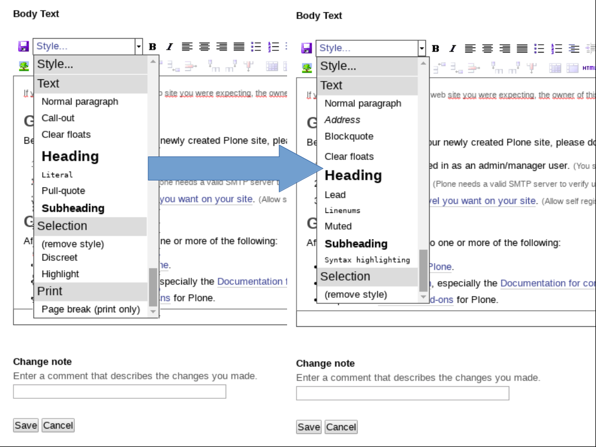
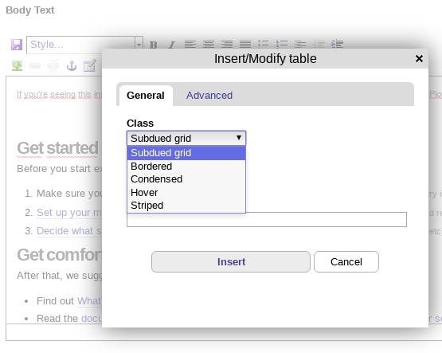

.. _layout-content:


Content section
---------------

There are some tools for manage the *content section* from global *Layout design*.


Viewlet manager
^^^^^^^^^^^^^^^

The *Viewlet manager* is a tools let you manages the viewlet(s) and view(s) that 
are contains in the default layout.

Usage
`````

If you are the *Zope User* ``Admin`` or you have privileges to ``Site administrator`` 
can be access to the viewlets manager via the browser view ``@@manage-viewlets`` 
from the Site root like this URL http://localhost:8081/Plone/@@manage-viewlets



  The ``@@manage-viewlets`` browser page at Plone.

----

Portlet manager
^^^^^^^^^^^^^^^

The *Portlet manager* is a tools let you manages the portlet(s) that are in the 
left and right columns from the default layout.

Usage
`````

If you are the *Zope User* ``Admin`` or you have privileges to ``Site administrator`` 
can be access to the portlets manager via the browser view ``@@manage-portlets`` 
from the Site root like this URL http://localhost:8081/Plone/@@manage-portlets



  The ``@@manage-portlets`` browser page at Plone.

----

Content Well Portlets
^^^^^^^^^^^^^^^^^^^^^

The `Products.ContentWellPortlets <https://pypi.org/project/Products.ContentWellPortlets>`_ package that enables you to add portlets to the central column in a page.

* This product enables you to put portlets in places other than right and left
  columns, specifically:
  
  * Underneath global navigation but above portal-columns so it spans the width of 
    the page
  * above the main heading (h1) of the page
  * at the base of the page, above the footer
  * in the footer well
  
  In each area, you can add up to three columns of portlets. 

* You should use CSS (in the custom folder in ``portal_skins`` tool, or in your own
  theme product) to configure how these portlets should appear relative to
  each other and to the content.

* This may allow you to create distinctive layouts for pages, folders, etc
  without having to write new *Zope Page Templates*


Usage
`````


To add portlets in header
~~~~~~~~~~~~~~~~~~~~~~~~~

#. Log into your Plone site as a **Manager** (or someone else with the 
   ``Portlets: Manage portlets`` permission)

#. Go to the place in your site where you want portlets. For example:

   * If you want portlets on your home page only, go to http://yourSiteURL/front-page

   * If you want portlets on your entire site, go to http://yourSiteURL

#. Bring up a management page by either

   (a) Clicking the ``Add, edit or remove a portlet in the header area that spans columns one and two plus the content area`` link [0]_; or

   (b) Adding ``/@@manage-portletsinheader`` to the end of the URL and hitting "return"

#. You should see a management page entitled ``Manage portlets in header``
   This gives you the option to add portlets in one or more of three columns like 
   theses :guilabel:`In Header Portlet A`, :guilabel:`In Header Portlet B`, 
   :guilabel:`In Header Portlet C`, :guilabel:`In Header Portlet D`, 
   :guilabel:`In Header Portlet E` and :guilabel:`In Header Portlet F`.
   You can add as many portlets in each column as you like 
   Other commands (reordering, hiding, blocking portlets) are the same as for
   the right and left columns

.. [0] **Note:** if you are in a folder that has a default page, this will take
       you to a screen where you can add portlets to that page. If you want to add
       portlets to all the pages in the folder, make sure you are on the folder
       rather than the default page (e.g. by clicking the :guilabel:`Contents`: tab) 
       before clicking the link.

.. todo::
    TODO a screenshot for this section


To add portlets above the content
~~~~~~~~~~~~~~~~~~~~~~~~~~~~~~~~~

#. Log into your Plone site as a **Manager** (or someone else with the 
   ``Portlets: Manage portlets`` permission)

#. Go to the place in your site where you want portlets. For example:

   * If you want portlets on your home page only, go to http://yourSiteURL/front-page

   * If you want portlets on your entire site, go to http://yourSiteURL

#. Bring up a management page by either

   (a) Clicking the "add, edit or remove portlets link" [1]_; or

   (b) Adding ``/@@manage-portletsabovecontent`` to the end of the URL and hitting "return"

#. You should see a management page entitled ``Manage portlets above content``
   This gives you the option to add portlets in one or more of three columns like 
   theses :guilabel:`Portlet well A`, :guilabel:`Portlet well B`, 
   :guilabel:`Portlet well C`, :guilabel:`Portlet well D`, :guilabel:`Portlet well E` 
   and :guilabel:`Portlet well F`.
   You can add as many portlets in each column as you like
   Other commands (reordering, hiding, blocking portlets) are the same as for
   the right and left columns

.. [1] **Note:** if you are in a folder that has a default page, this will take
       you to a screen where you can add portlets to that page. If you want to add
       portlets to all the pages in the folder, make sure you are on the folder
       rather than the default page (e.g. by clicking the :guilabel:`Contents`: tab) 
       before clicking the link.

.. todo::
    TODO a screenshot for this section


To add portlets below the content
~~~~~~~~~~~~~~~~~~~~~~~~~~~~~~~~~

Follow the above instructions, but instead of clicking the 
``Add, edit or remove a portlet above the content`` link or adding 
``/@@manage-portletsabovecontent`` to the URL:

 (a) Click the ``Add, edit or remove a portlet below the content`` link; or
 (b) Add ``/@@manage-portletsbelowcontent`` to the end of the URL

.. todo::
    TODO a screenshot for this section


To add portlets in the footer
~~~~~~~~~~~~~~~~~~~~~~~~~~~~~

#. Log into your Plone site as a **Manager** (or someone else with the 
   ``Portlets: Manage portlets`` permission)

#. Go to the place in your site where you want portlets. For example:

   * If you want portlets on your home page only, go to http://yourSiteURL/front-page

   * If you want portlets on your entire site, go to http://yourSiteURL

#. Bring up a management page by either

   (a) Clicking the ``Add, edit or remove a portlet in the footer`` [2]_; or

   (b) Adding ``/@@manage-portletsfooter`` to the end of the URL and hitting "return"

#. You should see a management page entitled ``Manage portlets in footer``
   This gives you the option to add portlets in one or more of three columns like 
   theses :guilabel:`Footer Portlet A`, :guilabel:`Footer Portlet B`, 
   :guilabel:`Footer Portlet C`, :guilabel:`Footer Portlet D`, 
   :guilabel:`Footer Portlet E` and :guilabel:`Footer Portlet F`.
   You can add as many portlets in each column as you like
   Other commands (reordering, hiding, blocking portlets) are the same as for
   the right and left columns

.. [2] **Note:** if you are in a folder that has a default page, this will take
       you to a screen where you can add portlets to that page. If you want to add
       portlets to all the pages in the folder, make sure you are on the folder
       rather than the default page (e.g. by clicking the :guilabel:`Contents`: tab) 
       before clicking the link.

.. todo::
    TODO a screenshot for this section


Technical details
`````````````````

* The product adds two new viewlets; within each of these are three portlet
  managers (specified in ``portlets.xml`` file) For details of exactly which viewlet
  managers these viewlets slot into:
  
  * see ``configure.zcml`` file in ``Products/ContentWellPortlets/browser`` directory
  * or install the product, go to your Plone site and add ``/@@manage-viewlets`` to the URL

----

Cover
^^^^^

The `collective.cover <https://pypi.org/project/collective.cover>`_ package for 
edit to create front pages and other composite pages.

Features
````````

- A Content Type object called ``Cover``.
- A **Layout editor** for change the layout and grid initially defined.
- A **Compose editor** for adding the objects in the places defined at **Layout editor**.


Use cases
`````````

Suppose you are running The Planet, a news site that has a bunch of editors
focused on getting news on different topics, like Economy, Health or Sports.

If you are the main publisher of the site, you may want to delegate the
construction of the cover page of the Economy section to the people working on
that content area, but you might not want them messing around the Sports
section as well.

Also, suppose you have the final game of the World Cup and the match is going
to be defined on penalties: you may want to prepare a couple of cover pages
and publish the right one focused on the team that won in the end.

These are the kind of issues we want to solve with this package; we are still
far from it, but that is the idea.

Usage
`````


You can add a layout via a new Content Type object called ``Cover`` via the 
:guilabel:`Add new...` dropdown menu.



  A Content Type object called ``Cover``.

Later you can access to **Layout editor** via the :guilabel:`Layout` tab.

.. figure:: ../_static/collective_cover_1.png
  :align: center
  :width: 75%
  :alt: Layout editor for "collective.cover"

  Layout editor for *collective.cover*.

When you done the changes in the **Layout editor**, you can access to 
**Compose editor** via the :guilabel:`Compose` tab.

.. figure:: ../_static/collective_cover_2.png
  :align: center
  :width: 75%
  :alt: Compose editor for "collective.cover"

  Compose editor for *collective.cover*.

The you can see the layout rendered via the :guilabel:`View` tab.

.. todo::
    TODO a screenshot for this section

..
  ----

  Mosaic
  ^^^^^^

  Via extra add-on exists `plone.app.mosaic <https://pypi.org/project/plone.app.mosaic>`_ 
  for adds a doormat viewlet and installs it in the Plone footer.

  .. figure:: ../_static/Products_Doormat.png
    :align: center
    :width: 75%
    :alt: Editing a internal link into the Plone footer using "plone.app.mosaic"

    Editing a internal link into the Plone footer using *plone.app.mosaic*.

----

Dropdown menu
^^^^^^^^^^^^^

The `webcouturier.dropdownmenu <https://github.com/collective/webcouturier.dropdownmenu>`_ package is the dropdown solution for Plone since 2007 that integrates 
Dropdown menus for global navigation in Site.

You will get the dropdown menus for those items in global navigation 
that have the subitems. Submenus are built based on the same policy 
as the Site Map, so it will show the same tree as you would get in 
the Site Map or navigation portlet being in appropriate section.

How it works
````````````

Dropdown menus are build based on the same policy as the Site Map, so 
it will show the same tree as you would get in the Site Map or navigation 
portlet being in appropriate section. This means - no **private** objects 
for anonymouses; no objects, excluded from the navigation - exactly the 
same behavior you would expect from Site Map or navigation portlet.

Tips
````

- **While disabling clicking the links with children, I want the links in 
  the global navigation bar to be clickable nevertheless.**

  What you need is to customize the ``browser/dropdown.js`` file like the
  following:
  
  ::
  
    jQuery(function ($) {
        $('#portal-globalnav ul .noClick').click(function (e) {
            e.preventDefault();
        });
    });
  
  Note that we have added **ul** in the jQuery selector. This will stop
  clickability of the links in the dropdowns only, but not the section's 
  link in the global navigation bar itself.



  The "Dropdown" menu in the Plone global navigation.


----


Mega drop
^^^^^^^^^

The `collective.megadrop <https://github.com/collective/collective.megadrop>`_ 
package integrates a dropdown menu that presents primary and secondary 
navigation in the Plone global navigation.



  The "megadrop" menu in the Plone global navigation.


----


.. _vs-bootstrap-tinymce:

Bootstrap in TinyMCE
^^^^^^^^^^^^^^^^^^^^

The `vs.bootstrap.tinymce <https://pypi.org/project/vs.bootstrap.tinymce>`_ 
package is part of the `Diazo Bootstrap framework <https://github.com/veit/diazo_bootstrap/>`_ 
to add the Bootstrap css classes for ``TinyMCE editor`` in Plone.

You can access to ``TinyMCE editor`` control panel:

- at the top right corner of the page click on the :guilabel:`Admin` drop down menu 
- choose :guilabel:`Site Setup`
- click on :guilabel:`TinyMCE Visual Editor`



  The TinyMCE control panel.

Later you can use ``TinyMCE editor`` and adding the new Bootstrap css classes 
in Plone:



  The "Menu Styles" from TinyMCE editor.

Also you can use ``TinyMCE editor`` and adding the new Bootstrap Table css classes 
in Plone:



  The "Insert/Modify Table" from TinyMCE editor.
