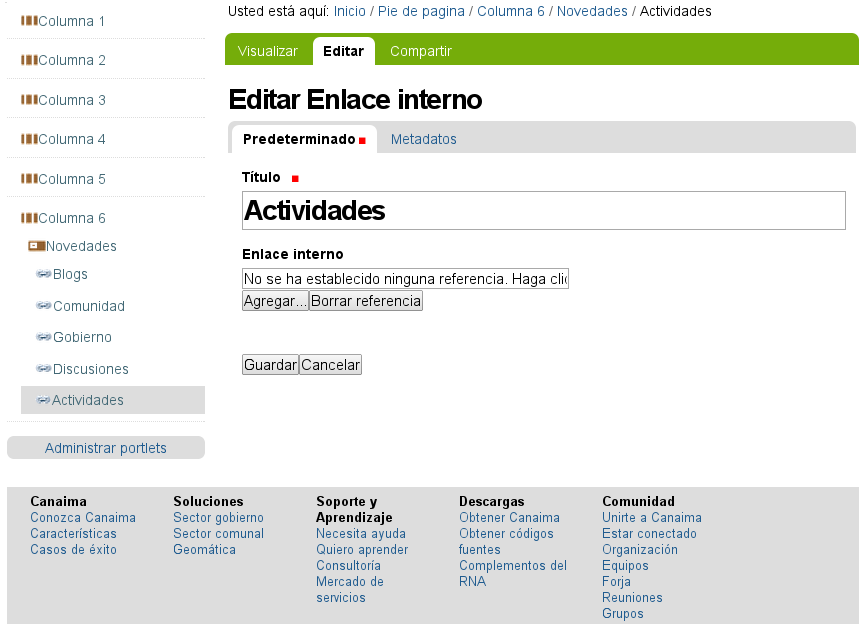

.. _layout-footer:

Footer section
--------------

There are some tools for manage the *footer section* from global Layout design.

Site footer links
^^^^^^^^^^^^^^^^^

The `Products.Doormat <https://pypi.org/project/Products.Doormat>`_ package adds a 
doormat viewlet and installs it in the Plone footer.

  Editing a internal link into the Plone footer using *Products.Doormat*.
