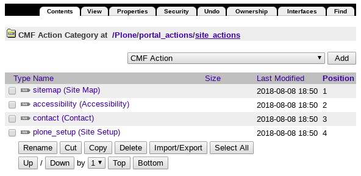
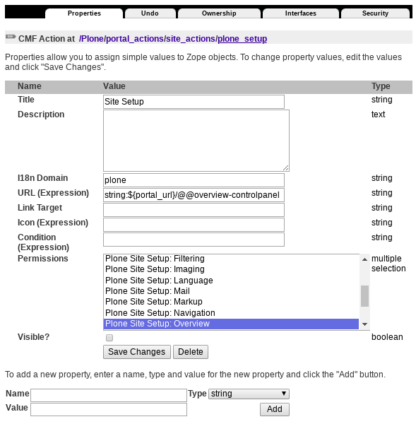
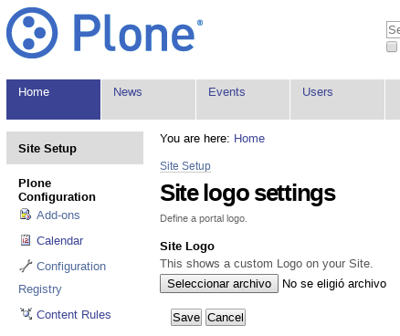
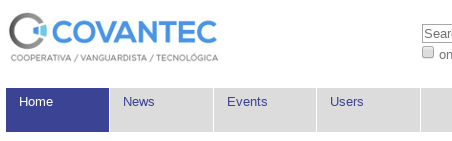
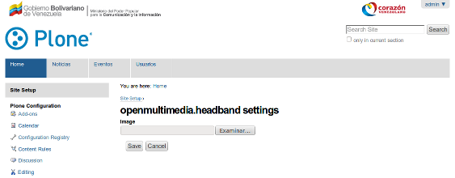

.. _layout-header:


Header section
--------------

There are some tools for manage the *header section* from global Layout design.


Site action links
^^^^^^^^^^^^^^^^^

By default, Plone let you changes the site action links on-the-fly via a ``plone_actions`` tools.



  The "site_actions" object at "portal_actions" control panel.

Usage
`````

You can change the :guilabel:`Admin` > :guilabel:`Site Setup` link inside the :guilabel:`site_actions` 
container from :guilabel:`portal_actions` tool from the *ZMI control panel*, as it's shows in the follow image:



  The "plone_setup" object at "site_actions" container.


----

Site logo
^^^^^^^^^

The `collective.sitelogo <https://github.com/collective/collective.sitelogo>`_ package 
for adds a custom site logo in the Plone header on-the-fly via a control panel.

Set the site logo through the web. Works with ``lineage.registry`` package, so you can define site logos for Lineage subsites also.

Usage
`````

You have a "Site Logo" menu entry in the user menu and also a configlet in the ``@@overview-controlpanel`` form.



  The *collective.sitelogo* control panel.

Later you can see the new Plone Site Logo, like the following:



  A Plone Logo Custom applied.

----

Site headband
^^^^^^^^^^^^^

The `openmultimedia.headband <https://github.com/OpenMultimedia/openmultimedia.headband>`_ 
package defines an editable viewlet to add an image headband for the site on-the-fly via 
a control panel.

Usage
`````

You can enabled an ``headband`` image follow the steps:

- at the top right corner of the page click on the :guilabel:`Admin` drop down menu 
- choose :guilabel:`Site Setup`
- at the :guilabel:`Add-on Configuration` 
- click on :guilabel:`openmultimedia.headband settings` section
- and upload an image, then you will see the image on top of the site.

The ``openmultimedia.headband`` package include a configlet like the following:



  The "openmultimedia.headband settings" control panel.
