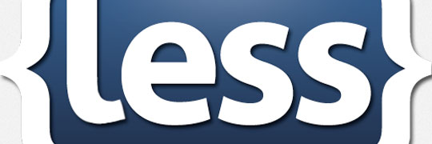
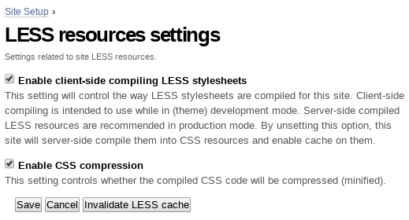
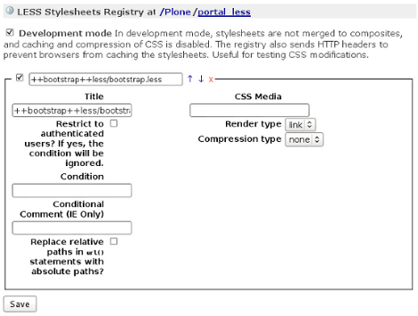
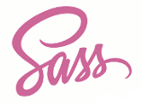

.. _css-preprocessing:

CSS Pre-Processing
==================

The **"Plone theming suite"** includes the following CSS pre-processors tools 
supported:

.. _less:

LESS
----

LESS extends CSS with dynamic behavior such as variables, mixins, operations 
and functions. LESS runs on both the client-side (Chrome, Safari, Firefox) and 
server-side.



  The LESS is support into Plone.

.. note::
    You can find more information about LESS at http://lesscss.org/

----

.. _collective-lesscss:

collective.lesscss
^^^^^^^^^^^^^^^^^^

The `collective.lesscss <https://old.plone.org/products/collective.lesscss>`_ 
package integrates the :ref:`LESS <less>` CSS pre-processor with Plone.

This package clone the ``portal_css`` tool behavior, extending it to meet both 
client-side and server-side :ref:`LESS <less>` resources compiling methods.

It adds a ``portal_less`` tool to the portal, enables an import/export GS profile 
``lessregistry.xml`` file, overrides the default 
`Products.ResourceRegistries <https://pypi.org/project/Products.ResourceRegistries/2.2.13/>`_ 
viewlet by adding the :ref:`LESS <less>` resources part for the ``<head>`` tag.


Adding LESS resources
`````````````````````

This package is intended to be used in conjunction with an user defined Plone Theme 
package. As a developer, you can include as many :ref:`LESS <less>` resources as you 
may need to build your theme. 
You can add :ref:`LESS <less>` resources using a GS profile named ``lessregistry.xml``. 
The syntax is cloned from ``cssregistry.xml`` profile:

::

    <?xml version="1.0"?>
    <object name="portal_less" meta_type="LESS Stylesheets Registry">
      <stylesheet title="++bootstrap++less/bootstrap.less" authenticated="False"
        enabled="on" id="++bootstrap++less/bootstrap.less" rendering="link"/>
    </object>


Control Panel
`````````````

You can manage the way the :ref:`LESS <less>` resources compile by accessing the LESS 
resources configlet located at the :guilabel:`Site Setup`. By default, client-side LESS 
resources compile mode and minification are enabled.

You can access to the Plone LESS control panel following the steps:

- at the top right corner of the page click on the :guilabel:`Admin` drop down menu 
- choose :guilabel:`Site Setup`
- at the :guilabel:`Add-on Configuration` 
- click on :guilabel:`LESS Stylesheets Tool` section

Then you need check the ``Enable client-side compiling stylesheets`` and ``Enable CSS compression``
at the ``LESS Stylesheets Tool`` control panel:



  Enabled the LESS configuration control panel

Also you can access to ``portal_less`` tool from the ZMI:



  The **portal_less** tool of ZMI.


Client side compiling
`````````````````````

Client-side compiling is intended to use while in (theme) development mode.

``collective.lesscss`` will use the standard method for compiling client-side 
by using the ``less.js`` file (v1.3, at the time of this writing) and exposing 
the LESS resources after the ``portal_css`` ones:

::

    <link rel="stylesheet/less" type="text/css" href="styles.less">
    <!-- Here goes the rest of portal_javascript resources -->
    <script src="less.js" type="text/javascript"></script>


Server side compiling
`````````````````````

Server-side compiled LESS resources are recommended in production mode. By unsetting 
this option, the site will server-side compile them into CSS resources and enable a 
volatile cache on them. 

.. warning
    *IMPORTANT NOTE:* Server-side compiling requires to have declared the resources 
    via `plone.resource <https://github.com/plone/plone.resource/1.2.3/>`_ package 
    in your theme package!

::

    <plone:static
      directory="resources/less"
      type="bootstrap"
      name="less"
      />

And furthermore, if you aren't using `plone.app.theming <https://pypi.org/project/plone.app.theming/1.1.8/>`_ 
for develop your theme you should declare the type you are using for your resources 
by creating this class somewhere in your theme (e.g. ``traversal.py`` file):

::

    from plone.resource.traversal import ResourceTraverser

    class BootstrapTraverser(ResourceTraverser):
    """The theme traverser.

    Allows traveral to /++bootstrap++<name> using ``plone.resource`` to fetch
    things stored either on the filesystem or in the ZODB.
    """
    name = 'bootstrap'

and later on, declare the adapter via ``configure.zcml`` file:

::

    <adapter
      name="bootstrap"
      for="* zope.publisher.interfaces.IRequest"
      provides="zope.traversing.interfaces.ITraversable"
      factory=".traversal.BootstrapTraverser"
    />

So, you should now be able to access to the resources inside the resources directory 
by accessing::

    http://localhost/Plone/++bootstrap++less/

Theme Example
`````````````

You can check out a :ref:`Twitter Bootstrap <bootstrap-css-framework>` integration 
using the :ref:`example.bootstrap <example-bootstrap>` package for a full example 
on how to integrate :ref:`LESS <less>` resources in your theme package.

.. note::
    The :ref:`example.bootstrap <example-bootstrap>` package is supported by the :ref:`Plone Theming Suite <pts-introduction>`.

----

.. _less_supported_themes:

LESS Supported Themes
^^^^^^^^^^^^^^^^^^^^^

There are available themes with :ref:`LESS <less>` supported and there are the following:

- :ref:`Beyondskins capitulo1 <beyondskins-capitulo1>` theme.

- :ref:`Beyondskins colors <beyondskins-colors>` theme.

- :ref:`Beyondskins happy <beyondskins-happy>` theme.

- :ref:`Beyondskins item6 <beyondskins-item6>` theme.

- :ref:`Beyondskins minimalist <beyondskins-minimalist>` theme.

- :ref:`Beyondskins phantasmagoria <beyondskins-phantasmagoria>` theme.

- :ref:`Beyondskins plaza <beyondskins-plaza>` theme.

- :ref:`example.bootstrap <example-bootstrap>` theme.

- :ref:`Kube "theme" from diazotheme.kube <diazotheme-kube>` package.

- :ref:`Kube "demo" Theme from diazotheme.kube <diazotheme-kube-demo-theme>` package.

- :ref:`quintagroup.theme.sunrain <quintagroup-theme-sunrain>` theme.

----

.. _sass:

SASS/SCSS
---------

.. todo::
    TODO this section for ``SASS/SCSS``.



  The SASS is support into Plone.

----

.. _collective-scss:

collective.scss
^^^^^^^^^^^^^^^

The `collective.scss <https://github.com/collective/collective.scss>`_ package integrates 
the SASS CSS pre-processor with Plone.

.. todo::
    TODO this section for ``collective.scss`` package


----

.. _sass_supported_themes:

SASS/SCSS Supported Themes
^^^^^^^^^^^^^^^^^^^^^^^^^^^

There are available themes with :ref:`SASS/SCSS <sass>` supported and there are the following:

- :ref:`Plone theme Trantor <plonetheme-trantor>`.

- :ref:`quintagroup.theme.pythonreel <quintagroup-theme-pythonreel>` theme.
