.. _jquery-libraries-support:

jQuery support
==============

The **"Plone theming suite"** includes the following :ref:`jQuery <jquery-library>` libraries 
supported:


.. _jquery-library:

jQuery
------

`jQuery`_ is a fast, small, and feature-rich JavaScript library. It makes things like HTML 
document traversal and manipulation, event handling, animation, and Ajax much simpler with 
an easy-to-use API that works across a multitude of browsers. With a combination of versatility 
and extensibility, jQuery has changed the way that millions of people write JavaScript.

Some features of jQuery library are the following:

Lightweight Footprint
  Only 30kB minified and gzipped. Can also be included as an AMD module

CSS3 Compliant
  Supports CSS3 selectors to find elements as well as in style property manipulation

Cross-Browser
  Chrome, Edge, Firefox, IE, Safari, Android, iOS, and more

.. note::
    More details about *jQuery* information https://jquery.com

----

.. _plone-app-jquery:

plone.app.jquery
^^^^^^^^^^^^^^^^

The `plone.app.jquery`_ package adds the :ref:`jQuery <jquery-library>` library to Plone.
Version numbers of the package is the same as the jQuery library + packaging version.

`jQuery 1.7` is not supported on Plone < 4.3. So if you have dependencies on ``plone.app.jquery``
package you should pin it in your buildout configuration to 1.4.4.

.. note:: 
    Note that on Plone 5, this package is no longer used.

----

.. _jquery-tools-library:

jquery.tools
------------

`jQuery Tools`_ is a collection of the most important user interface components for the web. 
These are tabs, accordions, tooltips, overlays, exposing effects and scrollables. 


.. figure:: ../_static/jquery_tools_logo.jpg
  :align: center
  :width: 65%
  :alt: jQuery Tools Logo

  ``jQuery Tools`` Logo.


They can dramatically improve the usability and responsiveness of your site. They mainly focus 
on presenting information and visual appeal. After all, this is exactly what most websites 
desperately want: to present their content to the reader in an easy and visually pleasing 
manner.

Other JavaScript UI libraries focus on desktop-like features such as drag-and-drop, ranges, 
sortable tables or draggable windows. They are meant to build "rich internet applications" 
(RIAs) such as email clients, task managers, CRM software, image organizers or feed viewers. 
These kinds of applications are very useful within a small group or when used in intranets; 
however, normal websites are very different in nature. Their purpose is to look good and 
present information. jQuery Tools are built exactly for that purpose.

It is recommended that you start designing your pages without using any JavaScript. There are 
many examples of highly functional, good looking and user friendly web sites that are not 
using JavaScript. The purpose of this library is to enhance an existing site with the 
great possibilities that modern JavaScript techniques have to offer. This is essentially the 
idea of "progressive enhancement" which is a common design pattern today. You should realize 
that highly professional sites don't overuse JavaScript just for the fun of it. Scripting is 
only used when it truly makes the pages more readable and user-friendly. This is where these 
jQuery Tools come into play.

This library is not a framework with a steep learning curve, lots of preliminary work and 
strict coding rules. You are not tied to any predefined HTML or CSS structures. You can include 
the library on your pages and start using it immediately. You can freely design the look and 
feel of your site or you can use any of the designs we present in our demos as a template.

These tools can be easily combined. Think of scrollables that trigger overlays or overlays 
that contain scrollables together with tooltips or whatever combination you can imagine. 
The possibilities are endless. And if that is not enough, you can harness the enormous power 
of the jQuery library. Many times you see complex JavaScript components implemented that 
could be done with just a few lines of jQuery code. For many websites, this may be the only 
JavaScript library necessary.

The old UNIX design philosophy **"tools, not policy"** is very important in web design.

.. note::
    More details about *jQuery Tools* documentation http://jquerytools.github.io/documentation/


----

.. _plone-app-jquerytools:

plone.app.jquerytools
^^^^^^^^^^^^^^^^^^^^^

The `plone.app.jquerytools`_ package adds the integration of :ref:`jquery.tools <jquery-tools-library>` 
library to Plone.

This is used as a Plone product, adding GenericSetup profiles and control panel, or as a Zope 
record of resource :ref:`jquery.ui <jquery-ui-library>`.

``plone.app.jquerytools`` adds :ref:`jquery.tools <jquery-tools-library>` and some related overlay 
and form-handling JavaScript libraries to Plone.

Usage
`````

Plone developers will wish to use ``plone.app.jquerytools`` to provide DOM popups, particularly 
if they require AJAX. There is extensive support for AJAX form posting. It's also useful for 
adding dateinput and forminput widgets that are HTML5 compatible.

The AJAX and AJAX-form support is Plone-specific, and is documented in this module. Dateinput, 
rangeinput, accordions, and tooltips are all unchanged from jquerytools, and the jquerytools 
docs should be consulted.

The ``plone.app.jquerytools`` add-on generates Forms that look like the following:

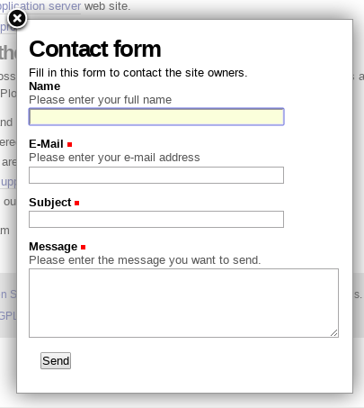

  The Plone Login Form Default.

Other example of Forms generating with ``plone.app.jquerytools`` look like the following:

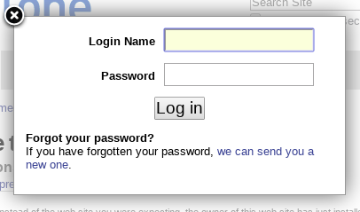

  The Plone Contact Form Default.

.. warning::
    ``plone.app.jquerytools`` uses a jQuery 1.9+ compatible fork of jquerytools, 
    located at: https://github.com/collective/jquerytools

----

.. _jquery-ui-library:

jquery.ui
---------

`jQuery UI`_ is a curated set of user interface interactions, effects, widgets, and themes 
built on top of the :ref:`jQuery <jquery-library>` JavaScript Library. Whether you're 
building highly interactive web applications or you just need to add a date picker to a 
form control, jQuery UI is the perfect choice.

``jQuery UI`` is built for designers and developers alike. We've designed all of our plugins 
to get you up and running quickly while being flexible enough to evolve with your needs 
and solve a plethora of use cases. If you're new to ``jQuery UI``, check out our 
`getting started guide <http://learn.jquery.com/jquery-ui/getting-started/>`_ and 
`other tutorials <http://learn.jquery.com/jquery-ui/>`_. Play around with the 
`demos <https://jqueryui.com/demos/>`_ and read through the 
`API documentation <http://api.jqueryui.com/>`_ to get an idea of what's possible.

.. figure:: ../_static/jquery_ui_logo.png
  :align: center
  :width: 65%
  :alt: jQuery UI Logo

  The ``jQuery UI`` is support into Plone.


**jquery.ui in Plone**

* The integration of :ref:`jquery.ui <jquery-ui-library>` for Plone is supported via the 
  additional add-on called :ref:`collective.js.jqueryui <collective-js-jqueryui>`.

* This is used as a Plone product, adding GenericSetup profiles 
  and control panel, or as a Zope record of resource :ref:`jquery.ui <jquery-ui-library>`.


.. seealso:: Build jQuery UI themes with jQUIT Builder https://jquit.com


----

.. _collective-js-jqueryui:

collective.js.jqueryui
^^^^^^^^^^^^^^^^^^^^^^

The `collective.js.jqueryui`_ package add all :ref:`jquery.ui <jquery-ui-library>` resources 
files to Plone 4 for integrate in your Plone theme.

You can changes to the ``JQueryUI`` settings via control panel with the following steps:

- at the top right corner of the page click on the :guilabel:`Admin` drop down menu 
- choose :guilabel:`Site Setup`
- at the :guilabel:`Add-on Configuration` 
- click on :guilabel:`JQueryUI` section

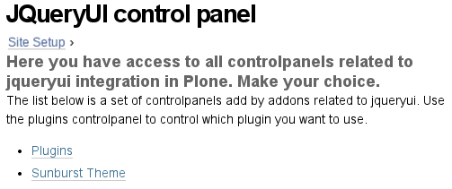

  The ``collective.js.jqueryui`` Controlpanel.

Clicking at the :guilabel:`Plugins` link for enabling the :guilabel:`JQueryUI plugins settings` 
different options, like the following items:

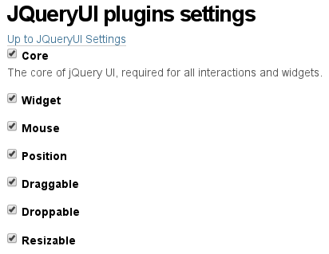

  The ``collective.js.jqueryui`` Plugins Controlpanel.

Clicking at the :guilabel:`Sunburst Theme` link for enabling the :guilabel:`JQueryUI Sunburst CSS settings` 
different options, like the following items:

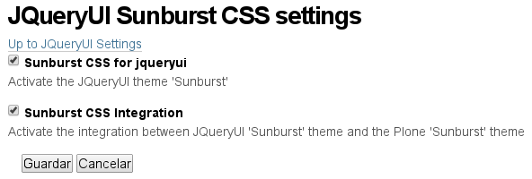

  The ``collective.js.jqueryui`` Sunburst Theme Controlpanel.


----

.. _zettwerk-ui:

zettwerk.ui
^^^^^^^^^^^

The `zettwerk.ui`_ package add :ref:`jquery.ui <jquery-ui-library>` to Plone 4 for easy theme 
customization.

.. note::
    For use :ref:`ThemeRoller <themeroller-webapp>` for :ref:`jquery.ui <jquery-ui-library>` 
    check the official main `Themeroller for jQuery UI`_ documentation.

You can changes to the ``Zettwerk UI`` settings via control panel with the following steps:

- at the top right corner of the page click on the :guilabel:`Admin` drop down menu 
- choose :guilabel:`Site Setup`
- at the :guilabel:`Add-on Configuration` 
- click on :guilabel:`Zettwerk UI` section

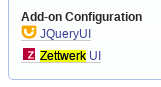

  The ``zettwerk.ui`` Controlpanel.

Control panel
`````````````

Clicking at the :guilabel:`Existing themes` tab for select a theme from the existing ones, 
like the following:

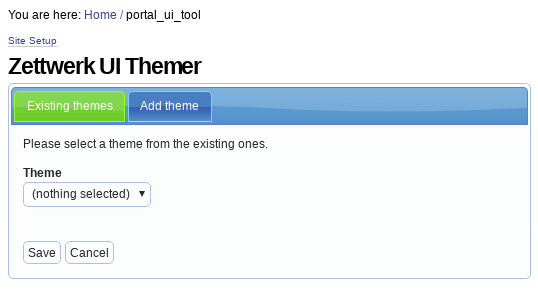

  The ``zettwerk.ui`` Themer.

Clicking at the :guilabel:`Add theme` tab for create a :ref:`ThemeRoller <themeroller-webapp>` 
download directory integration, it is possible, to download and add new themes by hand. There 
are two kind of themes: :ref:`jquery.ui <jquery-ui-library>` Default themes and custom ones.

To include all the default themes follow these steps:

#. Download the zip file from http://jqueryui.com/resources/download/jquery-ui-themes-1.9.2.zip

#. Extract the contents/subfolders of the themes folder to your :ref:`zettwerk.ui <zettwerk-ui>`
   download directory.

#. Reload this page and choose a theme.

To include a custom theme follow these steps:

#. Go to the :ref:`ThemeRoller <themeroller-webapp>` page and create your theme with the 
   ``ThemeRoller`` tool.

#. Click Download theme (in the :ref:`ThemeRoller <themeroller-webapp>` widget)

#. On the next page, choose the legacy version (1.9.2 at the moment)

#. Scroll to the bottom of the page set a folder name which gets the theme name.

#. Click download

#. Extract the folder ``css/$your_theme_name`` to your :ref:`zettwerk.ui <zettwerk-ui>` 
   download directory.

#. Reload this page and choose a theme.

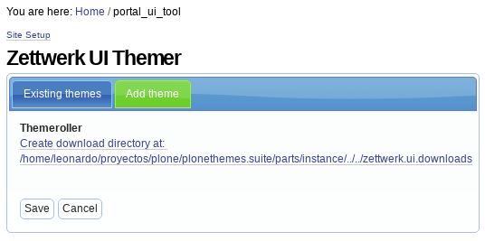

  The ``zettwerk.ui`` ThemeRoller.

A ``zettwerk.ui`` theme applied look like the following theme:

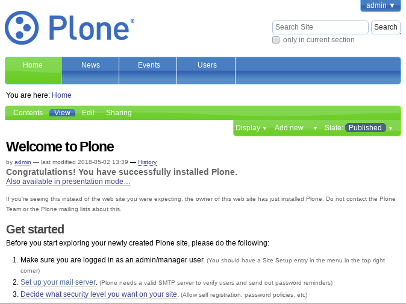

  A ``zettwerk.ui`` theme applied.

.. note:: 
    Optionally :ref:`ThemeRoller <themeroller-webapp>` also supports 
    :ref:`jquery.mobile <jquery-mobile-library>` library.

.. seealso::
    - `Using jQuery UI ThemeRoller <https://learn.jquery.com/jquery-ui/themeroller/>`_.

----

.. _jquery-mobile-library:

jquery.mobile
-------------

The `jQuery Mobile`_ library is a user interface framework based on HTML5 designed to 
make sensitive websites and applications (responsive) to be accessed by all smartphone 
devices, tablet and desktop devices.


  ``jQuery Mobile``, a Touch-Optimized Web Framework

``jQuery Mobile`` framework takes the "write less, do more" mantra to the next level: 
Instead of writing unique applications for each mobile device or OS, the jQuery 
mobile framework allows you to design a single highly-branded responsive web site 
or application that will work on all popular smartphone, tablet, and desktop platforms.

**Theming: Built to be branded**
  ``jQuery Mobile`` believe that your web site or app should feel like your brand, not 
  any particular OS. To make building highly customized themes easy, we've created 
  :ref:`ThemeRoller <themeroller-webapp>` for Mobile to make it easy to drag and drop 
  colours and download a custom theme. For polished visuals without the bloat, we leverage 
  CSS3 properties like text-shadow and box-shadow.

  .. figure:: ../_static/jquerymobile_themeroller_logo.png
    :align: center
    :width: 65%
    :alt: ThemeRoller For jQuery Mobile

    ``ThemeRoller`` For jQuery Mobile

----

.. _zettwerk-mobile:

zettwerk.mobile
^^^^^^^^^^^^^^^

The `zettwerk.mobile`_ package add all :ref:`jquery.mobile <jquery-mobile-library>` resources 
files to Plone 4 for integrate in your Plone theme.

This package have :ref:`ThemeRoller <themeroller-webapp>` support using the 
`ThemeRoller for jQuery Mobile`_, them the *Themes generated* with it are supported via 
additional add-on `zettwerk.mobile`_. It allows to manage the themes from the 
``zettwerk.mobile`` themes control panel.

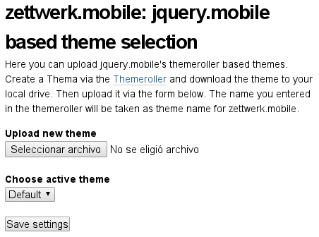

  The ``zettwerk.mobile`` Theme upload Controlpanel.

A ``zettwerk.mobile`` theme applied look like the following theme:

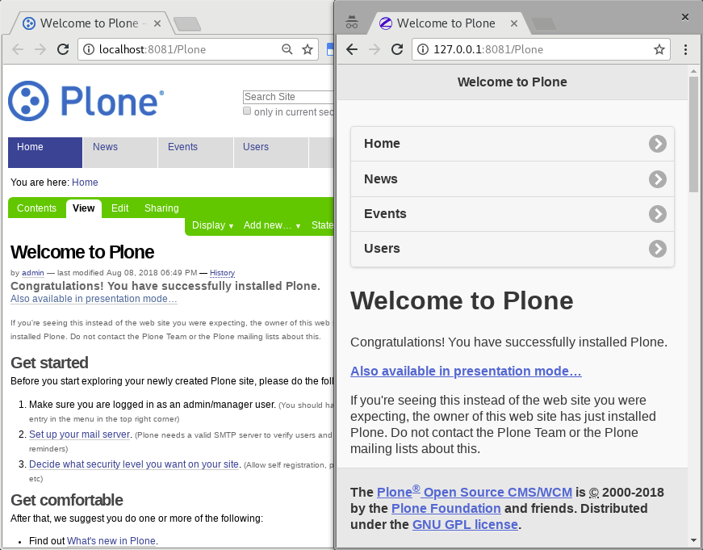

  A ``zettwerk.mobile`` theme applied.


----

.. _themeroller-webapp:

ThemeRoller WebApp
------------------

`Themeroller`_, is a web application that offers an intuitive and pleasant interface 
to design and download custom themes for :ref:`jquery.ui <jquery-ui-library>` and 
:ref:`jquery.mobile <jquery-mobile-library>`.

.. figure:: ../_static/themeroller_logo.png
  :align: center
  :width: 35%
  :alt: ThemeRoller Logo

  ``ThemeRoller`` Logo.

The ``ThemeRoller`` Web application looks like the following:

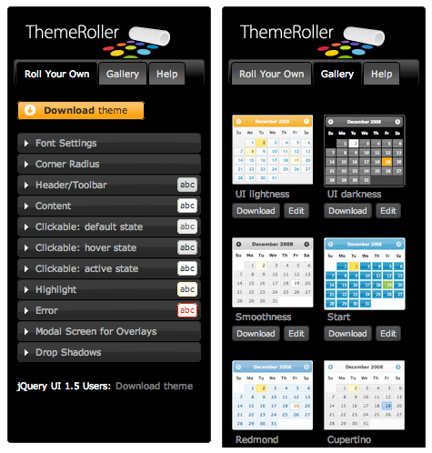

  ``ThemeRoller`` Web application.


.. _`jQuery`: https://jquery.com/
.. _`plone.app.jquery`: https://pypi.org/project/plone.app.jquery
.. _`jQuery Tools`: https://jquerytools.github.io
.. _`plone.app.jquerytools`: https://pypi.org/project/plone.app.jquerytools
.. _`jQuery UI`: https://jqueryui.com/
.. _`collective.js.jqueryui`: https://pypi.org/project/collective.js.jqueryui
.. _`zettwerk.ui`: https://pypi.org/project/zettwerk.ui
.. _`Themeroller for jQuery UI`: https://jqueryui.com/themeroller
.. _`jQuery Mobile`: https://jquerymobile.com/
.. _`ThemeRoller for jQuery Mobile`: https://themeroller.jquerymobile.com/
.. _`zettwerk.mobile`: https://pypi.org/project/zettwerk.mobile
.. _`Themeroller`: https://jqueryui.com/themeroller/
