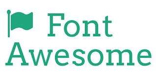
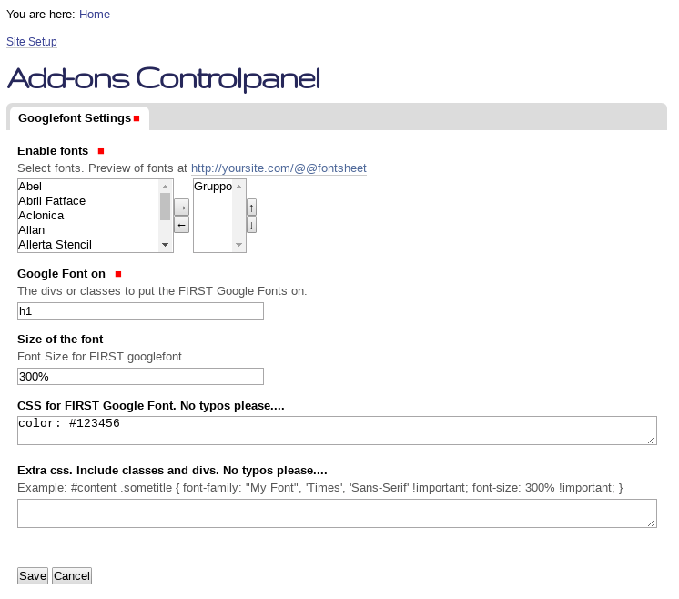
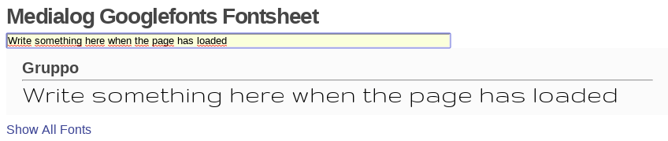
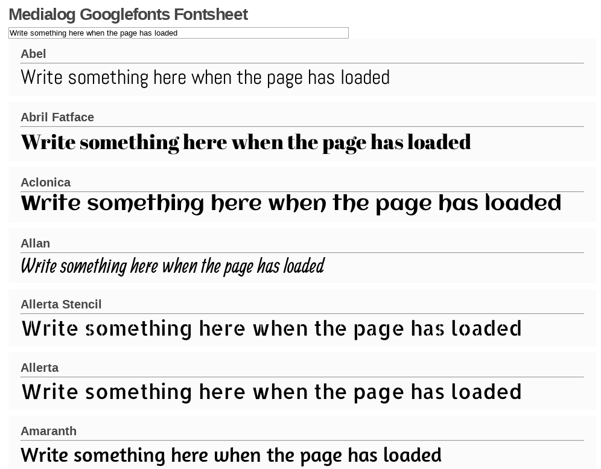
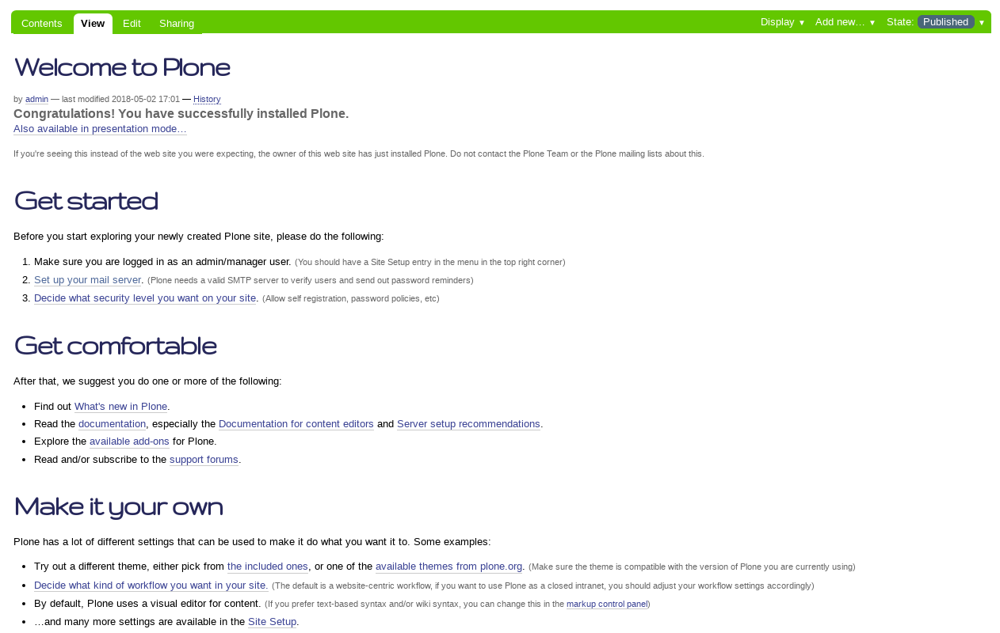

.. _web-font-tools:

Web Fonts tools
===============

The **"Plone theming suite"** includes the following *Web fonts* tools supported:

.. _font-awesome:

Font Awesome
------------

The `collective.fontawesome <https://pypi.org/project/collective.fontawesome>`_ package for 
add `Font Awesome <https://fontawesome.com/>`_ for Plone.

  The Web Font Awesome are support into Plone.

You can access for an example using the ``fontawesome`` resources included at ``collective.fontawesome`` 
add-on at ``@@example.collective.fontawesome`` view and it's look like the following:

.. figure:: ../_static/collective_fontawesome_01.png
  :align: center
  :width: 55%
  :alt: Font Awesome Example View

  Font Awesome Example View.

Replacing Plone's default icons with FontAwesome fonts
^^^^^^^^^^^^^^^^^^^^^^^^^^^^^^^^^^^^^^^^^^^^^^^^^^^^^^

There is now a separate Generic Setup profile called ``replace-plone-icons`` which
will replace Plone's default icons (e.g. for content types and actions) with
Font Awesome icons.

.. warning:: **IMPORTANT:** You still need to install the ``default`` profile as well.

.. figure:: ../_static/collective_fontawesome_00.png
  :align: center
  :width: 55%
  :alt: Replace Plone Icons with Font Awesome

  The ``Replace Plone Icons`` with Font Awesome.

----

.. _google-fonts:

Google Fonts
------------

  The Web Google Fonts are support into Plone.

The `medialog.googlefonts <https://pypi.org/project/medialog.googlefonts>`_ package for 
add `Google Fonts <https://fonts.google.com>`_ for Plone.

  The Google Fonts Configuration

Preview fontsheet selected
^^^^^^^^^^^^^^^^^^^^^^^^^^

You can find a preview of the fontsheet selected here: http://yoursite.com/@@fontsheet

  The Preview fontsheet selected

Preview all fontsheets
^^^^^^^^^^^^^^^^^^^^^^

You can find a preview of all ``Google Fonts`` supported here: http://yoursite.com/@@fontsheet_all

  The Preview all fontsheets

A demo using the ``Google Fonts`` resources included at ``medialog.googlefonts`` add-on look like 
the following ``Document`` page:

  Google Fonts Demo at Plone front-page.
