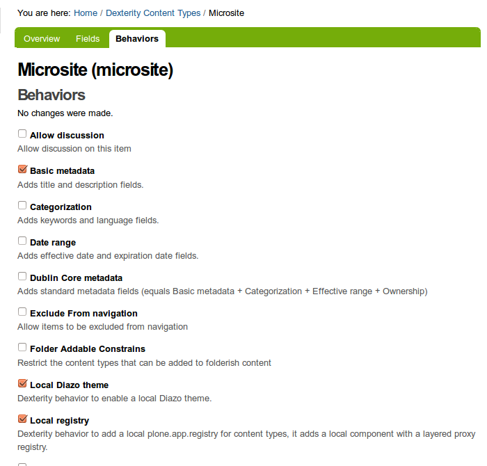
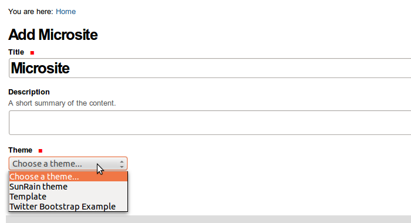
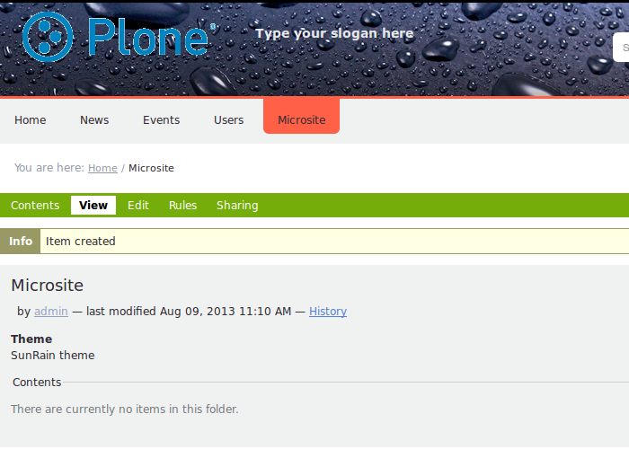
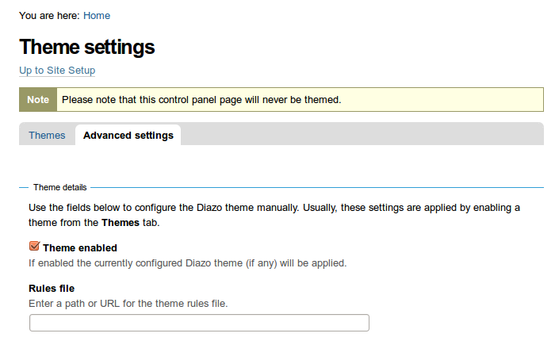
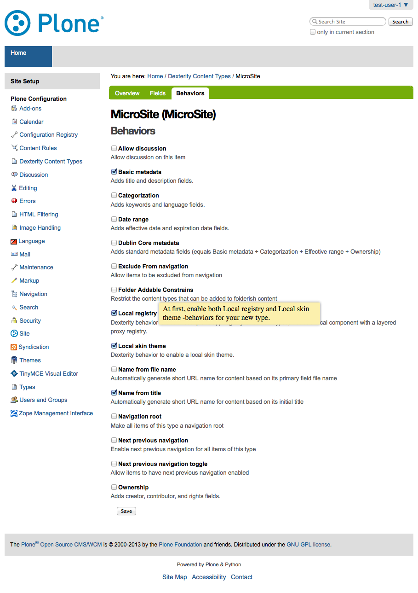
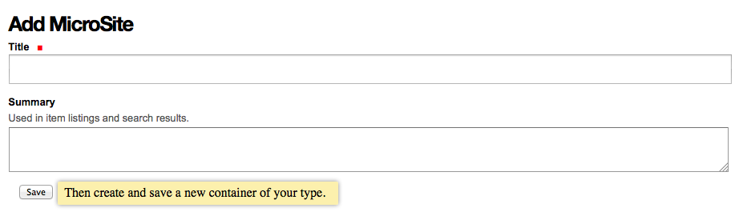
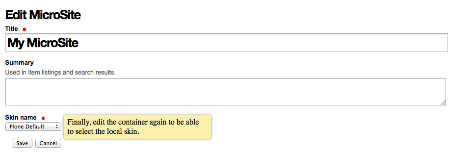
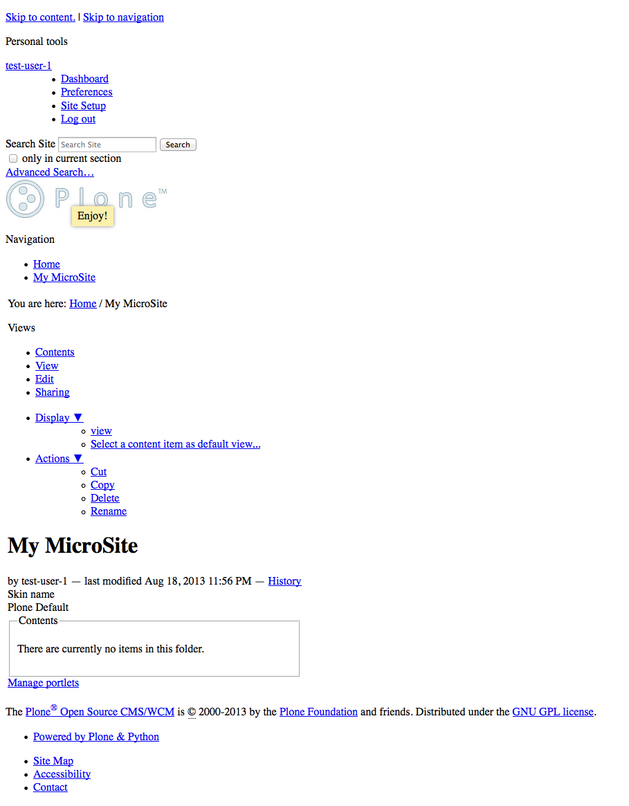

.. _behaviors-themes:

Behaviors Themes
================

The **"Plone theming suite"** includes the following behaviors themes supported:

Local Diazo Theme
-----------------

The `collective.behavior.localdiazo`_ package adds Dexterity behavior to enable a 
local :ref:`Diazo theme <diazo-themes>`. for Plone.

In Plone's control panel go to :guilabel:`Dexterity Content Types`, select your 
content type, go to the :guilabel:`Behaviors` tab and enable the :guilabel:`Local registry` 
and :guilabel:`Local Diazo theme` behaviors.

  Behaviors editor for *collective.behavior.localdiazo*.

Add a new object; you will see a new field called :guilabel:`Theme` and select a 
Diazo theme from the list.

  Adding a Microsite content type.

Now when you access your container you will see the Diazo theme applied to it.

  A local behavior of Diazo theme for Microsite.

If you followed all the instructions and the theme is not applied, make sure Diazo 
theming is enabled on :guilabel:`Theme settings`.

  The theme settings for Microsite.

----

Local Skin Theme
----------------

The `collective.behavior.localskin`_ package adds Dexterity behavior to enable a local 
:ref:`theme skin <plone-theme-skins>` for Plone.

In Plone's control panel go to :guilabel:`Dexterity Content Types`, select your content 
type, go to the :guilabel:`Behaviors` tab and enable the :guilabel:`Local registry` and 
:guilabel:`Local skin theme` behaviors.

  Behaviors editor for *collective.behavior.localskin*.

Add a new object; now when you access your container created.

  Adding a Microsite content type.

Later edit the object created; you will see a new field called :guilabel:`Skin name` and 
select a skin theme from the list.

  Editing a Microsite and select ``Skin name`` theme.

Now when you access your container you will see the Skin theme applied to it.

  A local behavior of Skin theme for Microsite.

.. _`collective.behavior.localdiazo`: https://pypi.org/project/collective.behavior.localdiazo
.. _`collective.behavior.localskin`: https://pypi.org/project/collective.behavior.localskin
