.. _beyondskins-themes:

Beyondskins Themes
------------------

The `Beyondskins themes`_ for Plone are design by `Simples Consultoria`_.

.. _beyondskins-beyondskins:

beyondskins.beyondskins
^^^^^^^^^^^^^^^^^^^^^^^

The `beyondskins.beyondskins <https://github.com/plone-ve/beyondskins.beyondskins>`_ package 
include the following *Technical details*:

- **DOCTYPE HTML:** HTML5
- **Stylesheet:** CSS
- **JS support?:** No
- **Web fonts?:** Unica One :ref:`Google Fonts <google-fonts>`
- **Grid support?:** Yes
- **Responsive?:** Yes
- **CSS framework:** None
- **Supported versions:** Plone 4

A demo using the ``beyondskins.beyondskins`` add-on look like the following:

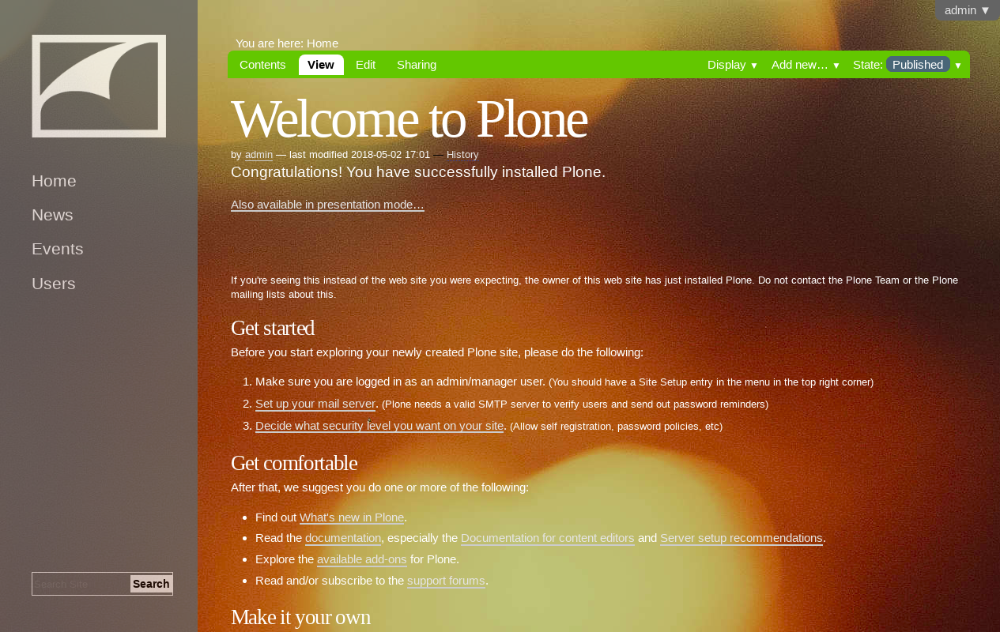

  ``Beyondskins Theme`` Demo at Plone front-page.

----

.. _beyondskins-brasilia:

beyondskins.brasilia
^^^^^^^^^^^^^^^^^^^^

The `beyondskins.brasilia <https://github.com/plone-ve/beyondskins.brasilia>`_ package include 
the following *Technical details*:

- **DOCTYPE HTML:** XHTML 1 Strict
- **Stylesheet:** CSS
- **JS support?:** :ref:`jQuery <jquery-library>`
- **Web fonts?:** No
- **Grid support?:** No
- **Responsive?:** Yes
- **CSS framework:** None
- **Supported versions:** Plone 4

A demo using the ``beyondskins.brasilia`` add-on look like the following:

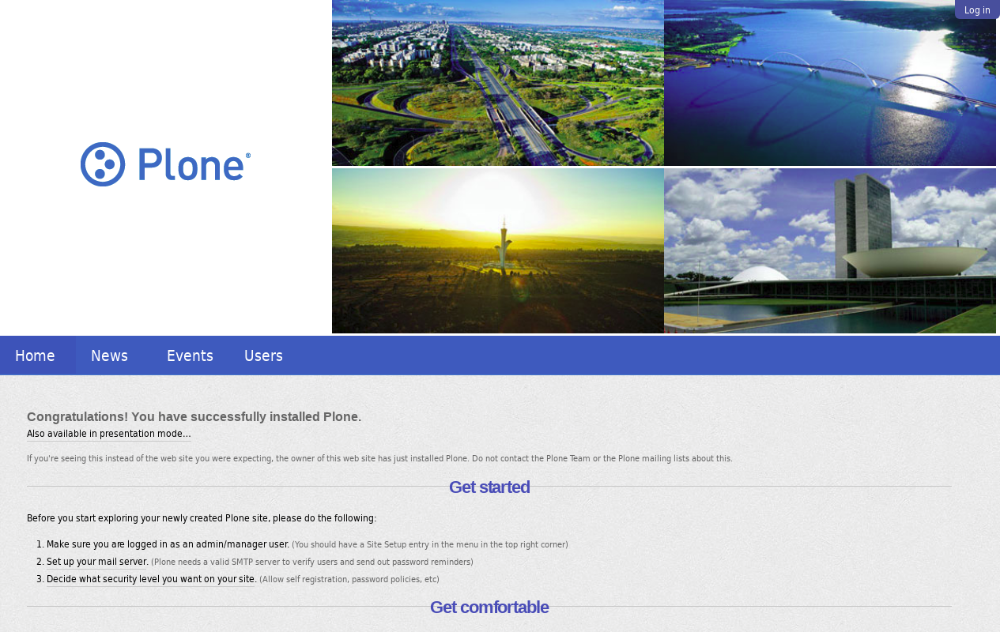

  ``Beyondskins Brasilia`` Theme Demo at Plone front-page.

----

.. _beyondskins-capitulo1:

beyondskins.capitulo1
^^^^^^^^^^^^^^^^^^^^^

The `beyondskins.capitulo1 <https://github.com/plone-ve/beyondskins.capitulo1>`_ package include 
the following *Technical details*:

- **DOCTYPE HTML:** HTML5
- **Stylesheet:** CSS/:ref:`LESS <less>`
- **JS support?:** :ref:`jQuery <jquery-library>`
- **Web fonts?:** Open Sans, Gochi Hand :ref:`Google Fonts <google-fonts>`
- **Grid support?:** Yes
- **Responsive?:** Yes
- **CSS framework:** None
- **Supported versions:** Plone 4

A demo using the ``beyondskins.capitulo1`` add-on look like the following:

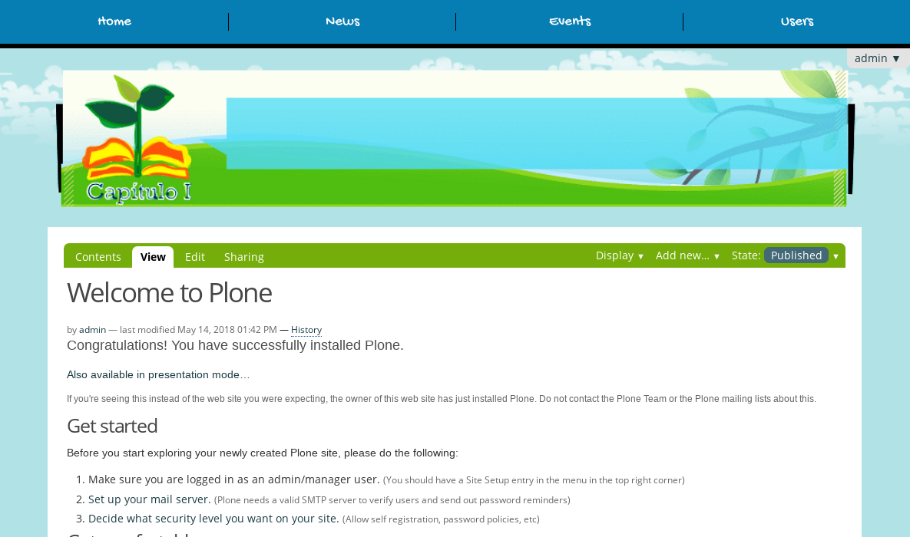

  ``Beyondskins Capitulo I`` Theme Demo at Plone front-page.

----

.. _beyondskins-colors:

beyondskins.colors
^^^^^^^^^^^^^^^^^^

The `beyondskins.colors <https://github.com/plone-ve/beyondskins.colors>`_ package include 
the following *Technical details*:

- **DOCTYPE HTML:** HTML5
- **Stylesheet:** CSS/:ref:`LESS <less>`
- **JS support?:** :ref:`jQuery <jquery-library>`
- **Web fonts?:** :ref:`Font Awesome <font-awesome>` 4.0.3, Open Sans :ref:`Google Fonts <google-fonts>`
- **Grid support?:** Yes
- **Responsive?:** Yes
- **CSS framework:** 
- **Supported versions:** Plone 4

A demo using the ``beyondskins.colors`` add-on look like the following:

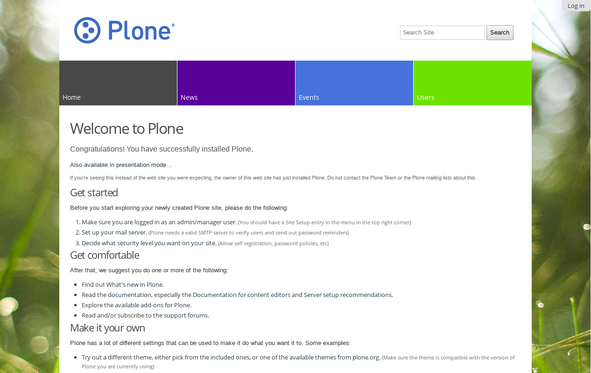

  ``Beyondskins Colors`` Theme Demo at Plone front-page.

----

.. _beyondskins-happy:

beyondskins.happy
^^^^^^^^^^^^^^^^^

The `beyondskins.happy <https://github.com/plone-ve/beyondskins.happy>`_ package include 
the following *Technical details*:

- **DOCTYPE HTML:** HTML5
- **Stylesheet:** CSS/:ref:`LESS <less>`
- **JS support?:** No
- **Web fonts?:** :ref:`Font Awesome <font-awesome>` 4.0.3, Open Sans :ref:`Google Fonts <google-fonts>`
- **Grid support?:** Yes
- **Responsive?:** Yes
- **CSS framework:** None
- **Supported versions:** Plone 4

A demo using the ``beyondskins.happy`` add-on look like the following:

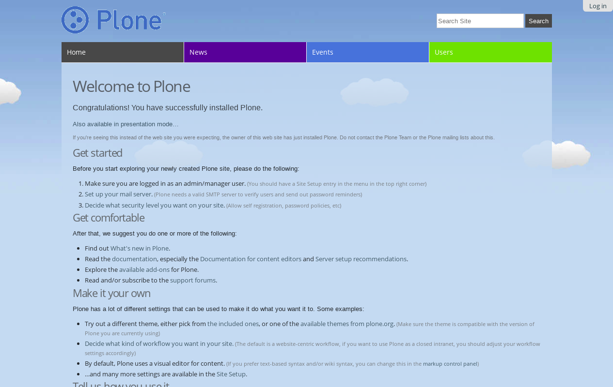

  ``Beyondskins Happy`` Theme Demo at Plone front-page.

----

.. _beyondskins-html5:

beyondskins.html5
^^^^^^^^^^^^^^^^^

The `beyondskins.html5 <https://github.com/plone-ve/beyondskins.html5>`_ package include 
the following *Technical details*:

- **DOCTYPE HTML:** HTML5
- **Stylesheet:** CSS, normalize.css v2.1.2
- **JS support?:** No
- **Web fonts?:** :ref:`Font Awesome <font-awesome>` 3.2.1, Open Sans :ref:`Google Fonts <google-fonts>`
- **Grid support?:** Yes
- **Responsive?:** Yes
- **CSS framework:** None
- **Supported versions:** Plone 4

A demo using the ``beyondskins.html5`` add-on look like the following:

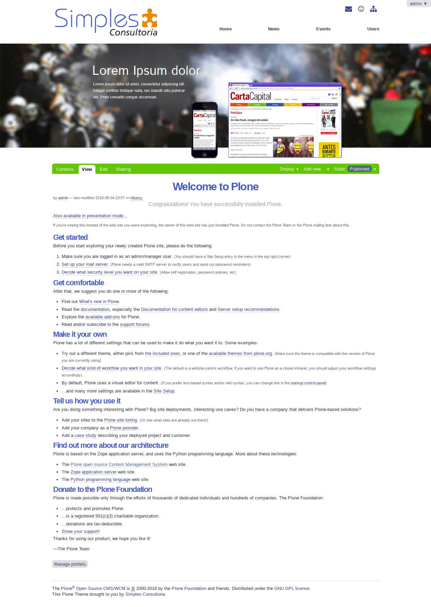

  ``Beyondskins Html5`` Theme Demo at Plone front-page.

----

.. _beyondskins-item6:

beyondskins.item6
^^^^^^^^^^^^^^^^^

The `beyondskins.item6 <https://github.com/plone-ve/beyondskins.item6>`_ package include 
the following *Technical details*:

- **DOCTYPE HTML:** HTML5
- **Stylesheet:** CSS/:ref:`LESS <less>`
- **JS support?:** :ref:`jQuery <jquery-library>` Cycle2
- **Web fonts?:** :ref:`Font Awesome <font-awesome>` 4.0.3, Unica One :ref:`Google Fonts <google-fonts>`
- **Grid support?:** Yes
- **Responsive?:** Yes
- **CSS framework:** None
- **Supported versions:** Plone 4

A demo using the ``beyondskins.item6`` add-on look like the following:

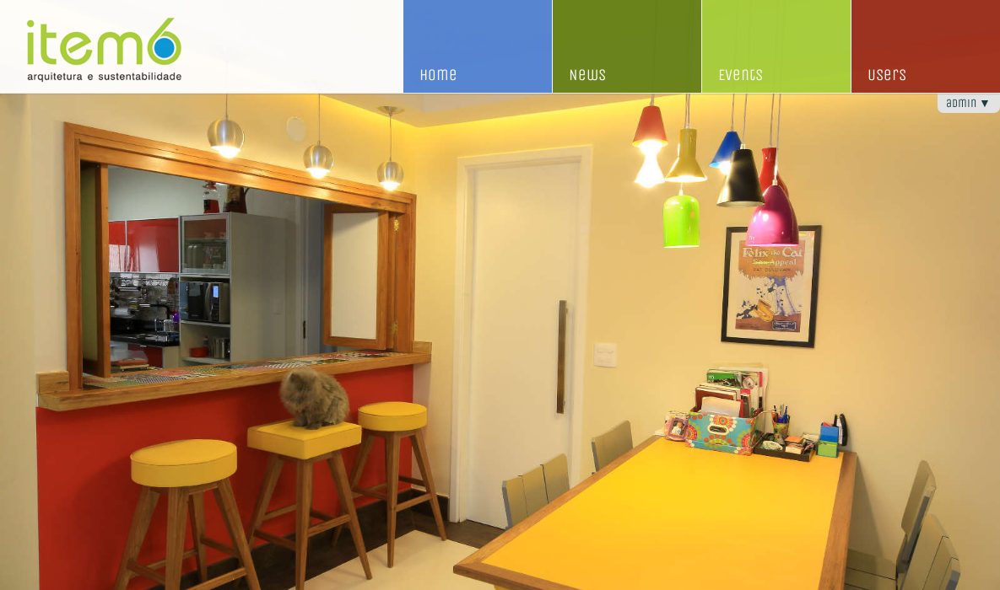

  ``Beyondskins item6`` Theme Demo at Plone front-page.

----

.. _beyondskins-lostkatana:

beyondskins.lostkatana
^^^^^^^^^^^^^^^^^^^^^^

The `beyondskins.lostkatana <https://github.com/plone-ve/beyondskins.lostkatana>`_ package 
include the following *Technical details*:

- **DOCTYPE HTML:** XHTML 1.0 Strict
- **Stylesheet:** CSS
- **JS support?:** :ref:`jQuery <jquery-library>`
- **Web fonts?:** No
- **Grid support?:** Yes
- **Responsive?:** Yes
- **CSS framework:** None
- **Supported versions:** Plone 4

A demo using the ``beyondskins.lostkatana`` add-on look like the following:

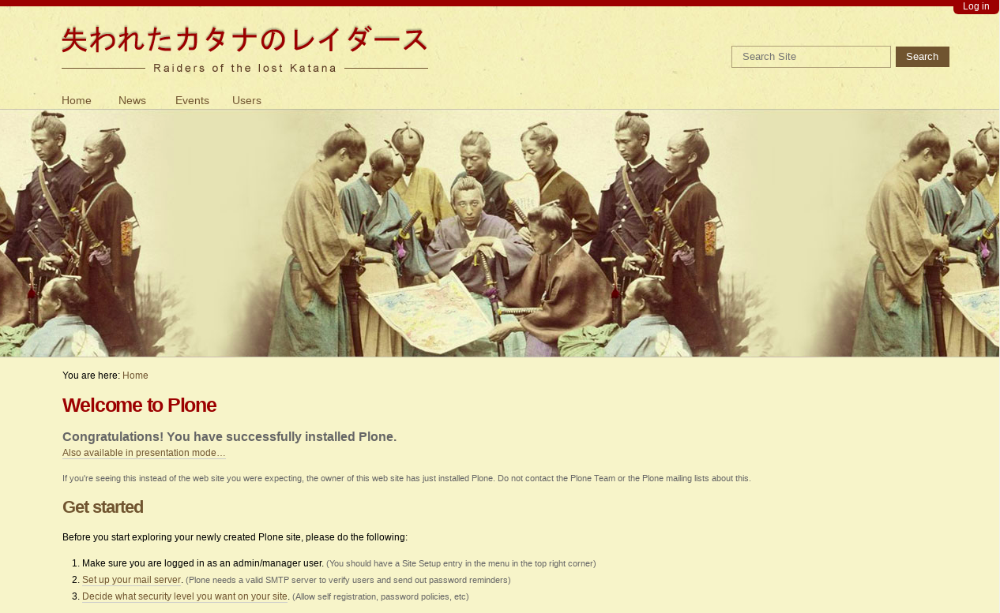

  ``Beyondskins "Raiders of the lost Katana"`` Theme Demo at Plone front-page.

----

.. _beyondskins-minimalist:

beyondskins.minimalist
^^^^^^^^^^^^^^^^^^^^^^

The `beyondskins.minimalist <https://github.com/plone-ve/beyondskins.minimalist>`_ package 
include the following *Technical details*:

- **DOCTYPE HTML:** HTML5
- **Stylesheet:** CSS/:ref:`LESS <less>`
- **JS support?:** No
- **Web fonts?:** :ref:`Font Awesome <font-awesome>` 4.0.3, Open Sans :ref:`Google Fonts <google-fonts>`
- **Grid support?:** Yes
- **Responsive?:** Yes
- **CSS framework:** None
- **Supported versions:** Plone 4

A demo using the ``beyondskins.minimalist`` add-on look like the following:

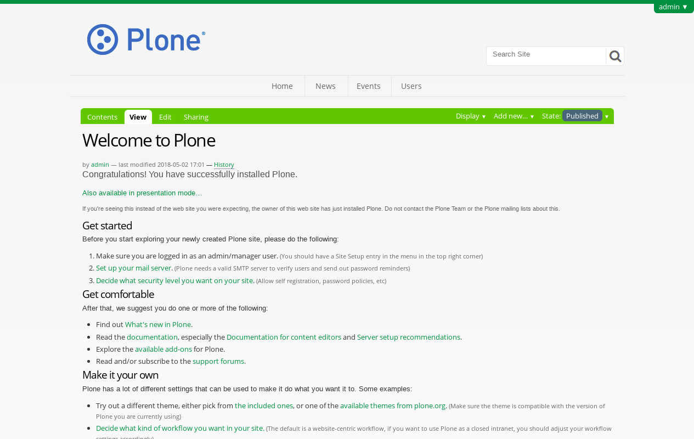

  ``Beyondskins Minimalist`` Theme Demo at Plone front-page.

----

.. _beyondskins-pb9-site:

beyondskins.pb9.site
^^^^^^^^^^^^^^^^^^^^

The `beyondskins.pb9.site <https://github.com/plone-ve/beyondskins.pb9.site>`_ package 
include the following *Technical details*:

- **DOCTYPE HTML:** XHTML 1.0 Strict
- **Stylesheet:** CSS
- **JS support?:** No
- **Web fonts?:** No
- **Grid support?:** No
- **Responsive?:** No
- **CSS framework:** None
- **Supported versions:** Plone 4

A demo using the ``beyondskins.pb9.site`` add-on look like the following:

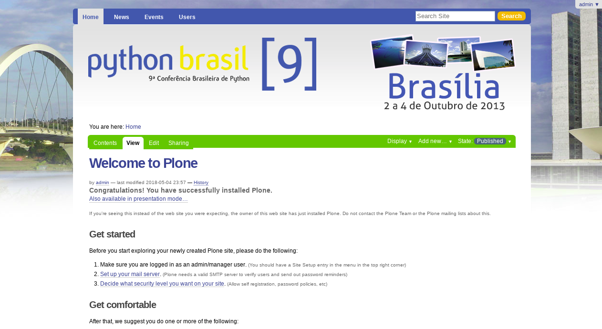

  ``Beyondskins PythonBrasil 9`` Theme Demo at Plone front-page.

----

.. _beyondskins-phantasmagoria:

beyondskins.phantasmagoria
^^^^^^^^^^^^^^^^^^^^^^^^^^

The `beyondskins.phantasmagoria <https://github.com/plone-ve/beyondskins.phantasmagoria>`_ 
package include the following *Technical details*:

- **DOCTYPE HTML:** HTML5
- **Stylesheet:** CSS/:ref:`LESS <less>`
- **JS support?:** :ref:`jQuery <jquery-library>`
- **Web fonts?:** :ref:`Font Awesome <font-awesome>` 4.0.3, Open Sans and Special Elite :ref:`Google Fonts <google-fonts>`
- **Grid support?:** Yes
- **Responsive?:** Yes
- **CSS framework:** None
- **Supported versions:** Plone 4

A demo using the ``beyondskins.phantasmagoria`` add-on look like the following:

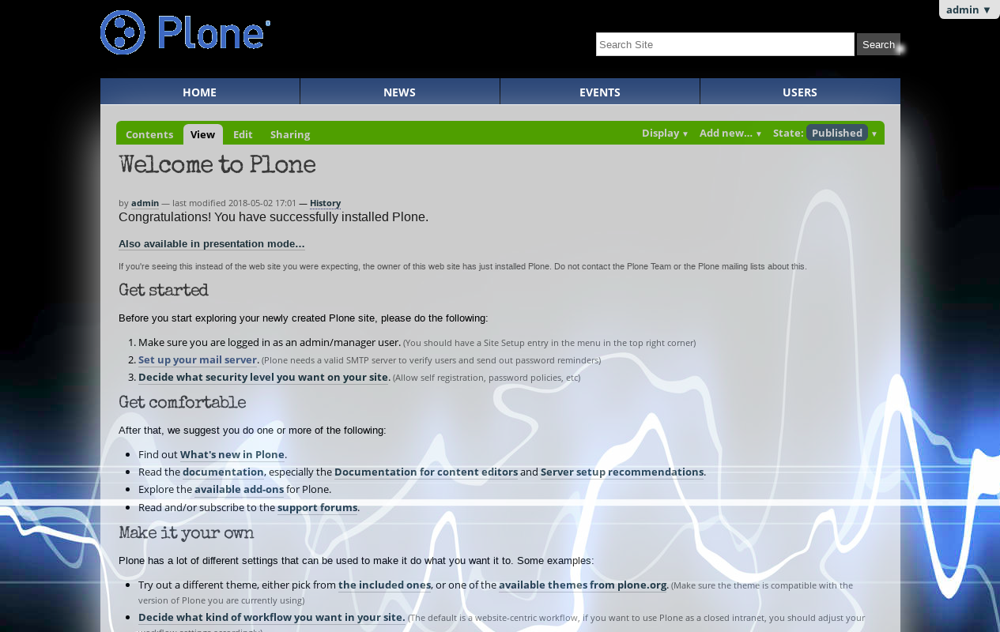

  ``Beyondskins Phantasmagoria`` Theme Demo at Plone front-page.

----

.. _beyondskins-plaza:

beyondskins.plaza
^^^^^^^^^^^^^^^^^

The `beyondskins.plaza <https://github.com/plone-ve/beyondskins.plaza>`_ package 
package include the following *Technical details*:

- **DOCTYPE HTML:** HTML5
- **Stylesheet:** CSS/:ref:`LESS <less>`
- **JS support?:** :ref:`jQuery <jquery-library>` Cycle 2
- **Web fonts?:** :ref:`Font Awesome <font-awesome>` 4.0.3, Unica One :ref:`Google Fonts <google-fonts>`
- **Grid support?:** Yes
- **Responsive?:** Yes
- **CSS framework:** None
- **Supported versions:** Plone 4

A demo using the ``beyondskins.plaza`` add-on look like the following:

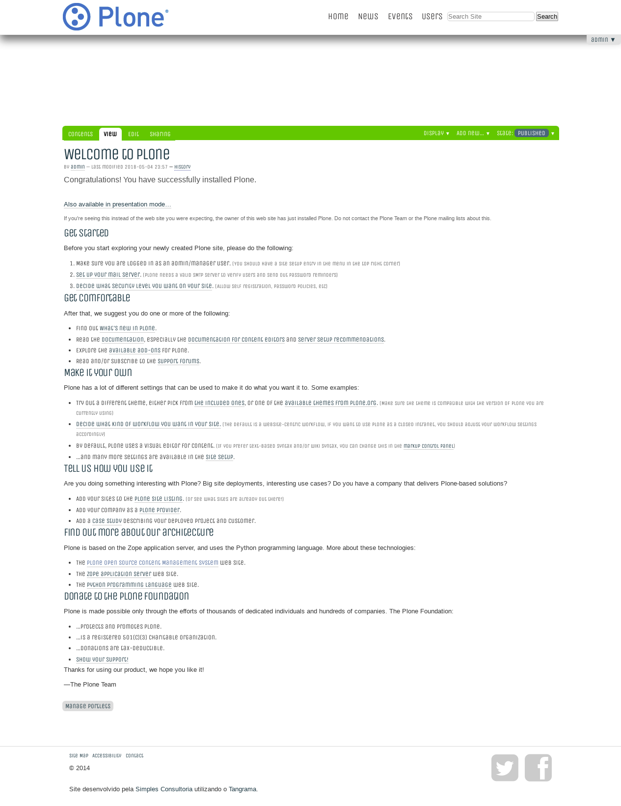

  ``Beyondskins Plaza`` Theme Demo at Plone front-page.

----

.. _beyondskins-plonesymposium-site:

beyondskins.plonesymposium.site
^^^^^^^^^^^^^^^^^^^^^^^^^^^^^^^

The `beyondskins.plonesymposium.site <https://github.com/plone-ve/beyondskins.plonesymposium.site>`_ package include the following *Technical details*:

- **DOCTYPE HTML:** XHTML 1.0 Strict
- **Stylesheet:** CSS
- **JS support?:** :ref:`jQuery <jquery-library>`
- **Web fonts?:** No
- **Grid support?:** No
- **Responsive?:** Yes
- **CSS framework:** None
- **Supported versions:** Plone 4

A demo using the ``beyondskins.plonesymposium.site`` add-on look like the following:

.. figure:: ../../_static/beyondskins_plonesymposium_site.png
  :align: center
  :width: 55%
  :alt: Beyondskins Plone Symposium South America 2012 Theme

  ``Beyondskins Plone Symposium South America 2012`` Theme Demo at Plone front-page.

----

.. _beyondskins-responsive:

beyondskins.responsive
^^^^^^^^^^^^^^^^^^^^^^

The `beyondskins.responsive <https://github.com/plone-ve/beyondskins.responsive>`_ package include the following *Technical details*:

- **DOCTYPE HTML:** XHTML 1.0 Strict
- **Stylesheet:** CSS
- **JS support?:** :ref:`jQuery <jquery-library>`
- **Web fonts?:** No
- **Grid support?:** No
- **Responsive?:** Yes
- **CSS framework:** None
- **Supported versions:** Plone 4

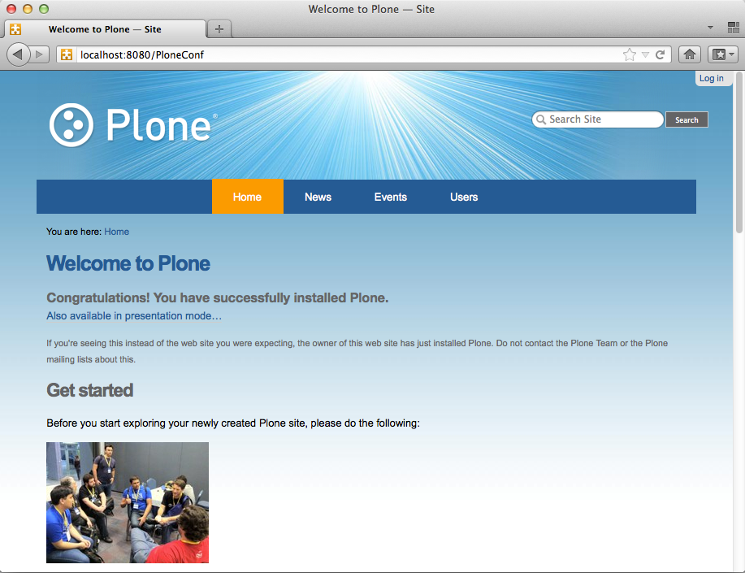

  ``Beyondskins Responsive`` Theme.

A demo using the ``Beyondskins Responsive Theme`` add-on as a reduced view for Mobile device 
look like the following:

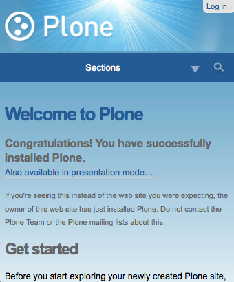

  ``Beyondskins Responsive`` theme Demo at Mobile device.

A demo using the ``Beyondskins Responsive Theme`` add-on as a reduced view for Tablet device 
look like the following:

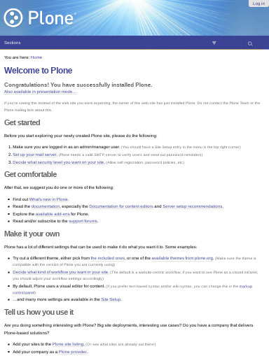

  ``Beyondskins Responsive`` theme Demo at Tablet device.

A demo using the ``Beyondskins Responsive Theme`` add-on as a reduced view for Laptop device 
look like the following:

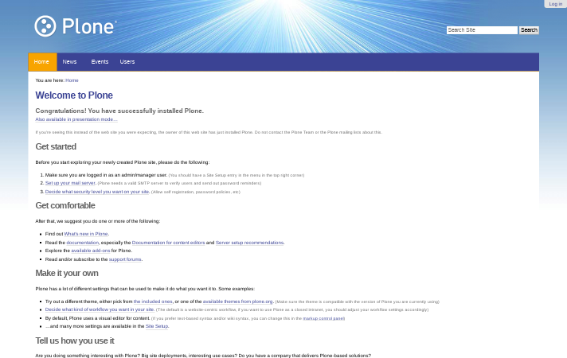

  ``Beyondskins Responsive`` theme Demo Laptop device.

----

.. _beyondskins-s17:

beyondskins.s17
^^^^^^^^^^^^^^^

The `beyondskins.s17 <https://github.com/plone-ve/beyondskins.s17>`_ package include the following *Technical details*:

- **DOCTYPE HTML:** HTML5
- **Stylesheet:** CSS
- **JS support?:** :ref:`jQuery <jquery-library>`
- **Web fonts?:** :ref:`Font Awesome <font-awesome>` 4.0.3, Open Sans :ref:`Google Fonts <google-fonts>`
- **Grid support?:** Yes
- **Responsive?:** Yes
- **CSS framework:** None
- **Supported versions:** Plone 4

A demo using the ``beyondskins.s17`` add-on look like the following:

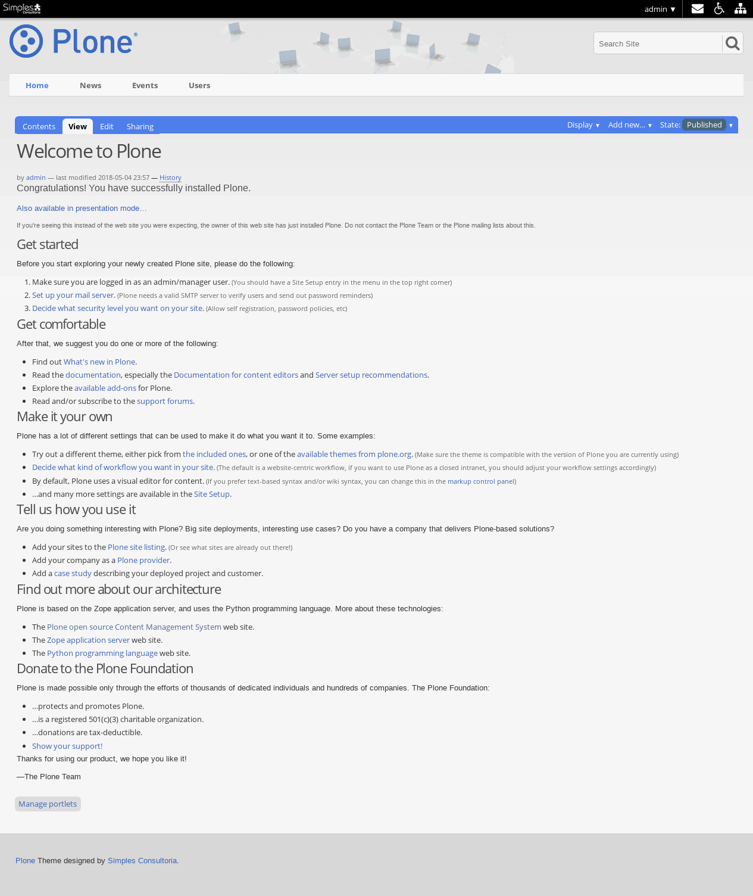

  ``Beyondskins s17`` Theme Demo at Plone front-page.

----

.. _beyondskins-sports:

beyondskins.sports
^^^^^^^^^^^^^^^^^^

The `beyondskins.sports <https://github.com/plone-ve/beyondskins.sports>`_ package include the following *Technical details*:

- **DOCTYPE HTML:** HTML5
- **Stylesheet:** CSS
- **JS support?:** :ref:`jQuery <jquery-library>`
- **Web fonts?:** :ref:`Font Awesome <font-awesome>` 4.0.3, Open Sans :ref:`Google Fonts <google-fonts>`
- **Grid support?:** Yes
- **Responsive?:** No
- **CSS framework:** None
- **Supported versions:** Plone 4

A demo using the ``beyondskins.sports`` add-on look like the following:

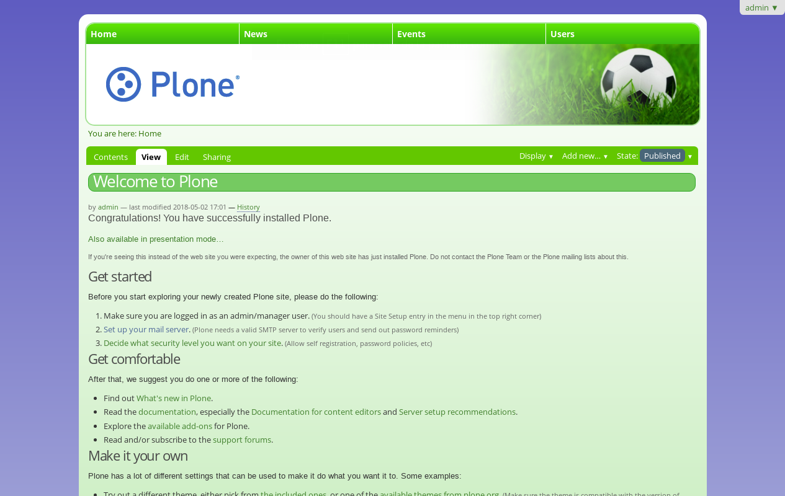

  ``Beyondskins Sports`` Theme Demo at Plone front-page.

----

.. _beyondskins-sunflower:

beyondskins.sunflower
^^^^^^^^^^^^^^^^^^^^^

The `beyondskins.sunflower <https://github.com/plone-ve/beyondskins.sunflower>`_ package include the following *Technical details*:

- **DOCTYPE HTML:** HTML5
- **Stylesheet:** CSS
- **JS support?:** No
- **Web fonts?:** :ref:`Font Awesome <font-awesome>` 4.0.3, Unica One :ref:`Google Fonts <google-fonts>`
- **Grid support?:** Yes
- **Responsive?:** Yes
- **CSS framework:** None
- **Supported versions:** Plone 4

A demo using the ``beyondskins.sunflower`` add-on look like the following:

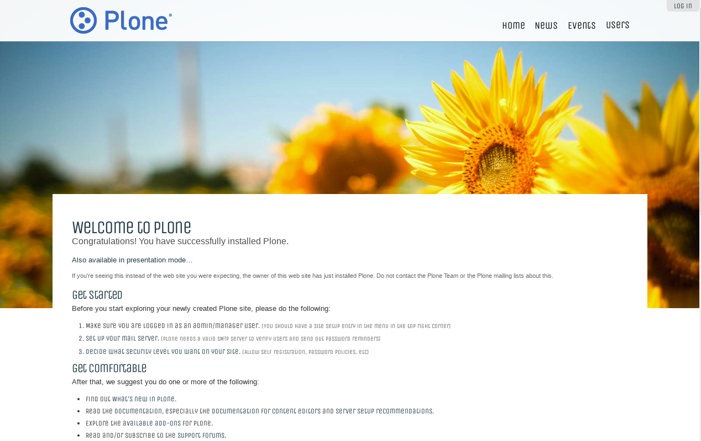

  ``Beyondskins Sunflower`` Theme Demo at Plone front-page.

----

.. _beyondskins-twentythirteen:

beyondskins.twentythirteen
^^^^^^^^^^^^^^^^^^^^^^^^^^

The `beyondskins.twentythirteen <https://github.com/plone-ve/beyondskins.twentythirteen>`_ package include the following *Technical details*:

- **DOCTYPE HTML:** HTML5
- **Stylesheet:** CSS
- **JS support?:** HTML5
- **Web fonts?:** Genericons by `Font Squirrel <http://www.fontsquirrel.com>`_.
- **Grid support?:** No
- **Responsive?:** Yes
- **CSS framework:** None
- **Supported versions:** Plone 4

A demo using the ``beyondskins.twentythirteen`` add-on look like the following:

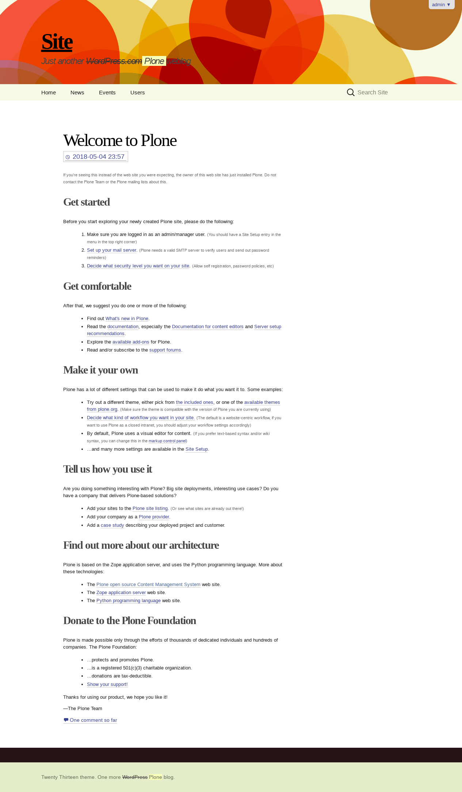

  ``Beyondskins Twenty Thirteen`` Theme Demo at Plone front-page.

.. note::

    **Twenty Thirteen** is a Plone integration of `Twenty Thirteen Wordpress Theme`_.

.. _`Beyondskins themes`: https://github.com/search?q=beyondskins&ref=opensearch
.. _`Simples Consultoria`: http://www.simplesconsultoria.com.br/
.. _`Twenty Thirteen Wordpress Theme`: https://wordpress.com/theme/twenty-thirteen
