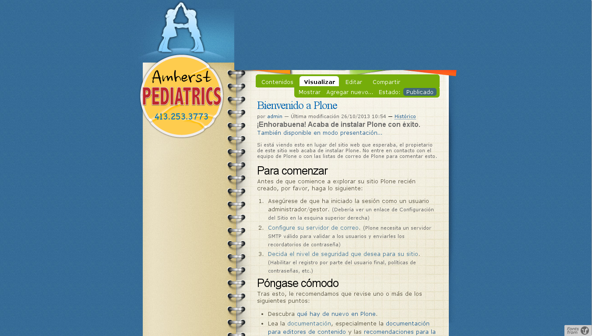
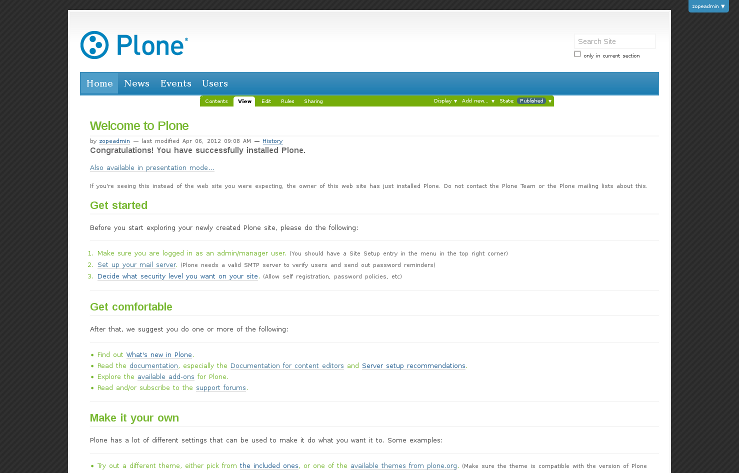
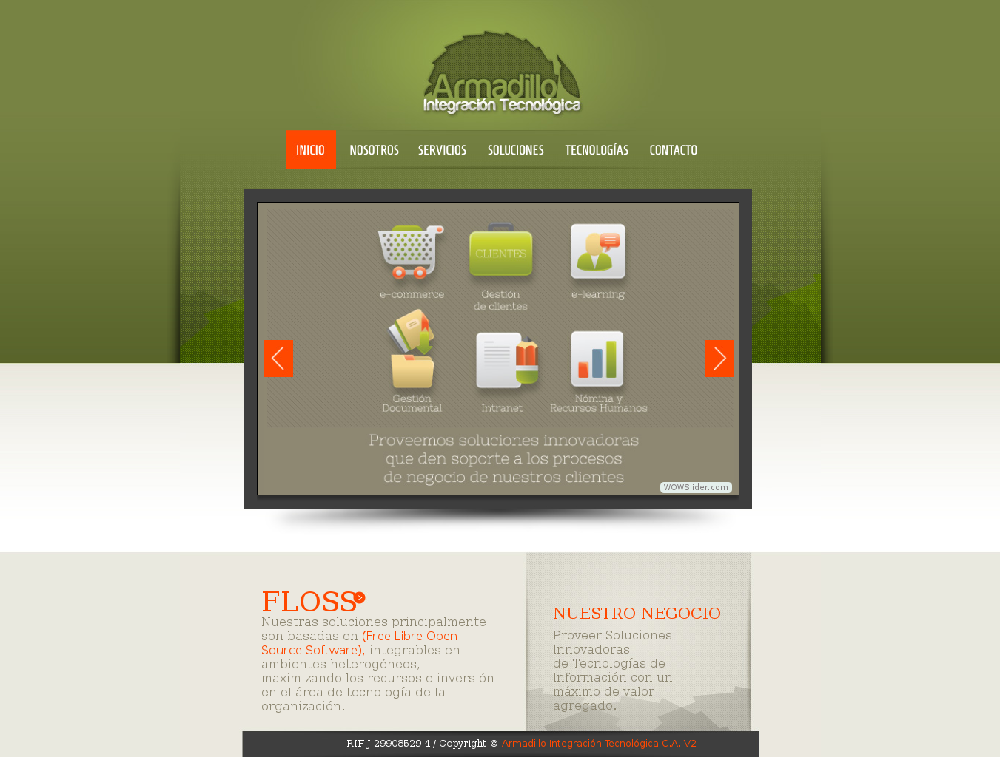
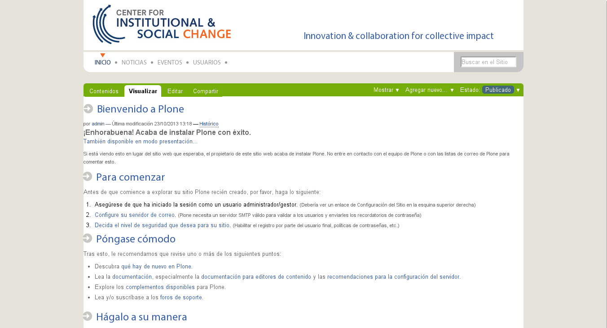
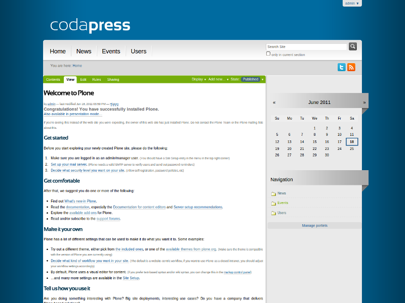
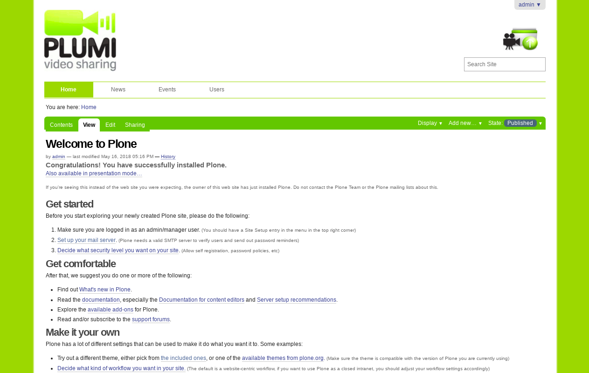
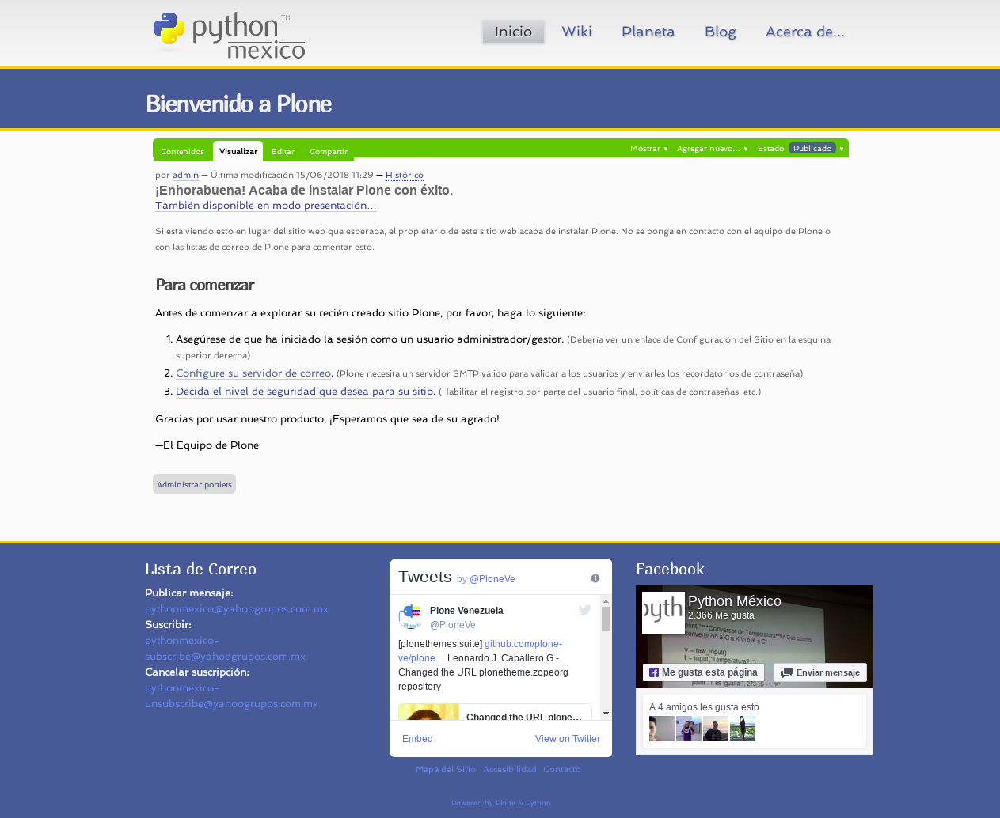
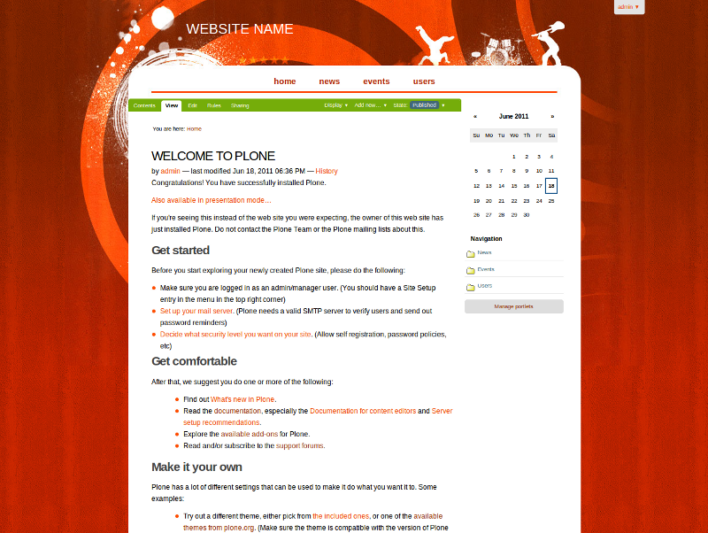
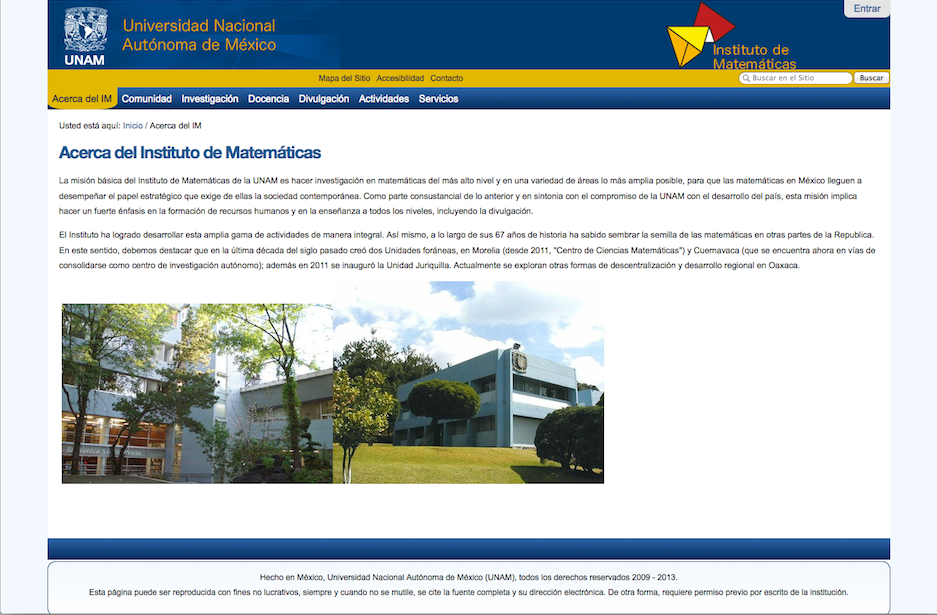
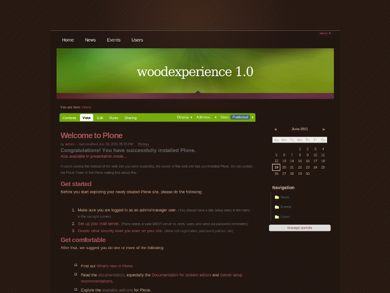

.. _custom-themes:

Others custom themes
--------------------

There are some *others custom themes* available in the following list:

plonetheme.amherst
^^^^^^^^^^^^^^^^^^

The `plonetheme.amherst <https://github.com/collective/plonetheme.amherst>`_ package include 
the following *Technical details*:

- **DOCTYPE HTML:** XHTML 1.0 Transitional
- **Stylesheet:** CSS
- **JS support?:** :ref:`jQuery <jquery-library>`
- **Web fonts?:** No
- **Grid support?:** No
- **Responsive?:** No
- **CSS framework:** None
- **Supported versions:** Plone 4

A demo using the ``plonetheme.amherst`` add-on look like the following:

  ``plonetheme.amherst`` add-on theme Demo at Plone front-page.

----

plonetheme.aqueouslight
^^^^^^^^^^^^^^^^^^^^^^^

The `plonetheme.aqueouslight <https://github.com/collective/plonetheme.aqueouslight>`_ package 
include the following *Technical details*:

- **DOCTYPE HTML:** XHTML 1.0 Transitional
- **Stylesheet:** CSS
- **JS support?:** No
- **Web fonts?:** No
- **Grid support?:** No
- **Responsive?:** No
- **CSS framework:** None
- **Supported versions:** Plone 4

A demo using the ``plonetheme.aqueouslight`` add-on look like the following:

  ``plonetheme.aqueouslight`` add-on theme Demo at Plone front-page.

.. note::
    **Aqueous**, a liquid template created by `Six Shooter Media <http://www,sixshootermedia.com>`_.

.. warning::
    The template itself is designed for higher resolutions, *1024x768* and up, however with it 
    being liquid, it will work in any resolution you can throw at it. It's written in XHTML 
    and CSS and displays consistently on various web browsers.

----

plonetheme.armadillotec
^^^^^^^^^^^^^^^^^^^^^^^

The `plonetheme.armadillotec <https://github.com/macagua/plonetheme.armadillotec>`_ package 
include the following *Technical details*:

- **DOCTYPE HTML:** XHTML 1.0 Transitional
- **Stylesheet:** CSS
- **JS support?:** :ref:`jQuery <jquery-library>`
- **Web fonts?:** Homenaje, Pontano Sans, Nixie One :ref:`Google Fonts <google-fonts>`
- **Grid support?:** No
- **Responsive?:** No
- **CSS framework:** None
- **Supported versions:** Plone 4

A demo using the ``plonetheme.armadillotec`` add-on look like the following:

  ``plonetheme.armadillotec`` add-on theme Demo at Plone front-page.

----

plonetheme.changecenter
^^^^^^^^^^^^^^^^^^^^^^^

The `plonetheme.changecenter <https://github.com/collective/plonetheme.changecenter>`_ package 
include the following *Technical details*:

- **DOCTYPE HTML:** XHTML 1.0 Strict
- **Stylesheet:** CSS
- **JS support?:** Yes
- **Web fonts?:** No
- **Grid support?:** No
- **Responsive?:** No
- **CSS framework:** None
- **Supported versions:** Plone 4

A demo using the ``plonetheme.changecenter`` add-on look like the following:

  ``plonetheme.changecenter`` add-on theme Demo at Plone front-page.

.. note::
    This is a `Plone`_ Theme was developed for the 
    `The Center for Institutional and Social Change <http://www.changecenter.org/>`_ website.

----

plonetheme.codapress
^^^^^^^^^^^^^^^^^^^^

The `plonetheme.codapress <https://github.com/collective/plonetheme.codapress>`_ package 
include the following *Technical details*:

- **DOCTYPE HTML:** XHTML 1.0 Strict
- **Stylesheet:** CSS
- **JS support?:** Yes
- **Web fonts?:** Gloria Hallelujah and Roboto :ref:`Google Fonts <google-fonts>`
- **Grid support?:** No
- **Responsive?:** No
- **CSS framework:** `TemplatesDock`_.
- **Supported versions:** Plone 4

A demo using the ``plonetheme.codapress`` add-on look like the following:

  ``plonetheme.codapress`` add-on theme Demo at Plone front-page.

.. note::
    **CodaPress** is a free template from `TemplatesDock`_ released for free under a 
    `Creative Commons Attribution 3.0 License`_

----

..
  plonetheme.gestured
  ^^^^^^^^^^^^^^^^^^^

  The `plonetheme.gestured <https://github.com/dante1987/plonetheme.gestured>`_ package include 
  the following *Technical details*:

  .. todo::
      TODO a screenshot for this section

----

plonetheme.plumigreen
^^^^^^^^^^^^^^^^^^^^^

The `plonetheme.plumigreen <https://github.com/garbas/plonetheme.plumigreen>`_ package 
include the following *Technical details*:

- **DOCTYPE HTML:** XHTML 1.0 Strict
- **Stylesheet:** CSS
- **JS support?:** :ref:`jQuery <jquery-library>`
- **Web fonts?:** No
- **Grid support?:** Yes
- **Responsive?:** Yes
- **CSS framework:** `HTML5 Boilerplate`_
- **Supported versions:** Plone 4

A demo using the ``plonetheme.plumigreen`` add-on look like the following:

  ``plonetheme.plumigreen`` add-on theme Demo at Plone front-page.

.. note::
    This Plone theme, is an installable `Diazo`_ theme for `Plone`_ 4. This intents 
    to be similar to `plumi.skin`_ package in *Plone 4*. Its ment to be its replacement.

----

plonetheme.pythonmexico
^^^^^^^^^^^^^^^^^^^^^^^

The `plonetheme.pythonmexico <https://github.com/PythonMexico/plonetheme.pythonmexico>`_ package include the following *Technical details*:

- **DOCTYPE HTML:** HTML5
- **Stylesheet:** CSS
- **JS support?:** :ref:`jQuery <jquery-library>`
- **Web fonts?:** Marmelad and Spinnaker :ref:`Google Fonts <google-fonts>`
- **Grid support?:** No
- **Responsive?:** No
- **CSS framework:** None.
- **Supported versions:** Plone 4

  ``plonetheme.pythonmexico`` add-on theme Demo at Plone front-page.

.. note::
    This is a `Plone`_ Theme was developed by `Erik Rivera <http://rivera.pro>`_ and 
    `Noe Nieto <http://noenieto.com>`_ for the `Python Mexico <http://python.org.mx>`_ 
    community website.

----

plonetheme.redmusic
^^^^^^^^^^^^^^^^^^^

The `plonetheme.redmusic <https://github.com/giacomos/plonetheme.redmusic>`_ package 
include the following *Technical details*:

- **DOCTYPE HTML:** XHTML 1.0 Transitional
- **Stylesheet:** CSS
- **JS support?:** No
- **Web fonts?:** No
- **Grid support?:** No
- **Responsive?:** No
- **CSS framework:** `Reality Software <http://www.realitysoftware.ca>`_.
- **Supported versions:** Plone 4

A demo using the ``plonetheme.redmusic`` add-on look like the following:

  ``plonetheme.redmusic`` add-on theme Demo at Plone front-page.

.. note::
    **Redmusic** is a free template released under the 
    `Creative Commons Attribution 3.0 License`_ 

----

plonetheme.unam
^^^^^^^^^^^^^^^

The `plonetheme.unam <https://github.com/imatem/plonetheme.unam>`_ package include 
the following *Technical details*:

- **DOCTYPE HTML:** XHTML 1.0 Strict
- **Stylesheet:** CSS
- **JS support?:** :ref:`jQuery <jquery-library>`
- **Web fonts?:** No
- **Grid support?:** No
- **Responsive?:** Yes
- **CSS framework:** :ref:`beyondskins.responsive <beyondskins-responsive>` and 
  Design taken from `Recursos Web, UNAM <http://recursosweb.unam.mx/recursos-web/lineamientos-unam/estructurales/plantilla-sugerida/>`_.
- **Supported versions:** Plone 4

A demo using the ``plonetheme.unam`` add-on look like the following:

  ``plonetheme.unam`` add-on theme Demo at Plone front-page.

.. note::
    This is a `Plone`_ Theme was developed by `Universidad Nacional Autónoma de México, UNAM <http://www.unam.mx>`_.

----

plonetheme.woodexperience
^^^^^^^^^^^^^^^^^^^^^^^^^

The `plonetheme.woodexperience <https://github.com/redomino/plonetheme.woodexperience>`_ package 
include the following *Technical details*:

- **DOCTYPE HTML:** XHTML 1.0 Strict
- **Stylesheet:** CSS
- **JS support?:** Yes
- **Web fonts?:** No
- **Grid support?:** No
- **Responsive?:** No
- **CSS framework:** None.
- **Supported versions:** Plone 4

A demo using the ``plonetheme.woodexperience`` add-on look like the following:

  ``plonetheme.woodexperience`` add-on theme Demo at Plone front-page.

.. note::
    This is a `Plone`_ Theme was developed by `Breezy New Media <http://www.breezy.cz>`_.

----

.. _`Plone`: http://plone.org
.. _`Diazo`: http://diazo.org
.. _`Creative Commons Attribution 2.5 License`: http://creativecommons.org/licenses/by/2.5/
.. _`TemplatesDock`: http://www.templatesdock.com
.. _`Creative Commons Attribution 3.0 License`: http://creativecommons.org/licenses/by/3/
.. _`plonetheme.sunburst`: https://github.com/plone/plonetheme.sunburst
.. _`plone.app.theming`: https://pypi.org/project/plone.app.theming/
.. _`HTML5 Boilerplate`: https://html5boilerplate.com/
.. _`plumi.skin`: https://github.com/plumi/plumi.skin/
