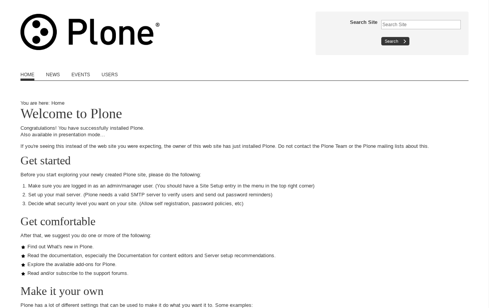

.. _amazium-themes:

Amazium CSS based
^^^^^^^^^^^^^^^^^

.. _diazoframework-amazium:

..
  diazoframework.amazium
  ````````````````````````

The `diazoframework.amazium`_ package provides the diazo framework implementation of the 
:ref:`Amazium CSS framework <amazium-css-framework>` using the **theming** and **packaging** 
features available in the :ref:`diazoframework.plone <diazoframework-plone>` core package for 
create `Diazo`_ theme using `plone.app.theming`_.

.. note::
    They are useful for creating themes based on :ref:`Amazium CSS framework <amazium-css-framework>` 
    provides the framework resources and diazo rules to reuse and add to in a Diazo theme. 
    For documentation on the framework itself, check the website.

The package themes based on :ref:`Amazium CSS framework <amazium-css-framework>` are 
the following:


.. _diazotheme-amazium:

Amazium CSS Theme
````````````````````

*Technical details:*

  - **DOCTYPE HTML:** HTML5
  - **Stylesheet:** CSS
  - **JS support?:** :ref:`jQuery <jquery-library>`, `Easing <http://gsgd.co.uk/sandbox/jquery/easing/>`_ and `UItoTop Plugin <http://www.mattvarone.com/web-design/uitotop-jquery-plugin/>`_.
  - **Web fonts?:** No
  - **Grid support?:** Yes
  - **Responsive?:** Yes
  - **CSS framework:** :ref:`Amazium CSS framework <amazium-css-framework>`
  - **Supported versions:** Plone 4

The **Amazium CSS Theme** aka ``theme``, is a diazo theme that use with `Sunburst Theme`_. A demo using it looks like the following:



  ``Amazium CSS`` Theme Demo at Plone front-page.

.. note::
    This theme is included into the `diazotheme.amazium`_ package that is based on the :ref:`diazoframework.amazium <diazoframework-amazium>` package.

----


.. _`Sunburst Theme`: https://github.com/plone/plonetheme.sunburst
.. _`Diazo`: http://diazo.org
.. _`plone.app.theming`: https://pypi.org/project/plone.app.theming/1.1.8/
.. _`diazoframework.amazium`: https://github.com/TH-code/diazoframework.amazium
.. _`diazotheme.amazium`: https://github.com/TH-code/diazotheme.amazium
