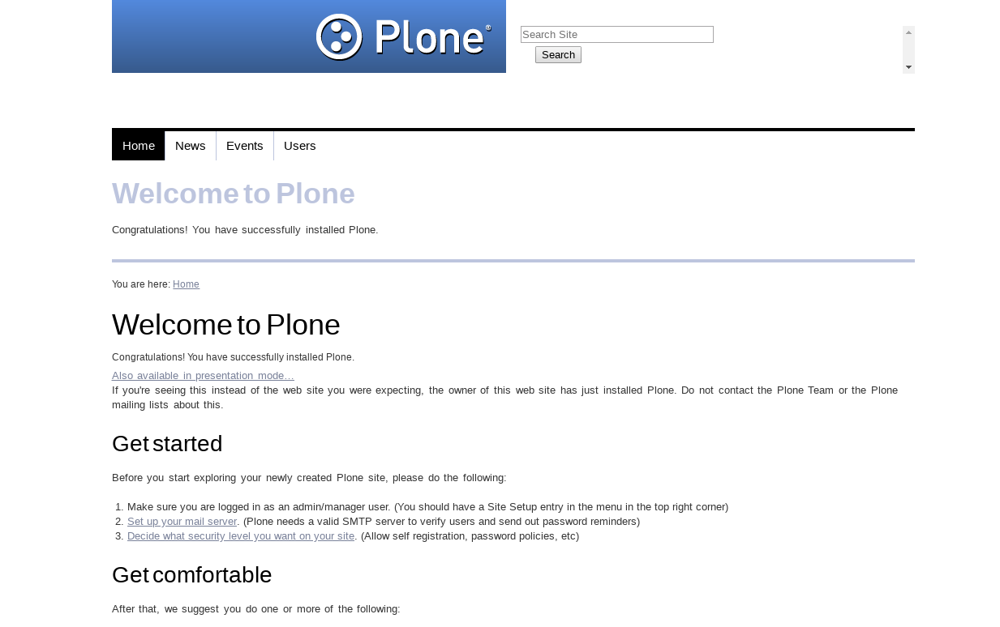

.. _baseline-themes:

Baseline CSS based
^^^^^^^^^^^^^^^^^^

.. _diazoframework-baseline:

..
  diazoframework.baseline
  ````````````````````````

The `diazoframework.baseline`_ package provides the diazo framework implementation of the 
:ref:`Baseline CSS framework <baseline-css-framework>` using the **theming** and **packaging** 
features available in the :ref:`diazoframework.plone <diazoframework-plone>` core package for 
create `Diazo`_ theme using `plone.app.theming`_.

.. note::
    They are useful for creating themes based on 
    :ref:`Baseline CSS framework <baseline-css-framework>` 
    provides the framework resources and diazo rules to reuse and add to in a Diazo theme. 
    For documentation on the framework itself, check the website.

The package themes based on :ref:`Baseline CSS framework <baseline-css-framework>` are 
the following:

.. _diazotheme-baseline:

Baseline CSS Theme
````````````````````

*Technical details:*

  - **DOCTYPE HTML:** HTML5
  - **Stylesheet:** CSS
  - **JS support?:** No
  - **Web fonts?:** No
  - **Grid support?:** Yes
  - **Responsive?:** No
  - **CSS framework:** :ref:`Baseline CSS framework <baseline-css-framework>`
  - **Supported versions:** Plone 4

The **Baseline CSS Theme** aka ``theme``, is a diazo theme that use with `Sunburst Theme`_. A demo using it looks like the following:



  ``Baseline CSS`` Theme Demo at Plone front-page.

.. note::
    This theme is included into the `diazotheme.baseline`_ package that is based on the :ref:`diazoframework.baseline <diazoframework-baseline>` package.

----

.. _`Sunburst Theme`: https://github.com/plone/plonetheme.sunburst
.. _`Diazo`: http://diazo.org
.. _`plone.app.theming`: https://pypi.org/project/plone.app.theming/1.1.8/
.. _`diazoframework.baseline`: https://github.com/TH-code/diazoframework.baseline
.. _`diazotheme.baseline`: https://github.com/TH-code/diazotheme.baseline
