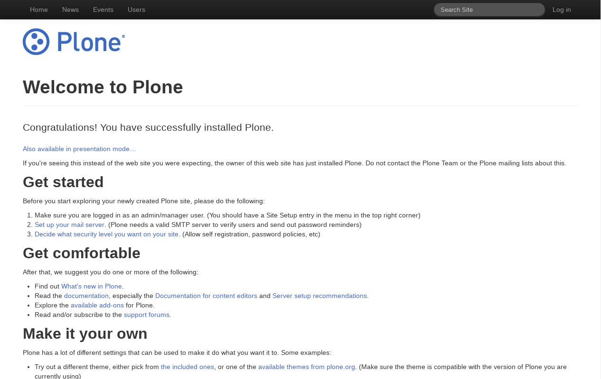
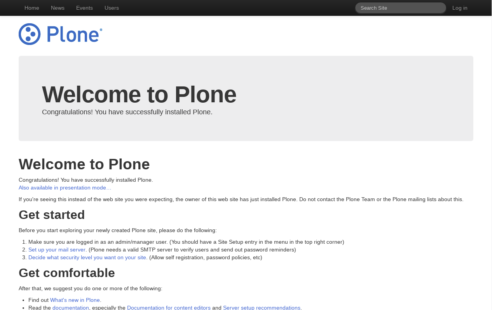
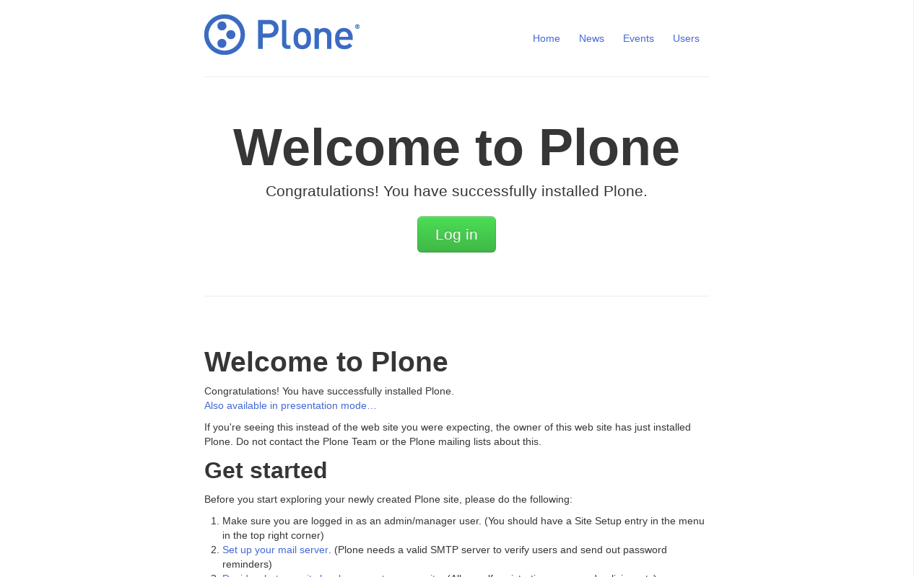

.. _bootstrap-themes:

Bootstrap CSS based
^^^^^^^^^^^^^^^^^^^

The package themes based on :ref:`Twitter Bootstrap CSS framework <bootstrap-css-framework>` are the following:


.. _diazoframework-bootstrap:

diazoframework.bootstrap
````````````````````````

The `diazoframework.bootstrap`_ package provides the diazo framework implementation 
of the :ref:`Twitter Bootstrap CSS framework <bootstrap-css-framework>` using the 
**theming** and **packaging** features available in the :ref:`diazoframework.plone <diazoframework-plone>` core package for create `Diazo`_ theme using `plone.app.theming`_.

.. note::
    They are useful for creating themes based on 
    :ref:`Twitter Bootstrap CSS framework <bootstrap-css-framework>` 
    provides the framework resources and diazo rules to reuse and add to in a Diazo 
    theme. For documentation on the framework itself, check the website.


.. _diazotheme-bootstrap:

diazotheme.bootstrap
````````````````````

The `diazotheme.bootstrap`_ package is a Diazo Theme based on the 
:ref:`diazoframework.bootstrap <diazoframework-bootstrap>` package. 
This add-on included the following themes:

Twitter Bootstrap Starter Theme
~~~~~~~~~~~~~~~~~~~~~~~~~~~~~~~

*Technical details:*

  - **DOCTYPE HTML:** HTML5
  - **Stylesheet:** CSS
  - **JS support?:** :ref:`jQuery <jquery-library>`
  - **Web fonts?:** No
  - **Grid support?:** Yes
  - **Responsive?:** Yes
  - **CSS framework:** :ref:`Twitter Bootstrap CSS framework <bootstrap-css-framework>`
  - **Supported versions:** Plone 4

The **Twitter Bootstrap Starter Theme** aka ``starter``, is a diazo theme that use with `Sunburst Theme`_. A demo using it looks like the following:



  ``Twitter Bootstrap Starter`` Theme Demo at Plone front-page.


Twitter Bootstrap Hero Theme
~~~~~~~~~~~~~~~~~~~~~~~~~~~~

*Technical details:*

  - **DOCTYPE HTML:** HTML5
  - **Stylesheet:** CSS
  - **JS support?:** :ref:`jQuery <jquery-library>`
  - **Web fonts?:** No
  - **Grid support?:** Yes
  - **Responsive?:** Yes
  - **CSS framework:** :ref:`Twitter Bootstrap CSS framework <bootstrap-css-framework>`
  - **Supported versions:** Plone 4

The **Twitter Bootstrap Hero Theme** aka ``theme``, is a diazo theme that use with `Sunburst Theme`_. A demo using it looks like the following:



  ``Twitter Bootstrap Hero`` Theme Demo at Plone front-page.


Twitter Bootstrap Marketing Narrow Theme
~~~~~~~~~~~~~~~~~~~~~~~~~~~~~~~~~~~~~~~~

*Technical details:*

  - **DOCTYPE HTML:** HTML5
  - **Stylesheet:** CSS
  - **JS support?:** :ref:`jQuery <jquery-library>`
  - **Web fonts?:** No
  - **Grid support?:** Yes
  - **Responsive?:** Yes
  - **CSS framework:** :ref:`Twitter Bootstrap CSS framework <bootstrap-css-framework>`
  - **Supported versions:** Plone 4

The **Twitter Bootstrap Marketing Narrow Theme** aka ``marketing-narrow``, is a diazo theme that use with `Sunburst Theme`_. A demo using it looks like the following:



  ``Twitter Bootstrap Marketing Narrow`` Theme at Plone front-page.

----

.. _example-bootstrap:

example.bootstrap
`````````````````

The `example.bootstrap <https://github.com/sneridagh/example.bootstrap>`_ package 
include the following *Technical details*:

- **DOCTYPE HTML:** HTML5
- **Stylesheet:** CSS/:ref:`LESS <less>`
- **JS support?:**  :ref:`jQuery <jquery-library>`
- **Web fonts?:** No
- **Grid support?:** Yes
- **Responsive?:** Yes
- **CSS framework:** :ref:`Twitter Bootstrap CSS framework <bootstrap-css-framework>`
- **Supported versions:** Plone 4


The resources of this theme can be reached through

``/++bootstrap++less``
  To access to :ref:`LESS <less>` resources files.

``/++bootstrap++js``
  To access to :ref:`jQuery <jquery-library>` resources files.

``/++bootstrap++img``
  To access to images resources files.

There are placed at ``example.bootstrap/src/example/bootstrap/resources`` 
directory with following resources files:

::

    resources/
    ├── img
    │   ├── glyphicons-halflings.png
    │   └── glyphicons-halflings-white.png
    ├── js
    │   ├── bootstrap-alert.js
    │   ├── bootstrap-button.js
    │   ├── bootstrap-carousel.js
    │   ├── bootstrap-collapse.js
    │   ├── bootstrap-dropdown.js
    │   ├── bootstrap-modal.js
    │   ├── bootstrap-popover.js
    │   ├── bootstrap-scrollspy.js
    │   ├── bootstrap-tab.js
    │   ├── bootstrap-tooltip.js
    │   ├── bootstrap-transition.js
    │   ├── bootstrap-typeahead.js
    │   ├── README.md
    │   └── tests
    │       ├── index.html
    │       ├── unit
    │       │   ├── bootstrap-alert.js
    │       │   ├── bootstrap-button.js
    │       │   ├── bootstrap-collapse.js
    │       │   ├── bootstrap-dropdown.js
    │       │   ├── bootstrap-modal.js
    │       │   ├── bootstrap-popover.js
    │       │   ├── bootstrap-scrollspy.js
    │       │   ├── bootstrap-tab.js
    │       │   ├── bootstrap-tooltip.js
    │       │   ├── bootstrap-transition.js
    │       │   └── bootstrap-typeahead.js
    │       └── vendor
    │           ├── jquery.js
    │           ├── qunit.css
    │           └── qunit.js
    └── less
        ├── accordion.less
        ├── alerts.less
        ├── badges.less
        ├── bootstrap.less
        ├── breadcrumbs.less
        ├── button-groups.less
        ├── buttons.less
        ├── carousel.less
        ├── close.less
        ├── code.less
        ├── component-animations.less
        ├── dropdowns.less
        ├── forms.less
        ├── grid.less
        ├── hero-unit.less
        ├── labels.less
        ├── layouts.less
        ├── mixins.less
        ├── modals.less
        ├── navbar.less
        ├── navs.less
        ├── pager.less
        ├── pagination.less
        ├── popovers.less
        ├── progress-bars.less
        ├── reset.less
        ├── responsive.less
        ├── scaffolding.less
        ├── sprites.less
        ├── tables.less
        ├── thumbnails.less
        ├── tooltip.less
        ├── type.less
        ├── utilities.less
        ├── variables.less
        └── wells.less

A demo using the ``example.bootstrap`` add-on look like the following:

.. todo::
    TODO Add a example.bootstrap screenshot

..
  .. figure:: ../../_static/example_bootstrap.png
    :align: center
    :width: 55%
    :alt: example.bootstrap Theme

    ``example.bootstrap`` Theme Demo at Plone front-page.


----

.. _`Sunburst Theme`: https://github.com/plone/plonetheme.sunburst
.. _`Diazo`: http://diazo.org
.. _`plone.app.theming`: https://pypi.org/project/plone.app.theming/1.1.8/
.. _`plonetheme.classic`: https://github.com/plone/plonetheme.classic
.. _`plonetheme.sunburst`: https://github.com/plone/plonetheme.sunburst
.. _`diazoframework.bootstrap`: https://github.com/collective/diazoframework.bootstrap
.. _`diazotheme.bootstrap`: https://github.com/collective/diazotheme.bootstrap
