.. _diazotheme-bootswatch:

Bootswatch Themes
`````````````````

..
  diazotheme.bootswatch
  `````````````````````

The `diazotheme.bootswatch`_ package add-on included the `Bootswatch`_ open source 
themes collection for :ref:`Bootstrap CSS framework <bootstrap-css-framework>` using
the :ref:`diazoframework.bootstrap <diazoframework-bootstrap>` core package:


Bootswatch Amelia Theme
~~~~~~~~~~~~~~~~~~~~~~~

The `Bootswatch Amelia Theme`_ aka ``amelia``, is a diazo theme that use with 
`Sunburst Theme`_. 

*Technical details:*

  - **DOCTYPE HTML:** HTML5
  - **Stylesheet:** CSS
  - **JS support?:** :ref:`jQuery <jquery-library>`
  - **Web fonts?:** :ref:`Font Awesome <font-awesome>`, Lobster and Cabin :ref:`Google Fonts <google-fonts>`
  - **Grid support?:** Yes
  - **Responsive?:** Yes
  - **CSS framework:** :ref:`Twitter Bootstrap CSS framework <bootstrap-css-framework>`
  - **Supported versions:** Plone 4

A *Bootswatch Amelia Theme* implementations in Plone looks like the following:

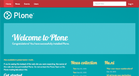

  ``Bootswatch Amelia`` Theme Demo at Plone front-page.

----

Bootswatch Amelia Narrow Theme
~~~~~~~~~~~~~~~~~~~~~~~~~~~~~~

The `Bootswatch Amelia Narrow Theme`_ aka ``amelia-narrow``, is a diazo theme that use with 
`Sunburst Theme`_. 

*Technical details:*

  - **DOCTYPE HTML:** HTML5
  - **Stylesheet:** CSS
  - **JS support?:** :ref:`jQuery <jquery-library>`
  - **Web fonts?:** :ref:`Font Awesome <font-awesome>`, Lobster and Cabin :ref:`Google Fonts <google-fonts>`
  - **Grid support?:** Yes
  - **Responsive?:** Yes
  - **CSS framework:** :ref:`Twitter Bootstrap CSS framework <bootstrap-css-framework>`
  - **Supported versions:** Plone 4

A *Bootswatch Amelia Narrow Theme* implementations in Plone looks like the following:


  ``Bootswatch Amelia Narrow`` Theme at Plone front-page.

----

Bootswatch Cerulean Theme
~~~~~~~~~~~~~~~~~~~~~~~~~

The `Bootswatch Cerulean Theme`_ aka ``cerulean``, is a diazo theme that use with 
`Sunburst Theme`_. 

*Technical details:*

  - **DOCTYPE HTML:** HTML5
  - **Stylesheet:** CSS
  - **JS support?:** :ref:`jQuery <jquery-library>`
  - **Web fonts?:** :ref:`Font Awesome <font-awesome>`, Telex :ref:`Google Fonts <google-fonts>`
  - **Grid support?:** Yes
  - **Responsive?:** Yes
  - **CSS framework:** :ref:`Twitter Bootstrap CSS framework <bootstrap-css-framework>`
  - **Supported versions:** Plone 4

A *Bootswatch Cerulean Theme* implementations in Plone looks like the following:

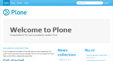

  ``Bootswatch Cerulean`` Theme Demo at Plone front-page.

----

Bootswatch Cerulean Narrow Theme
~~~~~~~~~~~~~~~~~~~~~~~~~~~~~~~~

The `Bootswatch Cerulean Narrow Theme`_ aka ``cerulean-narrow``, is a diazo theme that use with 
`Sunburst Theme`_. 

*Technical details:*

  - **DOCTYPE HTML:** HTML5
  - **Stylesheet:** CSS
  - **JS support?:** :ref:`jQuery <jquery-library>`
  - **Web fonts?:** :ref:`Font Awesome <font-awesome>`, Telex :ref:`Google Fonts <google-fonts>`
  - **Grid support?:** Yes
  - **Responsive?:** Yes
  - **CSS framework:** :ref:`Twitter Bootstrap CSS framework <bootstrap-css-framework>`
  - **Supported versions:** Plone 4

A *Bootswatch Cerulean Narrow Theme* implementations in Plone looks like the following:


  ``Bootswatch Cerulean Narrow`` Theme at Plone front-page.

----

Bootswatch Cosmo Theme
~~~~~~~~~~~~~~~~~~~~~~

The `Bootswatch Cosmo Theme`_ aka ``cosmo``, is a diazo theme that use with 
`Sunburst Theme`_. 

*Technical details:*

  - **DOCTYPE HTML:** HTML5
  - **Stylesheet:** CSS
  - **JS support?:** :ref:`jQuery <jquery-library>`
  - **Web fonts?:** :ref:`Font Awesome <font-awesome>`, Open Sans :ref:`Google Fonts <google-fonts>`
  - **Grid support?:** Yes
  - **Responsive?:** Yes
  - **CSS framework:** :ref:`Twitter Bootstrap CSS framework <bootstrap-css-framework>`
  - **Supported versions:** Plone 4

A *Bootswatch Cosmo Theme* implementations in Plone looks like the following:

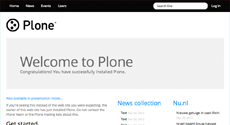

  ``Bootswatch Cosmo`` Theme Demo at Plone front-page.

----

Bootswatch Cosmo Narrow Theme
~~~~~~~~~~~~~~~~~~~~~~~~~~~~~

The `Bootswatch Cosmo Narrow Theme`_ aka ``cosmo-narrow``, is a diazo theme that use with 
`Sunburst Theme`_. 

*Technical details:*

  - **DOCTYPE HTML:** HTML5
  - **Stylesheet:** CSS
  - **JS support?:** :ref:`jQuery <jquery-library>`
  - **Web fonts?:** :ref:`Font Awesome <font-awesome>`, Open Sans :ref:`Google Fonts <google-fonts>`
  - **Grid support?:** Yes
  - **Responsive?:** Yes
  - **CSS framework:** :ref:`Twitter Bootstrap CSS framework <bootstrap-css-framework>`
  - **Supported versions:** Plone 4

A *Bootswatch Cosmo Narrow Theme* implementations in Plone looks like the following:

.. figure:: ../../../_static/diazotheme_bootswatch_cosmo_narrow.png
  :align: center
  :width: 55%
  :alt: Bootswatch Cosmo Narrow Theme

  ``Bootswatch Cosmo Narrow`` Theme at Plone front-page.

----

Bootswatch Cyborg Theme
~~~~~~~~~~~~~~~~~~~~~~~

The `Bootswatch Cyborg Theme`_ aka ``cyborg``, is a diazo theme that use with 
`Sunburst Theme`_. 

*Technical details:*

  - **DOCTYPE HTML:** HTML5
  - **Stylesheet:** CSS
  - **JS support?:** :ref:`jQuery <jquery-library>`
  - **Web fonts?:** :ref:`Font Awesome <font-awesome>`, Droid Sans :ref:`Google Fonts <google-fonts>`
  - **Grid support?:** Yes
  - **Responsive?:** Yes
  - **CSS framework:** :ref:`Twitter Bootstrap CSS framework <bootstrap-css-framework>`
  - **Supported versions:** Plone 4

A *Bootswatch Cyborg Theme* implementations in Plone looks like the following:

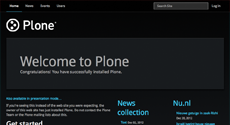

  ``Bootswatch Cyborg`` Theme Demo at Plone front-page.

----

Bootswatch Cyborg Narrow Theme
~~~~~~~~~~~~~~~~~~~~~~~~~~~~~~

The `Bootswatch Cyborg Narrow Theme`_ aka ``cyborg-narrow``, is a diazo theme that use with 
`Sunburst Theme`_. 

*Technical details:*

  - **DOCTYPE HTML:** HTML5
  - **Stylesheet:** CSS
  - **JS support?:** :ref:`jQuery <jquery-library>`
  - **Web fonts?:** :ref:`Font Awesome <font-awesome>`, Droid Sans :ref:`Google Fonts <google-fonts>`
  - **Grid support?:** Yes
  - **Responsive?:** Yes
  - **CSS framework:** :ref:`Twitter Bootstrap CSS framework <bootstrap-css-framework>`
  - **Supported versions:** Plone 4

A *Bootswatch Cyborg Narrow Theme* implementations in Plone looks like the following:


  ``Bootswatch Cyborg Narrow`` Theme at Plone front-page.

----

Bootswatch Journal Theme
~~~~~~~~~~~~~~~~~~~~~~~~

The `Bootswatch Journal Theme`_ aka ``journal``, is a diazo theme that use with 
`Sunburst Theme`_. 

*Technical details:*

  - **DOCTYPE HTML:** HTML5
  - **Stylesheet:** CSS
  - **JS support?:** :ref:`jQuery <jquery-library>`
  - **Web fonts?:** :ref:`Font Awesome <font-awesome>`, News Cycle :ref:`Google Fonts <google-fonts>`
  - **Grid support?:** Yes
  - **Responsive?:** Yes
  - **CSS framework:** :ref:`Twitter Bootstrap CSS framework <bootstrap-css-framework>`
  - **Supported versions:** Plone 4

A *Bootswatch Journal Theme* implementations in Plone looks like the following:

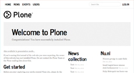

  ``Bootswatch Journal`` Theme Demo at Plone front-page.

----

Bootswatch Journal Narrow Theme
~~~~~~~~~~~~~~~~~~~~~~~~~~~~~~~

The `Bootswatch Journal Narrow Theme`_ aka ``journal-narrow``, is a diazo theme that use with 
`Sunburst Theme`_. 

*Technical details:*

  - **DOCTYPE HTML:** HTML5
  - **Stylesheet:** CSS
  - **JS support?:** :ref:`jQuery <jquery-library>`
  - **Web fonts?:** :ref:`Font Awesome <font-awesome>`, News Cycle :ref:`Google Fonts <google-fonts>`
  - **Grid support?:** Yes
  - **Responsive?:** Yes
  - **CSS framework:** :ref:`Twitter Bootstrap CSS framework <bootstrap-css-framework>`
  - **Supported versions:** Plone 4

A *Bootswatch Journal Narrow Theme* implementations in Plone looks like the following:

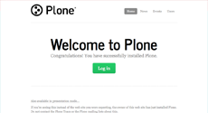

  ``Bootswatch Journal Narrow`` Theme at Plone front-page.

----

Bootswatch Readable Theme
~~~~~~~~~~~~~~~~~~~~~~~~~

The `Bootswatch Readable Theme`_ aka ``readable-narrow``, is a diazo theme that use with 
`Sunburst Theme`_. 

*Technical details:*

  - **DOCTYPE HTML:** HTML5
  - **Stylesheet:** CSS
  - **JS support?:** :ref:`jQuery <jquery-library>`
  - **Web fonts?:** :ref:`Font Awesome <font-awesome>`, Lora :ref:`Google Fonts <google-fonts>`
  - **Grid support?:** Yes
  - **Responsive?:** Yes
  - **CSS framework:** :ref:`Twitter Bootstrap CSS framework <bootstrap-css-framework>`
  - **Supported versions:** Plone 4

A *Bootswatch Readable Theme* implementations in Plone looks like the following:

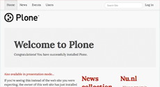

  ``Bootswatch Readable`` Theme Demo at Plone front-page.

----

Bootswatch Readable Narrow Theme
~~~~~~~~~~~~~~~~~~~~~~~~~~~~~~~~

The `Bootswatch Readable Narrow Theme`_ aka ``readable-narrow``, is a diazo theme that use with 
`Sunburst Theme`_. 

*Technical details:*

  - **DOCTYPE HTML:** HTML5
  - **Stylesheet:** CSS
  - **JS support?:** :ref:`jQuery <jquery-library>`
  - **Web fonts?:** :ref:`Font Awesome <font-awesome>`, Lora :ref:`Google Fonts <google-fonts>`
  - **Grid support?:** Yes
  - **Responsive?:** Yes
  - **CSS framework:** :ref:`Twitter Bootstrap CSS framework <bootstrap-css-framework>`
  - **Supported versions:** Plone 4

A *Bootswatch Readable Narrow Theme* implementations in Plone looks like the following:

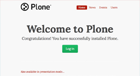

  ``Bootswatch Readable Narrow`` Theme at Plone front-page.

----

Bootswatch Simplex Theme
~~~~~~~~~~~~~~~~~~~~~~~~

The `Bootswatch Simplex Theme`_ aka ``simplex``, is a diazo theme that use with 
`Sunburst Theme`_. 

*Technical details:*

  - **DOCTYPE HTML:** HTML5
  - **Stylesheet:** CSS
  - **JS support?:** :ref:`jQuery <jquery-library>`
  - **Web fonts?:** :ref:`Font Awesome <font-awesome>`, Josefin Sans :ref:`Google Fonts <google-fonts>`
  - **Grid support?:** Yes
  - **Responsive?:** Yes
  - **CSS framework:** :ref:`Twitter Bootstrap CSS framework <bootstrap-css-framework>`
  - **Supported versions:** Plone 4

A *Bootswatch Simplex Theme* implementations in Plone looks like the following:

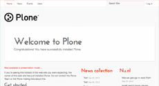

  ``Bootswatch Simplex`` Theme Demo at Plone front-page.

----

Bootswatch Simplex Narrow Theme
~~~~~~~~~~~~~~~~~~~~~~~~~~~~~~~

The `Bootswatch Simplex Narrow Theme`_ aka ``simplex-narrow``, is a diazo theme that use with 
`Sunburst Theme`_. 

*Technical details:*

  - **DOCTYPE HTML:** HTML5
  - **Stylesheet:** CSS
  - **JS support?:** :ref:`jQuery <jquery-library>`
  - **Web fonts?:** :ref:`Font Awesome <font-awesome>`, Josefin Sans :ref:`Google Fonts <google-fonts>`
  - **Grid support?:** Yes
  - **Responsive?:** Yes
  - **CSS framework:** :ref:`Twitter Bootstrap CSS framework <bootstrap-css-framework>`
  - **Supported versions:** Plone 4

A *Bootswatch Simplex Narrow Theme* implementations in Plone looks like the following:


  ``Bootswatch Simplex Narrow`` Theme at Plone front-page.

----

Bootswatch Slate Theme
~~~~~~~~~~~~~~~~~~~~~~

The `Bootswatch Slate Theme`_ aka ``slate``, is a diazo theme that use with 
`Sunburst Theme`_. 

*Technical details:*

  - **DOCTYPE HTML:** HTML5
  - **Stylesheet:** CSS
  - **JS support?:** :ref:`jQuery <jquery-library>`
  - **Web fonts?:** :ref:`Font Awesome <font-awesome>`
  - **Grid support?:** Yes
  - **Responsive?:** Yes
  - **CSS framework:** :ref:`Twitter Bootstrap CSS framework <bootstrap-css-framework>`
  - **Supported versions:** Plone 4

A *Bootswatch Slate Theme* implementations in Plone looks like the following:

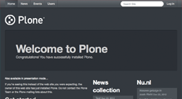

  ``Bootswatch Slate`` Theme Demo at Plone front-page.

----

Bootswatch Slate Narrow Theme
~~~~~~~~~~~~~~~~~~~~~~~~~~~~~

The `Bootswatch Slate Narrow Theme`_ aka ``slate-narrow``, is a diazo theme that use with 
`Sunburst Theme`_. 

*Technical details:*

  - **DOCTYPE HTML:** HTML5
  - **Stylesheet:** CSS
  - **JS support?:** :ref:`jQuery <jquery-library>`
  - **Web fonts?:** :ref:`Font Awesome <font-awesome>`
  - **Grid support?:** Yes
  - **Responsive?:** Yes
  - **CSS framework:** :ref:`Twitter Bootstrap CSS framework <bootstrap-css-framework>`
  - **Supported versions:** Plone 4

A *Bootswatch Slate Narrow Theme* implementations in Plone looks like the following:

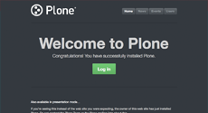

  ``Bootswatch Slate Narrow`` Theme at Plone front-page.

----

Bootswatch Spacelab Theme
~~~~~~~~~~~~~~~~~~~~~~~~~

The `Bootswatch Spacelab Theme`_ aka ``spacelab``, is a diazo theme that use with 
`Sunburst Theme`_. 

*Technical details:*

  - **DOCTYPE HTML:** HTML5
  - **Stylesheet:** CSS
  - **JS support?:** :ref:`jQuery <jquery-library>`
  - **Web fonts?:** :ref:`Font Awesome <font-awesome>`, Open Sans :ref:`Google Fonts <google-fonts>`
  - **Grid support?:** Yes
  - **Responsive?:** Yes
  - **CSS framework:** :ref:`Twitter Bootstrap CSS framework <bootstrap-css-framework>`
  - **Supported versions:** Plone 4

A *Bootswatch Spacelab Theme* implementations in Plone looks like the following:

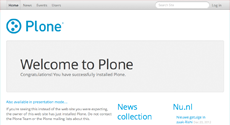

  ``Bootswatch Spacelab`` Theme Demo at Plone front-page.

----

Bootswatch Spacelab Narrow Theme
~~~~~~~~~~~~~~~~~~~~~~~~~~~~~~~~

The `Bootswatch Spacelab Narrow Theme`_ aka ``spacelab-narrow``, is a diazo theme that use with 
`Sunburst Theme`_. 

*Technical details:*

  - **DOCTYPE HTML:** HTML5
  - **Stylesheet:** CSS
  - **JS support?:** :ref:`jQuery <jquery-library>`
  - **Web fonts?:** :ref:`Font Awesome <font-awesome>`, Open Sans :ref:`Google Fonts <google-fonts>`
  - **Grid support?:** Yes
  - **Responsive?:** Yes
  - **CSS framework:** :ref:`Twitter Bootstrap CSS framework <bootstrap-css-framework>`
  - **Supported versions:** Plone 4

A *Bootswatch Spacelab Narrow Theme* implementations in Plone looks like the following:


  ``Bootswatch Spacelab Narrow`` Theme at Plone front-page.

----

Bootswatch Spruce Theme
~~~~~~~~~~~~~~~~~~~~~~~

The `Bootswatch Spruce Theme`_ aka ``spruce``, is a diazo theme that use with 
`Sunburst Theme`_. 

*Technical details:*

  - **DOCTYPE HTML:** HTML5
  - **Stylesheet:** CSS
  - **JS support?:** :ref:`jQuery <jquery-library>`
  - **Web fonts?:** :ref:`Font Awesome <font-awesome>`, Crete Round :ref:`Google Fonts <google-fonts>`
  - **Grid support?:** Yes
  - **Responsive?:** Yes
  - **CSS framework:** :ref:`Twitter Bootstrap CSS framework <bootstrap-css-framework>`
  - **Supported versions:** Plone 4

A *Bootswatch Spruce Theme* implementations in Plone looks like the following:

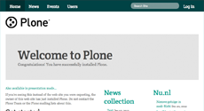

  ``Bootswatch Spruce`` Theme Demo at Plone front-page.

----

Bootswatch Spruce Narrow Theme
~~~~~~~~~~~~~~~~~~~~~~~~~~~~~~

The `Bootswatch Spruce Narrow Theme`_ aka ``spruce-narrow``, is a diazo theme that use with 
`Sunburst Theme`_. 

*Technical details:*

  - **DOCTYPE HTML:** HTML5
  - **Stylesheet:** CSS
  - **JS support?:** :ref:`jQuery <jquery-library>`, Crete Round :ref:`Google Fonts <google-fonts>`
  - **Web fonts?:** :ref:`Font Awesome <font-awesome>`
  - **Grid support?:** Yes
  - **Responsive?:** Yes
  - **CSS framework:** :ref:`Twitter Bootstrap CSS framework <bootstrap-css-framework>`
  - **Supported versions:** Plone 4

A *Bootswatch Spruce Narrow Theme* implementations in Plone looks like the following:

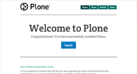

  ``Bootswatch Spruce Narrow`` Theme at Plone front-page.

----

Bootswatch Superhero Theme
~~~~~~~~~~~~~~~~~~~~~~~~~~

The `Bootswatch Superhero Theme`_ aka ``superhero``, is a diazo theme that use with 
`Sunburst Theme`_. 

*Technical details:*

  - **DOCTYPE HTML:** HTML5
  - **Stylesheet:** CSS
  - **JS support?:** :ref:`jQuery <jquery-library>`
  - **Web fonts?:** :ref:`Font Awesome <font-awesome>`, Oswald or Noticia Text :ref:`Google Fonts <google-fonts>`
  - **Grid support?:** Yes
  - **Responsive?:** Yes
  - **CSS framework:** :ref:`Twitter Bootstrap CSS framework <bootstrap-css-framework>`
  - **Supported versions:** Plone 4

A *Bootswatch Superhero Theme* implementations in Plone looks like the following:


  ``Bootswatch Superhero`` Theme Demo at Plone front-page.

----

Bootswatch Superhero Narrow Theme
~~~~~~~~~~~~~~~~~~~~~~~~~~~~~~~~~

The `Bootswatch Superhero Narrow Theme`_ aka ``superhero-narrow``, is a diazo theme 
that use with `Sunburst Theme`_. 

*Technical details:*

  - **DOCTYPE HTML:** HTML5
  - **Stylesheet:** CSS
  - **JS support?:** :ref:`jQuery <jquery-library>`
  - **Web fonts?:** :ref:`Font Awesome <font-awesome>`, Oswald or Noticia Text :ref:`Google Fonts <google-fonts>`
  - **Grid support?:** Yes
  - **Responsive?:** Yes
  - **CSS framework:** :ref:`Twitter Bootstrap CSS framework <bootstrap-css-framework>`
  - **Supported versions:** Plone 4

A *Bootswatch Superhero Narrow Theme* implementations in Plone looks like the following:


  ``Bootswatch Superhero Narrow`` Theme at Plone front-page.

----

Bootswatch United Theme
~~~~~~~~~~~~~~~~~~~~~~~

The `Bootswatch United Theme`_ aka ``united``, is a diazo theme that use with 
`Sunburst Theme`_. 

*Technical details:*

  - **DOCTYPE HTML:** HTML5
  - **Stylesheet:** CSS
  - **JS support?:** :ref:`jQuery <jquery-library>`
  - **Web fonts?:** :ref:`Font Awesome <font-awesome>`, Ubuntu :ref:`Google Fonts <google-fonts>`
  - **Grid support?:** Yes
  - **Responsive?:** Yes
  - **CSS framework:** :ref:`Twitter Bootstrap CSS framework <bootstrap-css-framework>`
  - **Supported versions:** Plone 4

A *Bootswatch United Theme* implementations in Plone looks like the following:

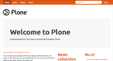

  ``Bootswatch United`` Theme Demo at Plone front-page.

----

Bootswatch United Narrow Theme
~~~~~~~~~~~~~~~~~~~~~~~~~~~~~~

The `Bootswatch United Narrow Theme`_ aka ``united-narrow``, is a diazo theme 
that use with `Sunburst Theme`_. 

*Technical details:*

  - **DOCTYPE HTML:** HTML5
  - **Stylesheet:** CSS
  - **JS support?:** :ref:`jQuery <jquery-library>`
  - **Web fonts?:** :ref:`Font Awesome <font-awesome>`, Ubuntu :ref:`Google Fonts <google-fonts>`
  - **Grid support?:** Yes
  - **Responsive?:** Yes
  - **CSS framework:** :ref:`Twitter Bootstrap CSS framework <bootstrap-css-framework>`
  - **Supported versions:** Plone 4

A *Bootswatch United Narrow Theme* implementations in Plone looks like the following:

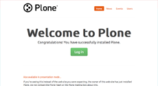

  ``Bootswatch United Narrow`` Theme at Plone front-page.

.. note::
    About `Bootswatch`_ is a open source themes collection for :ref:`Bootstrap CSS framework <bootstrap-css-framework>`.

----

.. _`Sunburst Theme`: https://github.com/plone/plonetheme.sunburst
.. _`Diazo`: http://diazo.org
.. _`plone.app.theming`: https://pypi.org/project/plone.app.theming/1.1.8/
.. _`plonetheme.classic`: https://github.com/plone/plonetheme.classic
.. _`plonetheme.sunburst`: https://github.com/plone/plonetheme.sunburst
.. _`Bootswatch`: https://bootswatch.com/
.. _`diazotheme.bootswatch`: https://github.com/TH-code/diazotheme.bootswatch
.. _`Bootswatch Amelia Theme`: https://bootswatch.com/amelia/
.. _`Bootswatch Amelia Narrow Theme`: https://bootswatch.com/amelia-narrow/
.. _`Bootswatch Cerulean Theme`: https://bootswatch.com/cerulean/
.. _`Bootswatch Cerulean Narrow Theme`: https://bootswatch.com/cerulean-narrow/
.. _`Bootswatch Cosmo Theme`: https://bootswatch.com/cosmo/
.. _`Bootswatch Cosmo Narrow Theme`: https://bootswatch.com/cosmo-narrow/
.. _`Bootswatch Cyborg Theme`: https://bootswatch.com/cyborg/
.. _`Bootswatch Cyborg Narrow Theme`: https://bootswatch.com/cyborg-narrow/
.. _`Bootswatch Journal Theme`: https://bootswatch.com/journal/
.. _`Bootswatch Journal Narrow Theme`: https://bootswatch.com/journal-narrow/
.. _`Bootswatch Readable Theme`: https://bootswatch.com/readable/
.. _`Bootswatch Readable Narrow Theme`: https://bootswatch.com/readable-narrow/
.. _`Bootswatch Simplex Theme`: https://bootswatch.com/simplex/
.. _`Bootswatch Simplex Narrow Theme`: https://bootswatch.com/simplex-narrow/
.. _`Bootswatch Slate Theme`: https://bootswatch.com/slate/
.. _`Bootswatch Slate Narrow Theme`: https://bootswatch.com/slate-narrow/
.. _`Bootswatch Spacelab Theme`: https://bootswatch.com/spacelab/
.. _`Bootswatch Spacelab Narrow Theme`: https://bootswatch.com/spacelab-narrow/
.. _`Bootswatch Spruce Theme`: https://bootswatch.com/spruce/
.. _`Bootswatch Spruce Narrow Theme`: https://bootswatch.com/spruce-narrow/
.. _`Bootswatch Superhero Theme`: https://bootswatch.com/superhero/
.. _`Bootswatch Superhero Narrow Theme`: https://bootswatch.com/superhero-narrow/
.. _`Bootswatch United Theme`: https://bootswatch.com/united/
.. _`Bootswatch United Narrow Theme`: https://bootswatch.com/united-narrow/
