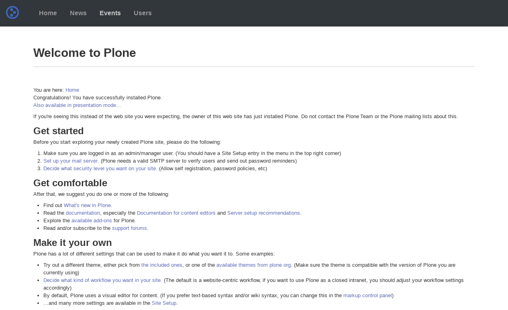

.. _cascade-themes:

Cascade based
^^^^^^^^^^^^^

.. _diazotheme-framework-cascade:

..
  diazotheme.framework.cascade
  `````````````````````````````

The `diazotheme.framework.cascade`_ package provides the diazo framework implementation 
of the :ref:`Cascade framework <cascade-css-framework>` using the 
**theming** and **packaging** features available in the :ref:`diazoframework.plone <diazoframework-plone>` core package for create `Diazo`_ theme using `plone.app.theming`_. 

.. note::
    They are useful for creating themes based on 
    :ref:`Cascade framework <cascade-css-framework>` 
    provides the framework resources and diazo rules to reuse and add to in a Diazo 
    theme. For documentation on the framework itself, check the website.

The package themes based on :ref:`Cascade framework <cascade-css-framework>` are the 
following:

.. _cascade-starter-theme:

Cascade Starter Theme
`````````````````````

*Technical details:*

  - **DOCTYPE HTML:** HTML5
  - **Stylesheet:** CSS
  - **JS support?:** :ref:`jQuery <jquery-library>`
  - **Web fonts?:** :ref:`Font Awesome <font-awesome>`
  - **Grid support?:** Yes
  - **Responsive?:** Yes
  - **CSS framework:** :ref:`Cascade framework <cascade-css-framework>`
  - **Supported versions:** Plone 4

The **Cascade Starter Theme** aka ``static``, is a diazo theme that use with `Sunburst Theme`_. A demo using it looks like the following:



  ``Cascade Framework Theme`` Demo at Plone front-page.

.. note::
    This theme is included into the :ref:`diazotheme.framework.cascade <diazotheme-framework-cascade>` package.

----

.. _`Sunburst Theme`: https://github.com/plone/plonetheme.sunburst
.. _`Diazo`: http://diazo.org
.. _`plone.app.theming`: https://pypi.org/project/plone.app.theming/1.1.8/
.. _`diazotheme.framework.cascade`: https://github.com/TH-code/diazotheme.framework.cascade
