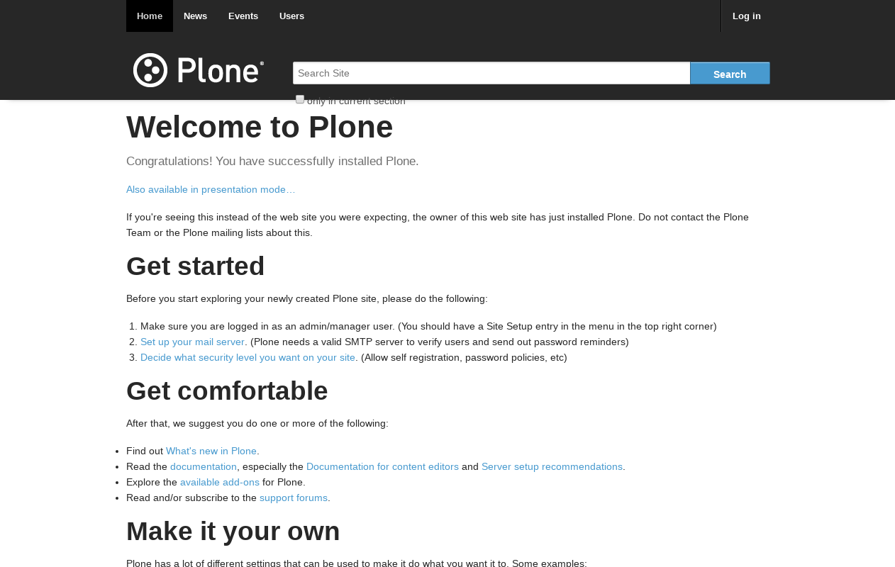

.. _foundation-themes:

Foundation CSS based
^^^^^^^^^^^^^^^^^^^^

The package themes based on :ref:`Foundation CSS framework <foundation-css-framework>` are the following:

.. _diazoframework-foundation:


diazoframework.foundation
`````````````````````````

The `diazoframework.foundation`_ package provides the diazo framework implementation 
of the :ref:`Zurb Foundation CSS framework <foundation-css-framework>` using the 
**theming** and **packaging** features available in the :ref:`diazoframework.plone <diazoframework-plone>` core package for create `Diazo`_ theme using `plone.app.theming`_.

.. note::
    They are useful for creating themes based on 
    :ref:`Zurb Foundation CSS framework <foundation-css-framework>` 
    provides the framework resources and diazo rules to reuse and add to in a Diazo 
    theme. For documentation on the framework itself, check the website.


.. _diazotheme-foundation:

This add-on contains the following diazo theme implementations:

Foundation Example Theme
````````````````````````

*Technical details:*

  - **DOCTYPE HTML:** HTML5
  - **Stylesheet:** CSS
  - **JS support?:** :ref:`jQuery <jquery-library>`
  - **Web fonts?:** No
  - **Grid support?:** Yes
  - **Responsive?:** Yes
  - **CSS framework:** :ref:`Foundation CSS framework <foundation-css-framework>`
  - **Supported versions:** Plone 4

The **Foundation Example Theme** aka ``theme``, is a diazo theme that use with `Sunburst Theme`_. A demo using it looks like the following:



  ``Foundation Example Theme`` Demo at Plone front-page.

.. note::
    This theme is included into the `diazotheme.foundation`_ package that is based on the 
    :ref:`diazoframework.foundation <diazoframework-foundation>` package.


----

.. _`Sunburst Theme`: https://github.com/plone/plonetheme.sunburst
.. _`Diazo`: http://diazo.org
.. _`plone.app.theming`: https://pypi.org/project/plone.app.theming/1.1.8/
.. _`diazoframework.foundation`: https://github.com/TH-code/diazoframework.foundation
.. _`diazotheme.foundation`: https://github.com/TH-code/diazotheme.foundation
