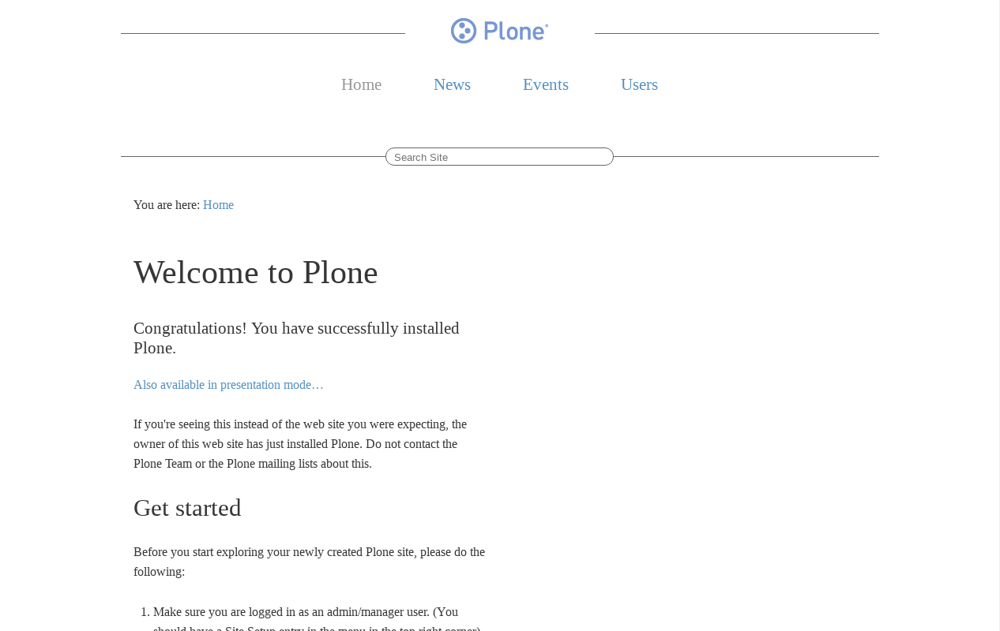
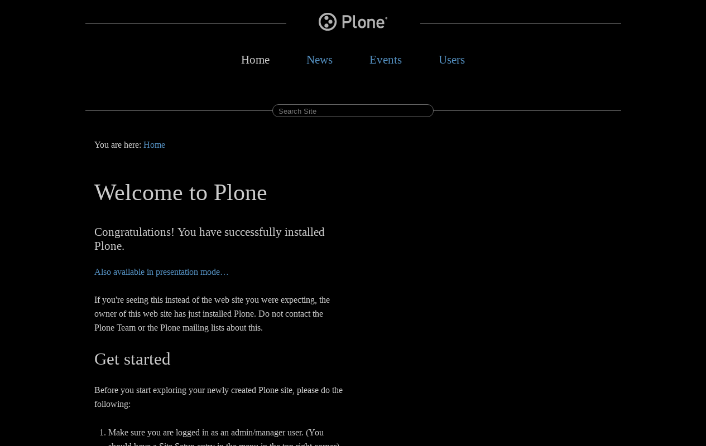

.. _goldilocks-themes:

Goldilocks Approach based
^^^^^^^^^^^^^^^^^^^^^^^^^

.. _diazoframework-goldilocks:

..
  diazoframework.goldilocks
  `````````````````````````

The `diazoframework.goldilocks`_ package provides the diazo framework implementation 
of the :ref:`Goldilocks Approach CSS framework <goldilocks-css-framework>` using the 
**theming** and **packaging** features available in the :ref:`diazoframework.plone <diazoframework-plone>` core package for create `Diazo`_ theme using `plone.app.theming`_.

.. note::
    They are useful for creating themes based on 
    :ref:`Goldilocks Approach CSS framework <goldilocks-css-framework>` 
    provides the framework resources and diazo rules to reuse and add to in a Diazo 
    theme. For documentation on the framework itself, check the website.

The package themes based on :ref:`Goldilocks Approach CSS framework <goldilocks-css-framework>` are the following:


.. _diazotheme-goldilocks:

Goldilocks Theme
`````````````````

*Technical details:*

  - **DOCTYPE HTML:** HTML5
  - **Stylesheet:** CSS
  - **JS support?:** Modernizr 1.7
  - **Web fonts?:** No
  - **Grid support?:** Yes
  - **Responsive?:** Yes
  - **CSS framework:** :ref:`Goldilocks Approach CSS framework <goldilocks-css-framework>`
  - **Supported versions:** Plone 4

The **Goldilocks Theme** aka ``theme``, is a diazo theme that use with `Sunburst Theme`_. A demo using it looks like the following:



  ``Goldilocks Theme`` Demo at Plone front-page.

.. note::
    This theme is included into the `diazotheme.goldilocks`_ package that is based on the :ref:`diazoframework.goldilocks <diazoframework-goldilocks>` package.

----

Goldilocks Inverted Theme
`````````````````````````

*Technical details:*

  - **DOCTYPE HTML:** HTML5
  - **Stylesheet:** CSS
  - **JS support?:** Modernizr 1.7
  - **Web fonts?:** No
  - **Grid support?:** Yes
  - **Responsive?:** Yes
  - **CSS framework:** :ref:`Goldilocks Approach CSS framework <goldilocks-css-framework>`
  - **Supported versions:** Plone 4

The **Goldilocks Inverted Theme** aka ``inverted``, is a diazo theme that use with `Sunburst Theme`_. A demo using it looks like the following:



  ``Goldilocks Inverted Theme`` Demo at Plone front-page.

.. note::
    This theme is included into the `diazotheme.goldilocks`_ package that is based on the :ref:`diazoframework.goldilocks <diazoframework-goldilocks>` package.

----

.. _`Diazo`: http://diazo.org
.. _`plone.app.theming`: https://pypi.org/project/plone.app.theming/1.1.8/
.. _`diazoframework.goldilocks`: https://github.com/TH-code/diazoframework.goldilocks
.. _`diazotheme.goldilocks`: https://github.com/TH-code/diazotheme.goldilocks
.. _`Sunburst Theme`: https://github.com/plone/plonetheme.sunburst
