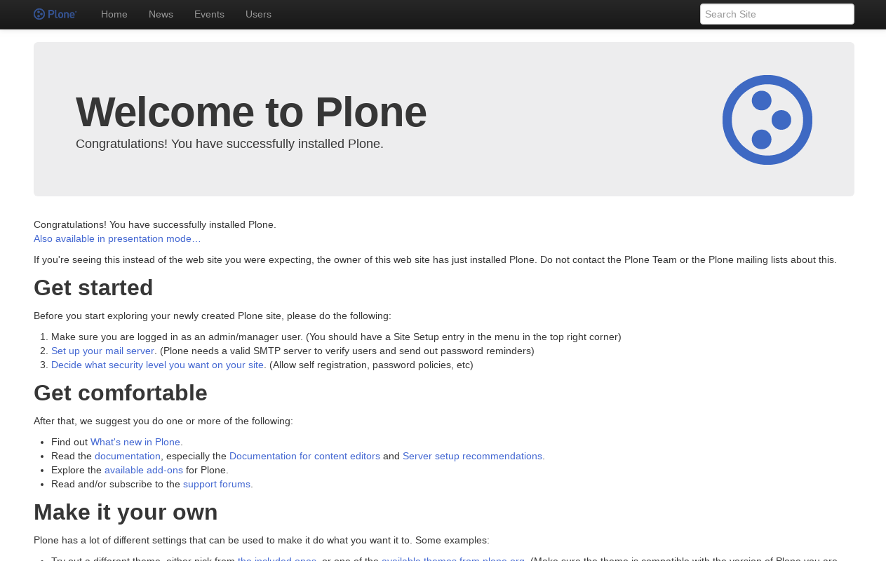
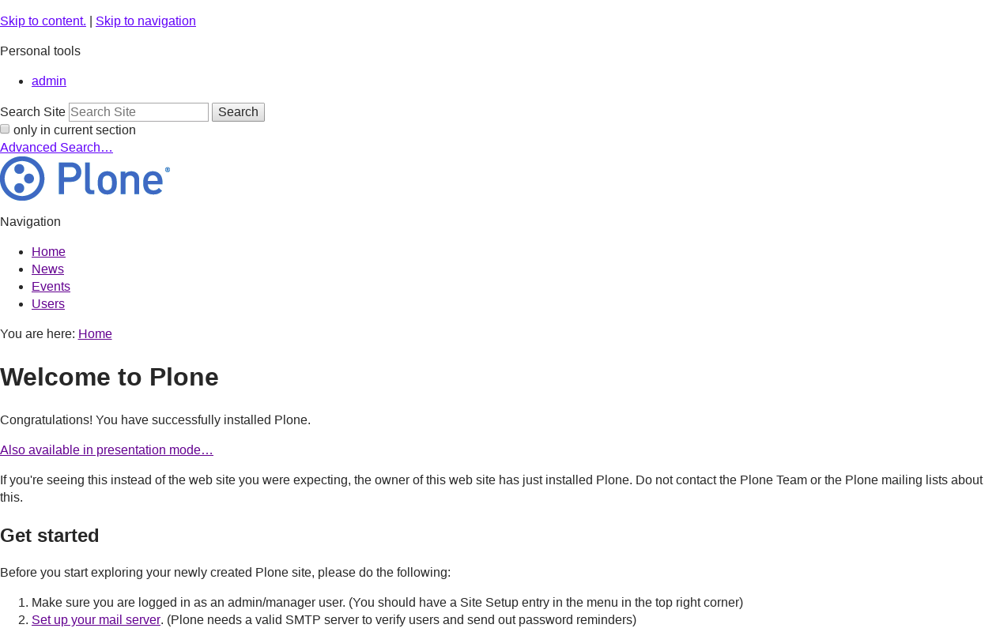
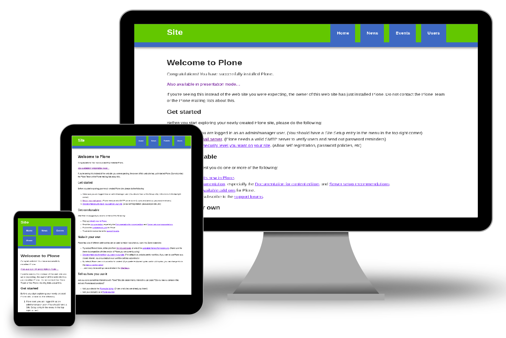
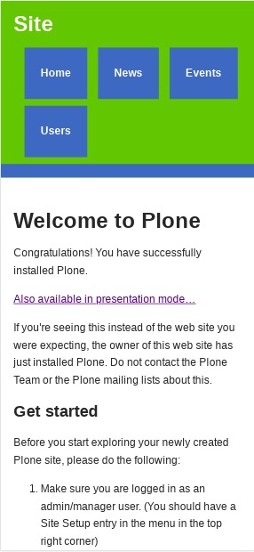
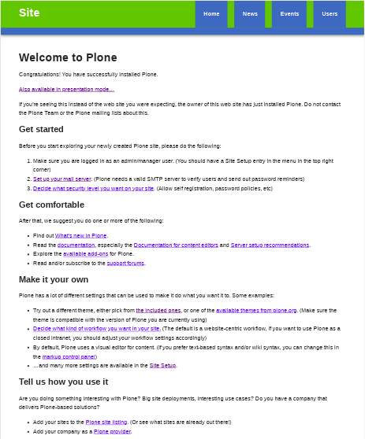
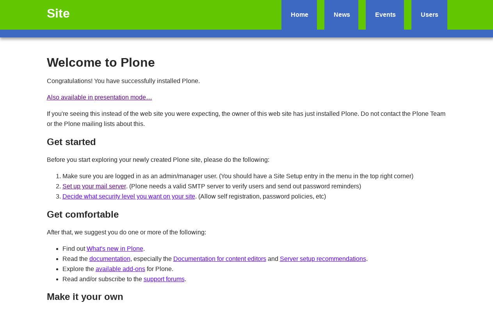

.. _diazotheme-startup:

Startup Initializr
````````````````````

..
  diazotheme.startup
  ````````````````````

`Initializr`_ is here to kick-start the development of your new projects. It generates 
templates based on HTML5 Boilerplate by allowing you to choose which parts you want or 
don't want from it. A `responsive template`_ has also been added to start from a basic 
design instead of a blank page.

The `diazotheme.startup`_ package contains the following diazo ``Initializr`` implementations:

- ``bootstrap``, a diazo theme based on `Bootstrap Jumbotron`_  Theme.
- ``h5bp``, a startup Classic HTML5 Boilerplate Initializr theme.
- ``responsive``, a startup Responsive Initializr theme.

..
  - ``classic``, a diazo theme based on `plonetheme.classic`_ used until Plone 3 versions.
  - ``sunburst``, a diazo theme based on `plonetheme.sunburst`_ to be used with theme base 
    "(unstyled)" until Plone 4 versions.


.. _diazotheme-startup-bootstrap:

Startup Bootstrap Jumbotron Initializr Theme
~~~~~~~~~~~~~~~~~~~~~~~~~~~~~~~~~~~~~~~~~~~~

The `Startup Bootstrap Jumbotron Initializr Theme`_ aka ``bootstrap``, is a diazo theme 
that use with `Sunburst Theme`_. 

*Technical details:*

  - **DOCTYPE HTML:** HTML5
  - **Stylesheet:** CSS
  - **JS support?:** :ref:`jQuery <jquery-library>`
  - **Web fonts?:** No
  - **Grid support?:** Yes
  - **Responsive?:** Yes
  - **CSS framework:** :ref:`Twitter Bootstrap CSS framework <bootstrap-css-framework>`
  - **Supported versions:** Plone 4

A *Startup Bootstrap Jumbotron Initializr Theme* implementations in Plone looks like the following:



  ``Startup Bootstrap Jumbotron Initializr`` Theme at Plone front-page.

.. note::
    This theme is included into the `diazotheme.startup`_ package that is based on the 
    :ref:`diazoframework.bootstrap <diazoframework-bootstrap>` package.

----

.. _diazotheme-startup-h5bp:

Startup Classic HTML5 Boilerplate Initializr Theme
~~~~~~~~~~~~~~~~~~~~~~~~~~~~~~~~~~~~~~~~~~~~~~~~~~

The `Startup Classic HTML5 Boilerplate Initializr Theme`_ aka ``h5bp``, is a diazo theme 
that use with `Sunburst Theme`_. 

*Technical details:*

  - **DOCTYPE HTML:** HTML5
  - **Stylesheet:** CSS
  - **JS support?:** :ref:`jQuery <jquery-library>`
  - **Web fonts?:** No
  - **Grid support?:** Yes
  - **Responsive?:** Yes
  - **CSS framework:** :ref:`Twitter Bootstrap CSS framework <bootstrap-css-framework>`
  - **Supported versions:** Plone 4

A *Startup Classic HTML5 Boilerplate Initializr Theme* implementations in Plone looks like the following:



  ``Startup Classic HTML5 Boilerplate Initializr`` Theme at Plone front-page.

.. note::
    This theme is included into the `diazotheme.startup`_ package that is based on the 
    :ref:`diazoframework.bootstrap <diazoframework-bootstrap>` package.

----

.. _diazotheme-startup-responsive:

Startup Responsive Initializr Theme
~~~~~~~~~~~~~~~~~~~~~~~~~~~~~~~~~~~

The `Startup Responsive Initializr Theme`_ aka ``responsive``, is a diazo theme 
that use with `Sunburst Theme`_. 

*Technical details:*

  - **DOCTYPE HTML:** HTML5
  - **Stylesheet:** CSS
  - **JS support?:** :ref:`jQuery <jquery-library>`
  - **Web fonts?:** No
  - **Grid support?:** Yes
  - **Responsive?:** Yes
  - **CSS framework:** :ref:`Twitter Bootstrap CSS framework <bootstrap-css-framework>`
  - **Supported versions:** Plone 4

A *Startup Responsive Initializr Theme* implementations in Plone looks like the following:



  ``Startup Responsive Initializr`` Theme.

A demo using the ``Startup Responsive Initializr Theme`` add-on as a reduced view for Mobile device 
look like the following:



  ``Startup Responsive Initializr`` theme Demo at Mobile device.

A demo using the ``Startup Responsive Initializr Theme`` add-on as a reduced view for Tablet device 
look like the following:



  ``Startup Responsive Initializr`` theme Demo at Tablet device.

A demo using the ``Startup Responsive Initializr Theme`` add-on as a reduced view for Laptop device 
look like the following:



  ``Startup Responsive Initializr`` theme Demo Laptop device.

.. note::
    This theme is included into the `diazotheme.startup`_ package that is based on the 
    :ref:`diazoframework.bootstrap <diazoframework-bootstrap>` package.

----

..
  The **Startup Plone Classic Theme** and a demo using it looks like the following:

  .. figure:: ../../../_static/diazotheme_startup_classic.png
    :align: center
    :width: 55%
    :alt: Startup Plone Classic Theme

    ``Startup Plone Classic`` Theme at Plone front-page.

  ----

  The **Startup Plone Sunburst Theme** and a demo using it looks like the following:

  .. figure:: ../../../_static/diazotheme_startup_sunburst.png
    :align: center
    :width: 55%
    :alt: Startup Plone Sunburst Theme

    ``Startup Plone Sunburst`` Theme at Plone front-page.

  ----

.. _`diazotheme.startup`: https://github.com/TH-code/diazotheme.startup
.. _`plonetheme.classic`: https://github.com/plone/plonetheme.classic
.. _`plonetheme.sunburst`: https://github.com/plone/plonetheme.sunburst
.. _`Initializr`: http://www.initializr.com/
.. _`responsive template`: http://verekia.com/initializr/responsive-template
.. _`Bootstrap Jumbotron`: http://getbootstrap.com/examples/jumbotron/
.. _`Sunburst Theme`: https://github.com/plone/plonetheme.sunburst
