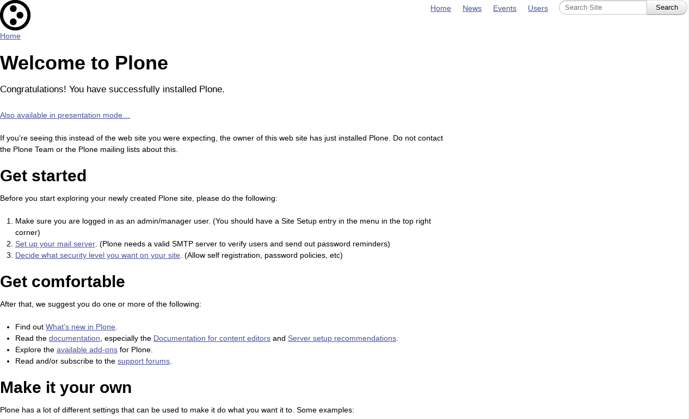
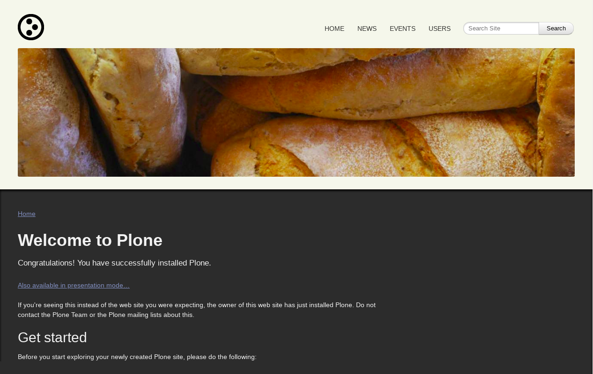

.. _kube-themes:

Kube CSS based
^^^^^^^^^^^^^^

.. _diazoframework-kube:

..
  diazoframework.kube
  ````````````````````

The `diazoframework.kube`_ package provides the diazo framework implementation of the 
:ref:`Kube CSS framework <kube-css-framework>` using the **theming** and **packaging** features available in the :ref:`diazoframework.plone <diazoframework-plone>` core package 
for create `Diazo`_ theme using `plone.app.theming`_.

.. note::
    They are useful for creating themes based on :ref:`Kube CSS framework <kube-css-framework>` 
    provides the framework resources and diazo rules to reuse and add to in a Diazo theme. For documentation on the framework itself, check the website.

The package themes based on :ref:`Kube CSS framework <kube-css-framework>` are the following:

.. _diazotheme-kube:

Kube Theme
````````````

*Technical details:*

  - **DOCTYPE HTML:** HTML5
  - **Stylesheet:** CSS/:ref:`LESS <less>`
  - **JS support?:** No
  - **Web fonts?:** No
  - **Grid support?:** Yes
  - **Responsive?:** Yes
  - **CSS framework:** :ref:`Kube CSS framework <kube-css-framework>`
  - **Supported versions:** Plone 4

The **Kube Theme** aka ``theme``, is a diazo theme that use with `Sunburst Theme`_. A demo using it looks like the following:



  ``Kube Theme`` Demo at Plone front-page.

.. note::
    This theme is included into the `diazotheme.kube`_ package that is based on the :ref:`diazoframework.kube <diazoframework-kube>` package.


----

.. _diazotheme-kube-demo-theme:

Kube Demo Theme
````````````````

*Technical details:*

  - **DOCTYPE HTML:** HTML5
  - **Stylesheet:** CSS/:ref:`LESS <less>`
  - **JS support?:** No
  - **Web fonts?:** Oswald :ref:`Google Fonts <google-fonts>`
  - **Grid support?:** Yes
  - **Responsive?:** Yes
  - **CSS framework:** :ref:`Kube CSS framework <kube-css-framework>`
  - **Supported versions:** Plone 4

The **Kube Demo Theme** aka ``demo``, is a diazo theme that use with `Sunburst Theme`_. A demo using it looks like the following:



  ``Kube Demo`` Theme at Plone front-page.

.. note::
    This theme is included into the `diazotheme.kube`_ package that is based on the :ref:`diazoframework.kube <diazoframework-kube>` package.

----

.. _`diazoframework.kube`: https://github.com/TH-code/diazoframework.kube
.. _`diazotheme.kube`: https://github.com/TH-code/diazotheme.kube
.. _`Sunburst Theme`: https://github.com/plone/plonetheme.sunburst
.. _`Diazo`: http://diazo.org
.. _`plone.app.theming`: https://pypi.org/project/plone.app.theming/1.1.8/

