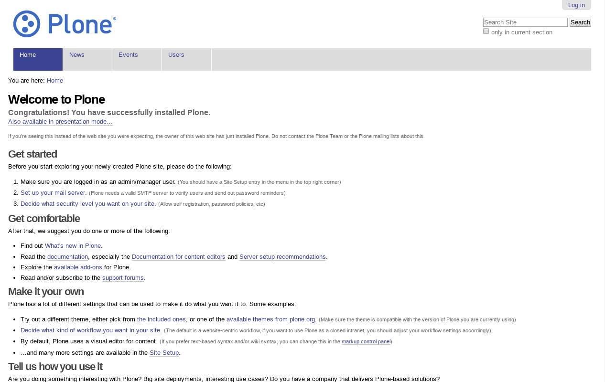
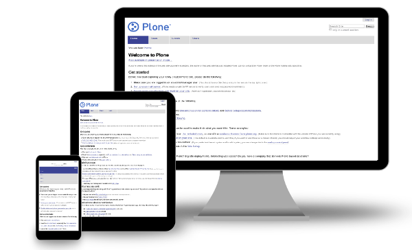
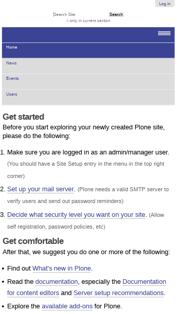
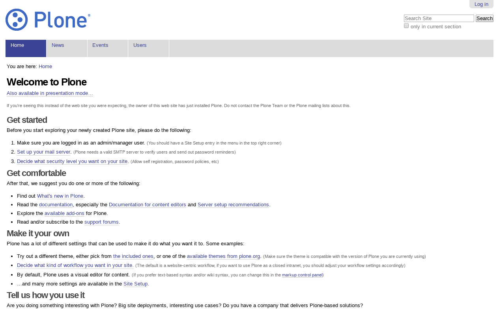

.. _plone-default-themes:

Plone themes based
^^^^^^^^^^^^^^^^^^

.. _diazotheme-plone:

The `diazotheme.plone`_ package provides diazo themes based on the `Sunburst Theme`_ 
using the **theming** and **packaging** features available in the 
:ref:`diazoframework.plone <diazoframework-plone>` core package for create `Diazo`_ 
theme using `plone.app.theming`_. This add-on contains the following diazo theme 
implementations:


Plone Classic (Diazo Framework) Theme
````````````````````````````````````````

*Technical details:*

  - **DOCTYPE HTML:** HTML5
  - **Stylesheet:** CSS
  - **JS support?:** :ref:`jQuery <jquery-library>`.
  - **Web fonts?:** No
  - **Grid support?:** No
  - **Responsive?:** No
  - **CSS framework:** Plone style sheet
  - **Supported versions:** Plone 4

The **Plone Classic (Diazo Framework) Theme** aka ``classic``, is a diazo theme 
based on `plonetheme.classic`_ used until Plone 3 versions. A demo using it looks 
like the following:

.. figure:: ../../../_static/diazotheme_plone_classic.png
  :align: center
  :width: 55%
  :alt: Plone Classic (Diazo Framework) Theme

  ``Diazo Framework Plone Classic`` Theme at Plone front-page.

.. note::
    This theme is included into the `diazotheme.plone`_ package that is based on the 
    :ref:`diazoframework.plone <diazoframework-plone>` package.

----

Plone Sunburst (Diazo Framework) Theme
````````````````````````````````````````

*Technical details:*

  - **DOCTYPE HTML:** HTML5
  - **Stylesheet:** CSS
  - **JS support?:** :ref:`jQuery <jquery-library>`.
  - **Web fonts?:** No
  - **Grid support?:** Yes
  - **Responsive?:** No
  - **CSS framework:** Plone style sheet
  - **Supported versions:** Plone 4

The **Plone Sunburst (Diazo Framework) Theme** aka ``sunburst``, is a diazo theme 
based on `plonetheme.sunburst`_ to be used with theme base "(unstyled)" until 
Plone 4 versions. A demo using it looks like the following:



  ``Plone Sunburst (Diazo Framework)`` Theme at Plone front-page.

.. note::
    This theme is included into the `diazotheme.plone`_ package that is based on the 
    :ref:`diazoframework.plone <diazoframework-plone>` package.


----

Plone Sunburst Responsive (Diazo Framework) Theme
`````````````````````````````````````````````````

*Technical details:*

  - **DOCTYPE HTML:** HTML5
  - **Stylesheet:** CSS
  - **JS support?:** :ref:`jQuery <jquery-library>`.
  - **Web fonts?:** No
  - **Grid support?:** Yes
  - **Responsive?:** Yes
  - **CSS framework:** Plone style sheet
  - **Supported versions:** Plone 4

The **Plone Sunburst Responsive (Diazo Framework) Theme** aka ``responsive``, 
is a theme to responsify `plonetheme.sunburst`_ through diazo. A demo using it 
looks like the following:



  ``Plone Sunburst Responsive (Diazo Framework)`` Theme.

A demo using the ``Plone Sunburst Responsive (Diazo Framework) Theme`` add-on as a reduced view for Mobile device 
look like the following:



  ``Plone Sunburst Responsive (Diazo Framework)`` theme Demo at Mobile device.

A demo using the ``Plone Sunburst Responsive (Diazo Framework) Theme`` add-on as a reduced view for Tablet device 
look like the following:

.. figure:: ../../../_static/diazotheme_plone_sunburst_responsive_tablet.png
  :align: center
  :width: 45%
  :alt: Plone Sunburst Responsive (Diazo Framework) Theme at Tablet device

  ``Plone Sunburst Responsive (Diazo Framework)`` theme Demo at Tablet device.

A demo using the ``Plone Sunburst Responsive (Diazo Framework) Theme`` add-on as a reduced view for Laptop device 
look like the following:



  ``Plone Sunburst Responsive (Diazo Framework)`` theme Demo Laptop device.

.. note::
    This theme is included into the `diazotheme.plone`_ package that is based on the 
    :ref:`diazoframework.plone <diazoframework-plone>` package.

----

.. _diazoframework-plone:

diazoframework.plone
````````````````````

The `diazoframework.plone`_ package is the base for creating CSS frameworks (e.g. 
Twitter :ref:`Bootstrap <bootstrap-css-framework>`, Zurb :ref:`Foundation <foundation-css-framework>`, etc.) using the **theming** and **packaging** 
features available for create `Diazo`_ theme using `plone.app.theming`_. 

They are useful for creating themes based on CSS frameworks. A Diazo framework 
should provide the framework resources and diazo rules to reuse and add to in 
a Diazo theme.

.. _`diazoframework.plone`: https://github.com/collective/diazoframework.plone
.. _`diazotheme.plone`: https://github.com/collective/diazotheme.plone
.. _`Sunburst Theme`: https://github.com/plone/plonetheme.sunburst
.. _`Diazo`: http://diazo.org
.. _`plone.app.theming`: https://pypi.org/project/plone.app.theming/1.1.8/
.. _`plonetheme.classic`: https://github.com/plone/plonetheme.classic
.. _`plonetheme.sunburst`: https://github.com/plone/plonetheme.sunburst
