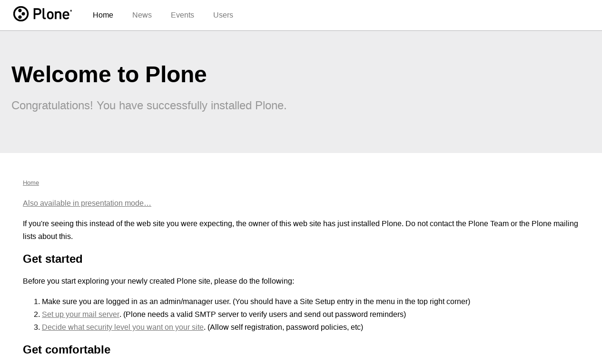

.. _purecss-themes:

PureCSS based
^^^^^^^^^^^^^


.. _diazoframework-purecss:

..
  diazoframework.purecss
  ````````````````````````

The `diazoframework.purecss`_ package provides the diazo framework implementation of the 
:ref:`PureCSS framework <purecss-framework>` using the **theming** and **packaging** 
features available in the :ref:`diazoframework.plone <diazoframework-plone>` core package 
for create `Diazo`_ theme using `plone.app.theming`_.

.. note::
    They are useful for creating themes based on :ref:`PureCSS framework <purecss-framework>` 
    provides the framework resources and diazo rules to reuse and add to in a Diazo theme. For documentation on the framework itself, check the website.

The package themes based on :ref:`PureCSS framework <purecss-framework>` are the following:


.. _diazotheme-purecss:

PureCSS Theme
`````````````

*Technical details:*

  - **DOCTYPE HTML:** HTML5
  - **Stylesheet:** CSS
  - **JS support?:** `YUI 3.10.1 <http://yuilibrary.com/>`_
  - **Web fonts?:** No
  - **Grid support?:** Yes
  - **Responsive?:** Yes
  - **CSS framework:** :ref:`PureCSS framework <purecss-framework>`
  - **Supported versions:** Plone 4

The **PureCSS Theme** aka ``theme``, is a diazo theme that use with `Sunburst Theme`_. A demo using it looks like the following:



  ``PureCSS Theme`` Demo at Plone front-page.

.. note::
    This theme is included into the `diazotheme.purecss`_ package that is based on the 
    :ref:`diazoframework.purecss <diazoframework-purecss>` package.

----

.. _`diazoframework.purecss`: https://github.com/TH-code/diazoframework.purecss
.. _`diazotheme.purecss`: https://github.com/TH-code/diazotheme.purecss
.. _`Sunburst Theme`: https://github.com/plone/plonetheme.sunburst
.. _`Diazo`: http://diazo.org
.. _`plone.app.theming`: https://pypi.org/project/plone.app.theming/1.1.8/
