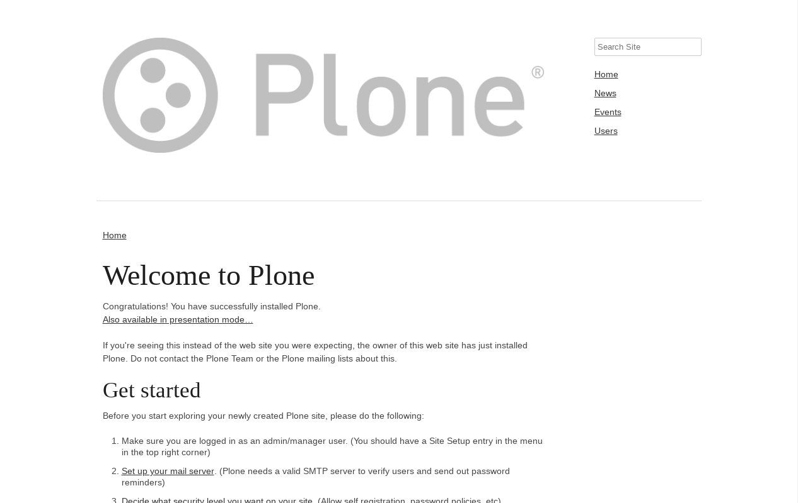

.. _skeleton-themes:

Skeleton CSS based
^^^^^^^^^^^^^^^^^^

.. _diazoframework-skeleton:

..
  diazoframework.skeleton
  ````````````````````````

The `diazoframework.skeleton`_ package provides the diazo framework implementation of the 
:ref:`Skeleton CSS framework <skeleton-css-framework>` using the **theming** and **packaging** 
features available in the :ref:`diazoframework.plone <diazoframework-plone>` core package for 
create `Diazo`_ theme using `plone.app.theming`_.

.. note::
    They are useful for creating themes based on :ref:`Skeleton CSS framework <skeleton-css-framework>` provides the framework resources and diazo rules to 
    reuse and add to in a Diazo theme. For documentation on the framework itself, check the 
    website.

The package themes based on :ref:`Skeleton CSS framework <skeleton-css-framework>` are the following:


.. _diazotheme-skeleton:

Skeleton CSS Theme
````````````````````

*Technical details:*

  - **DOCTYPE HTML:** HTML5
  - **Stylesheet:** CSS
  - **JS support?:** No
  - **Web fonts?:** No
  - **Grid support?:** Yes
  - **Responsive?:** Yes
  - **CSS framework:** :ref:`Skeleton CSS framework <skeleton-css-framework>`
  - **Supported versions:** Plone 4

The **Skeleton CSS Theme** aka ``theme``, is a diazo theme that use with `Sunburst Theme`_. A demo using it looks like the following:




  ``Skeleton CSS Theme`` Demo at Plone front-page.

.. note::
    This theme is included into the `diazotheme.skeleton`_ package that is based on the :ref:`diazoframework.skeleton <diazoframework-skeleton>` package.

.. _`diazoframework.skeleton`: https://github.com/TH-code/diazoframework.skeleton
.. _`diazotheme.skeleton`: https://github.com/TH-code/diazotheme.skeleton
.. _`Sunburst Theme`: https://github.com/plone/plonetheme.sunburst
.. _`Diazo`: http://diazo.org
.. _`plone.app.theming`: https://pypi.org/project/plone.app.theming/1.1.8/
