.. _free-css-templates:

Free CSS Templates
------------------

There are some `Free CSS Templates`_ available in the following list:

plonetheme.bananaleaf
^^^^^^^^^^^^^^^^^^^^^

The `plonetheme.bananaleaf <https://github.com/collective/plonetheme.bananaleaf>`_ package 
include the following *Technical details*:

- **DOCTYPE HTML:** XHTML 1.0 Strict
- **Stylesheet:** CSS
- **JS support?:** :ref:`jQuery <jquery-library>`
- **Web fonts?:** No
- **Grid support?:** No
- **Responsive?:** No
- **CSS framework:** `Free CSS Templates`_
- **Supported versions:** Plone 4

A demo using the ``plonetheme.bananaleaf`` add-on look like the following:

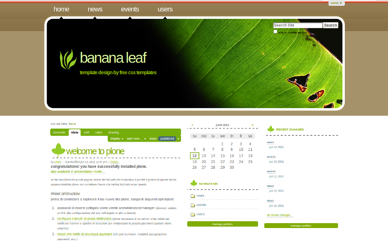

  ``plonetheme.bananaleaf`` add-on theme Demo at Plone front-page.

.. note::
    **Banana Leaf Theme**, A three-column, fixed-width design suitable for news sites and blogs.

----

plonetheme.burned
^^^^^^^^^^^^^^^^^

The `plonetheme.burned <https://github.com/collective/plonetheme.burned>`_ package include 
the following *Technical details*:

- **DOCTYPE HTML:** XHTML 1.0 Strict
- **Stylesheet:** CSS
- **JS support?:** No
- **Web fonts?:** No
- **Grid support?:** No
- **Responsive?:** No
- **CSS framework:** `Free CSS Templates`_
- **Supported versions:** Plone 4

A demo using the ``plonetheme.burned`` add-on look like the following:

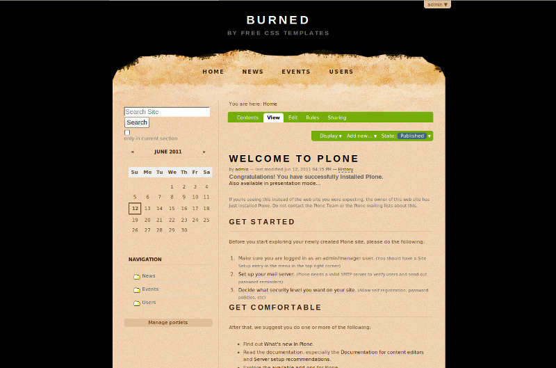

  ``plonetheme.burned`` add-on theme Demo at Plone front-page

.. note::
    **Burned** is a free template from `Free CSS Templates`_ released under a 
    `Creative Commons Attribution 2.5 License`_

----

plonetheme.darkened
^^^^^^^^^^^^^^^^^^^

The `plonetheme.darkened <https://github.com/collective/plonetheme.darkened>`_ package 
include the following *Technical details*:

- **DOCTYPE HTML:** XHTML 1.0 Strict
- **Stylesheet:** CSS
- **JS support?:** Yes
- **Web fonts?:** No
- **Grid support?:** No
- **Responsive?:** No
- **CSS framework:** `Free CSS Templates`_.
- **Supported versions:** Plone 4

A demo using the ``plonetheme.darkened`` add-on look like the following:

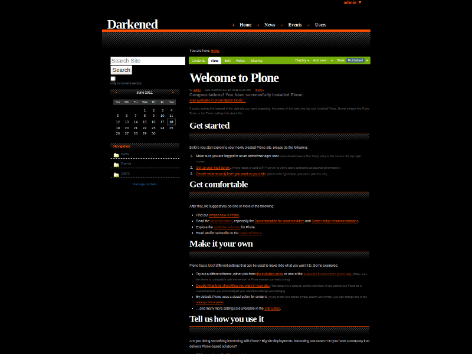

  ``plonetheme.darkened`` add-on theme Demo at Plone front-page.

.. note::
    **Darkened** is a free template from `Free CSS Templates`_ released under a 
    `Creative Commons Attribution 2.5 License`_.

----

plonetheme.discovery
^^^^^^^^^^^^^^^^^^^^

The `plonetheme.discovery <https://github.com/giacomos/plonetheme.discovery>`_ package 
include the following *Technical details*:

- **DOCTYPE HTML:** XHTML 1.0 Strict
- **Stylesheet:** CSS
- **JS support?:** No
- **Web fonts?:** No
- **Grid support?:** No
- **Responsive?:** No
- **CSS framework:** `Free CSS Templates`_.
- **Supported versions:** Plone 4

A demo using the ``plonetheme.discovery`` add-on look like the following:

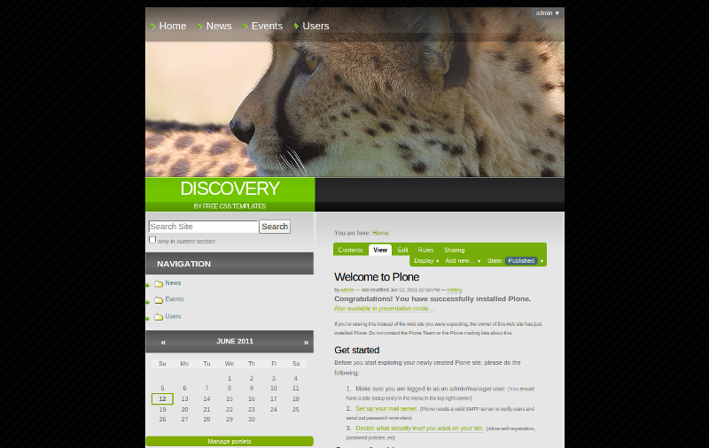

  ``plonetheme.discovery`` add-on theme Demo at Plone front-page.

.. note::

    **Discovery** is a layout with a two-column, fixed-width template with dark 
    colour scheme. This theme is a free template from `Free CSS Templates`_ 
    released under a `Creative Commons Attribution 2.5 License`_.

----

plonetheme.earthlingtwo
^^^^^^^^^^^^^^^^^^^^^^^

The `plonetheme.earthlingtwo <http://svn.plone.org/svn/collective/plonetheme.earthlingtwo/trunk/>`_ package include the following *Technical details*:

- **DOCTYPE HTML:** XHTML 1.0 Strict
- **Stylesheet:** CSS
- **JS support?:** No
- **Web fonts?:** No
- **Grid support?:** No
- **Responsive?:** No
- **CSS framework:** `Free CSS Templates`_.
- **Supported versions:** Plone 4

A demo using the ``plonetheme.earthlingtwo`` add-on look like the following:

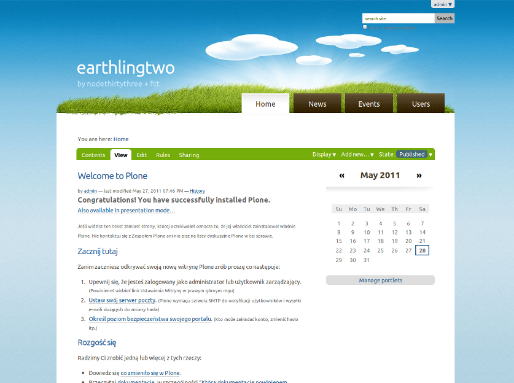

  ``plonetheme.earthlingtwo`` add-on theme Demo at Plone front-page.

.. note::

    **EarthlingTwo** is a layout with a two-column, fixed-width design with 
    dark colour scheme. This theme is a free template from `Free CSS Templates`_ 
    released under a `Creative Commons Attribution 2.5 License`_.

----

plonetheme.evergreen
^^^^^^^^^^^^^^^^^^^^

The `plonetheme.evergreen <https://github.com/giacomos/plonetheme.evergreen>`_ package 
include the following *Technical details*:

- **DOCTYPE HTML:** XHTML 1.0 Strict
- **Stylesheet:** CSS
- **JS support?:** No
- **Web fonts?:** No
- **Grid support?:** No
- **Responsive?:** No
- **CSS framework:** `Free CSS Templates`_.
- **Supported versions:** Plone 4

A demo using the ``plonetheme.evergreen`` add-on look like the following:

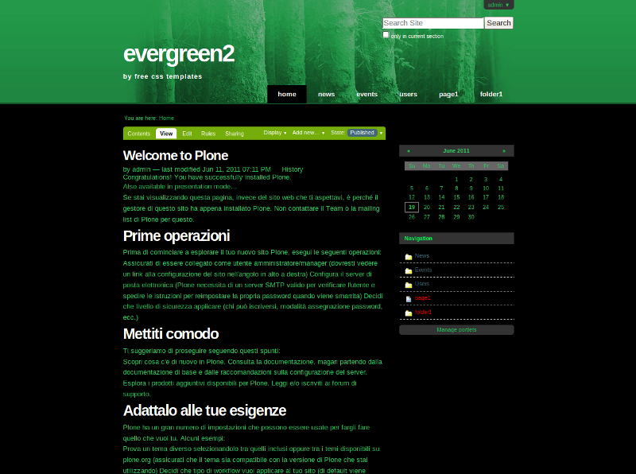

  ``plonetheme.evergreen`` add-on theme Demo at Plone front-page.

.. note::

    **Evergreen** a free template from `Free CSS Templates`_ released under a 
    `Creative Commons Attribution 2.5 License`_.

----

plonetheme.flowerbuds
^^^^^^^^^^^^^^^^^^^^^

The `plonetheme.flowerbuds <https://github.com/toutpt/plonetheme.flowerbuds>`_ package 
include the following *Technical details*:

- **DOCTYPE HTML:** XHTML 1.0 Strict
- **Stylesheet:** CSS
- **JS support?:** No
- **Web fonts?:** No
- **Grid support?:** No
- **Responsive?:** No
- **CSS framework:** `Free CSS Templates`_.
- **Supported versions:** Plone 4

A demo using the ``plonetheme.flowerbuds`` add-on look like the following:

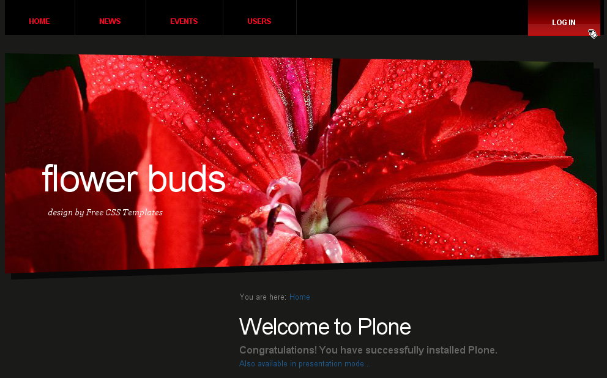

  ``plonetheme.flowerbuds`` add-on theme Demo at Plone front-page.

.. note::

    **Flower Buds** is a layout with a two-column, fixed-width design with 
    dark colour scheme. This theme is a free template from `Free CSS Templates`_ 
    released under a `Creative Commons Attribution 2.5 License`_.

----

plonetheme.leavesdew
^^^^^^^^^^^^^^^^^^^^

The `plonetheme.leavesdew <https://github.com/giacomos/plonetheme.leavesdew>`_ package 
include the following *Technical details*:

- **DOCTYPE HTML:** XHTML 1.0 Strict
- **Stylesheet:** CSS
- **JS support?:** No
- **Web fonts?:** No
- **Grid support?:** No
- **Responsive?:** No
- **CSS framework:** `Free CSS Templates`_.
- **Supported versions:** Plone 4

A demo using the ``plonetheme.leavesdew`` add-on look like the following:

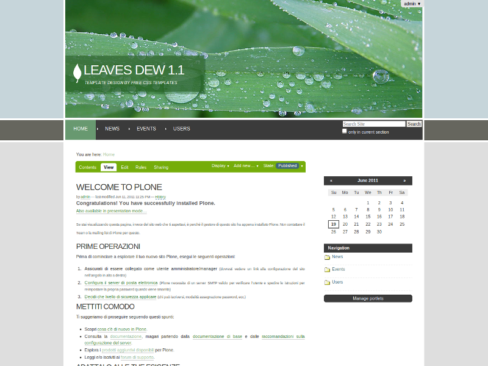

  ``plonetheme.leavesdew`` add-on theme Demo at Plone front-page.

.. note::

    **Leaves Dew** is a layout with a two-column, fixed-width design for 
    *1024x768* pixels of screen resolutions. This theme is a free template from 
    `Free CSS Templates`_ released under a `Creative Commons Attribution 2.5 License`_.

----

plonetheme.pollination
^^^^^^^^^^^^^^^^^^^^^^

The `plonetheme.pollination <http://svn.plone.org/svn/collective/plonetheme.pollination/trunk/>`_ package include the following *Technical details*:

- **DOCTYPE HTML:** XHTML 1.0 Strict
- **Stylesheet:** CSS
- **JS support?:** Yes
- **Web fonts?:** No
- **Grid support?:** No
- **Responsive?:** No
- **CSS framework:** `Free CSS Templates`_.
- **Supported versions:** Plone 4

A demo using the ``plonetheme.pollination`` add-on look like the following:

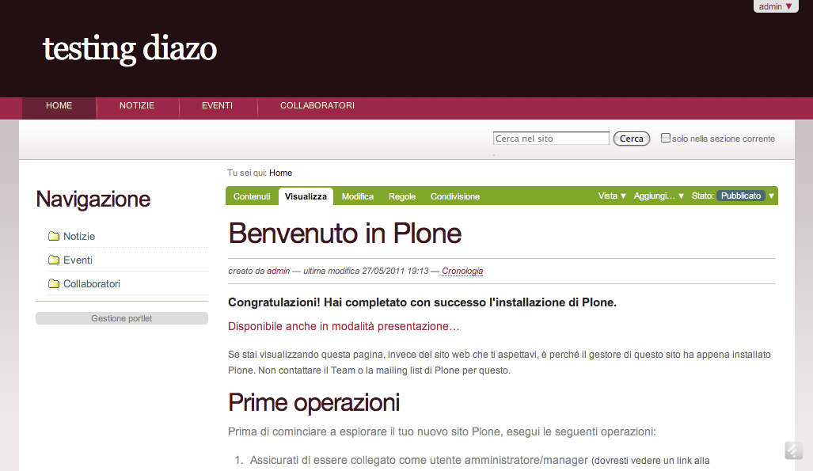

  ``plonetheme.pollination`` add-on theme Demo at Plone front-page.

.. note::

    **Pollination** is a layout with a two-column, fixed-width design with dark 
    color scheme. This theme is a free template from `Free CSS Templates`_ 
    released under a `Creative Commons Attribution 2.5 License`_.

----

plonetheme.transition
^^^^^^^^^^^^^^^^^^^^^

The `plonetheme.transition <https://github.com/gyst/plonetheme.transition>`_ package include 
the following *Technical details*:

- **DOCTYPE HTML:** XHTML 1.0 Strict
- **Stylesheet:** CSS
- **JS support?:** No
- **Web fonts?:** No
- **Grid support?:** No
- **Responsive?:** No
- **CSS framework:** `Free CSS Templates`_.
- **Supported versions:** Plone 4

A demo using the ``plonetheme.transition`` add-on look like the following:

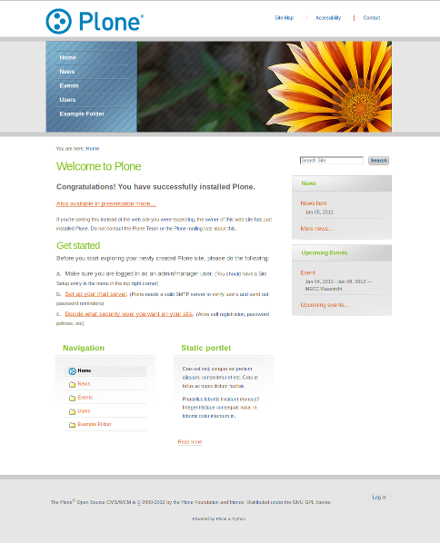

  ``plonetheme.transition`` add-on theme Demo at Plone front-page.

.. note::

    **Transition** is a layout with a two-column, fixed-width template with 
    light colour blend. This theme is a free template from `Free CSS Templates`_ 
    released under a `Creative Commons Attribution 2.5 License`_.

----

plonetheme.unilluminated
^^^^^^^^^^^^^^^^^^^^^^^^

The `plonetheme.unilluminated <https://github.com/collective/plonetheme.unilluminated>`_ package 
include the following *Technical details*:

- **DOCTYPE HTML:** XHTML 1.0 Strict
- **Stylesheet:** CSS
- **JS support?:** No
- **Web fonts?:** No
- **Grid support?:** No
- **Responsive?:** No
- **CSS framework:** `Free CSS Templates`_.
- **Supported versions:** Plone 4

A demo using the ``plonetheme.unilluminated`` add-on look like the following:

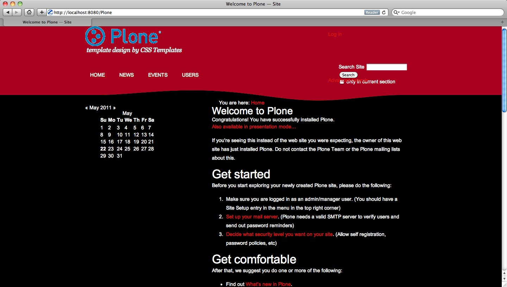

  ``plonetheme.unilluminated`` add-on theme Demo at Plone front-page.

.. note::

    **Unilluminated** is a layout with a two-column, fixed-width design with 
    dark color scheme. This theme is a free template from `Free CSS Templates`_ 
    released under a `Creative Commons Attribution 2.5 License`_.

----

.. _`Free CSS Templates`: http://freecsstemplates.org/
.. _`Creative Commons Attribution 2.5 License`: http://creativecommons.org/licenses/by/2.5/
.. _`Creative Commons Attribution 3.0 License`: http://creativecommons.org/licenses/by/3/
.. _`plone.app.theming`: https://pypi.org/project/plone.app.theming/
