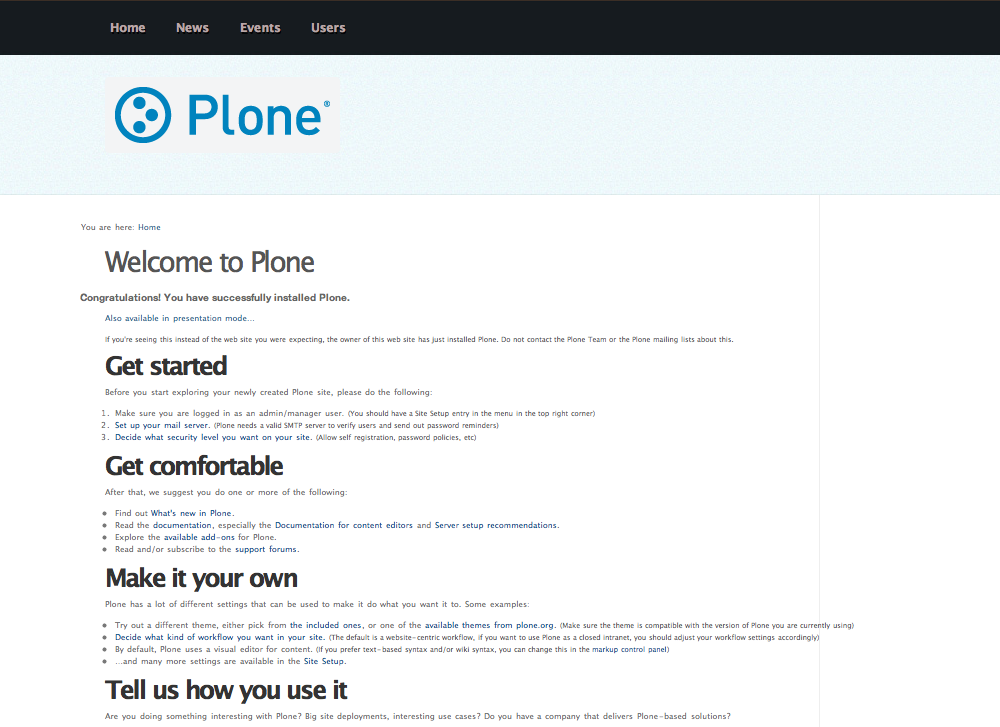
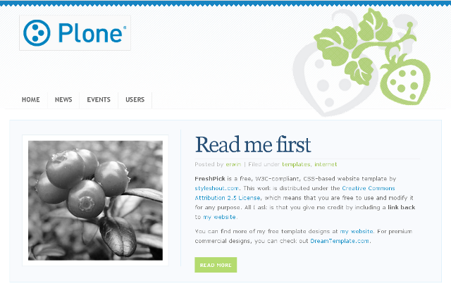
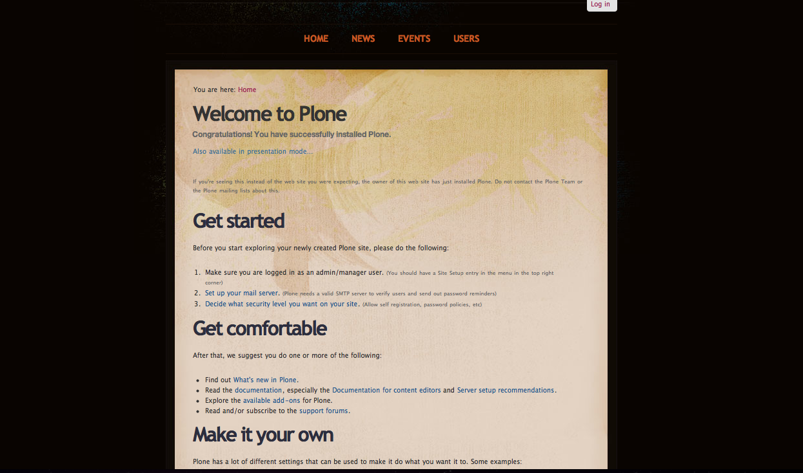
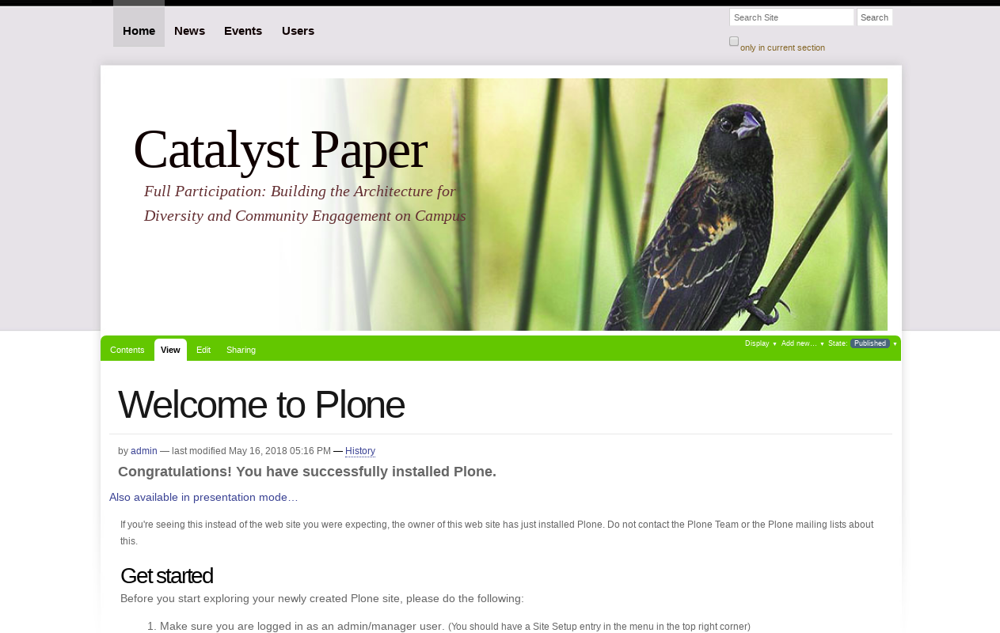

.. _styleshout-css-templates:

Styleshout CSS Templates
------------------------

There are some `Styleshout CSS Templates`_ available in the following list:

plonetheme.coolblue
^^^^^^^^^^^^^^^^^^^

The `plonetheme.coolblue <https://github.com/collective/plonetheme.coolblue>`_ package 
include the following *Technical details*:

- **DOCTYPE HTML:** XHTML 1.0 Strict
- **Stylesheet:** CSS2/CSS3
- **JS support?:** Yes
- **Web fonts?:** No
- **Grid support?:** No
- **Responsive?:** No
- **CSS framework:** `Styleshout CSS Templates`_.
- **Supported versions:** Plone 4

A demo using the ``plonetheme.coolblue`` add-on look like the following:

  ``plonetheme.coolblue`` add-on theme Demo at Plone front-page.

.. note::
  **CoolBlue** is a free, W3C-compliant, CSS-based website template by 
  `styleshout.com <http://www.styleshout.com/>`_. This work is distributed 
  under the `Creative Commons Attribution 2.5 License`_, which means that 
  you are free to use and modify it for any purpose.

----

plonetheme.freshpick
^^^^^^^^^^^^^^^^^^^^

The `plonetheme.freshpick <https://github.com/collective/plonetheme.freshpick>`_ package 
include the following *Technical details*:

- **DOCTYPE HTML:** XHTML 1.0 Strict
- **Stylesheet:** CSS
- **JS support?:** No
- **Web fonts?:** No
- **Grid support?:** No
- **Responsive?:** No
- **CSS framework:** `Styleshout CSS Templates`_.
- **Supported versions:** Plone 4

A demo using the ``plonetheme.freshpick`` add-on look like the following:

  ``plonetheme.freshpick`` add-on theme Demo at Plone front-page.

.. note::
  **FreshPick** is a free, W3C-compliant, CSS-based website template by 
  `styleshout.com <http://www.styleshout.com/>`_. This work is distributed 
  under the `Creative Commons Attribution 2.5 License`_, which means that 
  you are free to use and modify it for any purpose.

----

plonetheme.grungeera
^^^^^^^^^^^^^^^^^^^^

The `plonetheme.grungeera <https://github.com/collective/plonetheme.grungeera>`_ package 
include the following *Technical details*:

- **DOCTYPE HTML:** XHTML 1.0 Strict
- **Stylesheet:** CSS
- **JS support?:** No
- **Web fonts?:** No
- **Grid support?:** No
- **Responsive?:** No
- **CSS framework:** `Styleshout CSS Templates`_.
- **Supported versions:** Plone 4

A demo using the ``plonetheme.grungeera`` add-on look like the following:

  ``plonetheme.grungeera`` add-on theme Demo at Plone front-page.

.. note::
  **GrungeEra** is a free, W3C-compliant, CSS-based website template by 
  `styleshout.com <http://www.styleshout.com/>`_. This work is distributed 
  under the `Creative Commons Attribution 2.5 License`_, which means that 
  you are free to use and modify it for any purpose.

..
  ----

  plonetheme.keepitsimple
  ^^^^^^^^^^^^^^^^^^^^^^^

  The `plonetheme.keepitsimple <https://github.com/collective/plonetheme.keepitsimple>`_ package include the following *Technical details*:

  .. todo::
      TODO a screenshot for this section

----

plonetheme.unbound11
^^^^^^^^^^^^^^^^^^^^

The `plonetheme.unbound11 <https://github.com/a-pasquale/plonetheme.unbound11>`_ package include 
the following *Technical details*:

- **DOCTYPE HTML:** XHTML 1.0 Strict
- **Stylesheet:** CSS
- **JS support?:** No
- **Web fonts?:** No
- **Grid support?:** No
- **Responsive?:** No
- **CSS framework:** `Styleshout CSS Templates`_.
- **Supported versions:** Plone 4

A demo using the ``plonetheme.unbound11`` add-on look like the following:

  ``plonetheme.unbound11`` add-on theme Demo at Plone front-page.

.. note::
  **Unbound** is a free, W3C-compliant, CSS-based website template by 
  `styleshout.com <http://www.styleshout.com/>`_. This work is distributed 
  under the `Creative Commons Attribution 2.5 License`_, which means that 
  you are free to use and modify it for any purpose.

----

.. _`Styleshout CSS Templates`: http://www.styleshout.com/
.. _`Creative Commons Attribution 2.5 License`: http://creativecommons.org/licenses/by/2.5/
