.. _mobile-tools:

Mobile tools
============

The **"Plone theming suite"** includes the following mobile tools supported:

.. _zettwerk-mobiletheming:

zettwerk.mobiletheming
----------------------

The `zettwerk.mobiletheming <https://github.com/collective/zettwerk.mobiletheming>`_ 
package, switching mobile themes based on urls using the `MobileESP`_ library to Plone 4.3.x.

The ``zettwerk.mobiletheming`` package includes:

- A Mobile theming control panel
- The GenericSetup import/export profiles
- Also provides some mobile themes packages
- Provides the ``me.redirect.min.js`` resource based on *MobileESP* library.

With ``zettwerk.mobiletheming`` add-on you can choose to apply mobile themes for various 
mobile devices based on URLs in Plone.

You can enabled a mobile theming for ``zettwerk.mobiletheming`` package follow the steps:

- at the top right corner of the page click on the :guilabel:`Admin` drop down menu 
- choose :guilabel:`Site Setup`
- at the :guilabel:`Add-on Configuration` 
- click on :guilabel:`Mobile theming` section
- at the :guilabel:`View` tab can add a new URL ont the :guilabel:`Hostnames` row with 
  the ``URL`` value

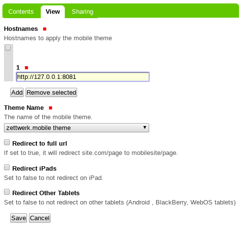

  The ``Mobile theming`` Controlpanel.

The ``Default`` theme from :ref:`zettwerk.mobile <zettwerk-mobile>` package applied look 
like the following theme:

.. figure:: ../_static/zettwerk_mobile.png
  :align: center
  :width: 75%
  :alt: A zettwerk.mobile theme applied.

.. warning:: 
    You need install and enabled the :ref:`zettwerk.mobile <zettwerk-mobile>` package for 
    see the previous theme applied.

----

.. _medialog-mobilethemeone:

medialog.mobilethemeOne
^^^^^^^^^^^^^^^^^^^^^^^

The `medialog.mobilethemeOne <https://github.com/plone-ve/medialog.mobilethemeOne>`_ 
package is a mobile theme for :ref:`zettwerk.mobiletheming <zettwerk-mobiletheming>`, 
that include the following *Technical details*:

- **DOCTYPE HTML:** HTML5
- **Stylesheet:** CSS
- **JS support?:** :ref:`jQuery <jquery-library>`
- **Web fonts?:** Source Sans Pro :ref:`Google Fonts <google-fonts>`
- **Grid support?:** Yes
- **Responsive?:** Yes
- **CSS framework:** None
- **Supported versions:** Plone 4

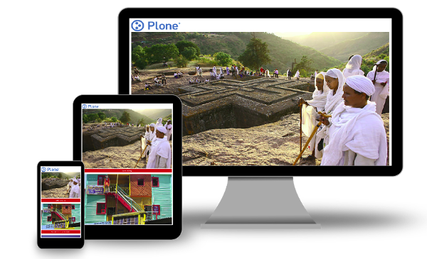

  ``medialog.mobilethemeOne`` Mobile Theme.

A demo using the ``medialog.mobilethemeOne`` add-on as a reduced view for Mobile device 
look like the following:

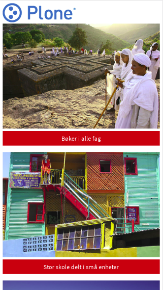

  ``medialog.mobilethemeOne`` theme Demo at Mobile device.

A demo using the ``medialog.mobilethemeOne`` add-on as a reduced view for Tablet device 
look like the following:

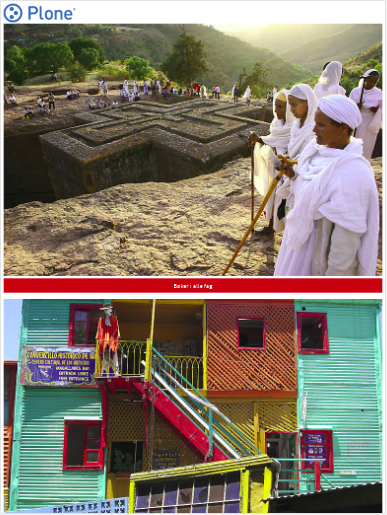

  ``medialog.mobilethemeOne`` theme Demo at Tablet device.

A demo using the ``medialog.mobilethemeOne`` add-on as a reduced view for Laptop device 
look like the following:

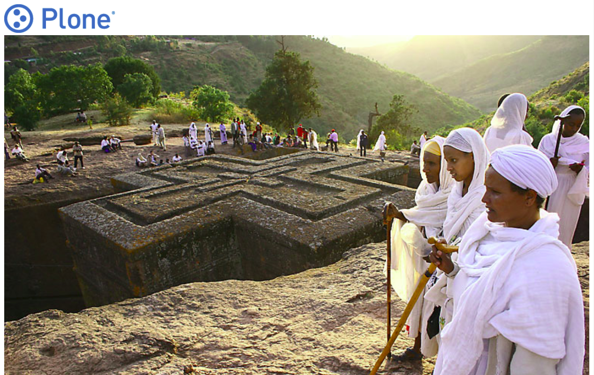

  ``medialog.mobilethemeOne`` theme Demo Laptop device.

----

.. _medialog-mobilethemetwo:

medialog.mobilethemeTwo
^^^^^^^^^^^^^^^^^^^^^^^

The `medialog.mobilethemeTwo <https://github.com/plone-ve/medialog.mobilethemeTwo>`_ 
package is a mobile theme for :ref:`zettwerk.mobiletheming <zettwerk-mobiletheming>`, 
that include the following *Technical details*:

- **DOCTYPE HTML:** HTML5
- **Stylesheet:** CSS
- **JS support?:** :ref:`jQuery <jquery-library>`
- **Web fonts?:** Source Sans Pro :ref:`Google Fonts <google-fonts>`
- **Grid support?:** Yes
- **Responsive?:** Yes
- **CSS framework:** None
- **Supported versions:** Plone 4

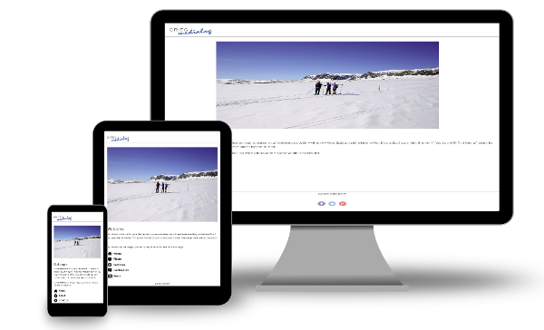

  ``medialog.mobilethemeTwo`` Mobile Theme.

A demo using the ``medialog.mobilethemeTwo`` add-on as a reduced view for Mobile device 
look like the following:

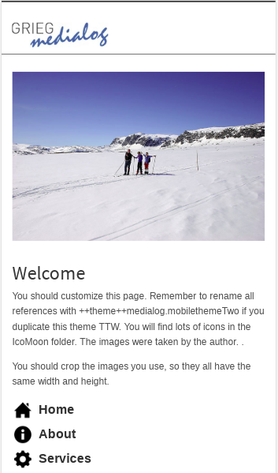

  ``medialog.mobilethemeTwo`` theme Demo at Mobile device.

A demo using the ``medialog.mobilethemeTwo`` add-on as a reduced view for Tablet device 
look like the following:

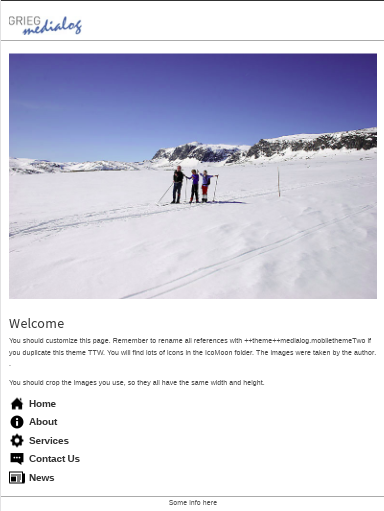

  ``medialog.mobilethemeTwo`` theme Demo at Tablet device.

A demo using the ``medialog.mobilethemeTwo`` add-on as a reduced view for Laptop device 
look like the following:

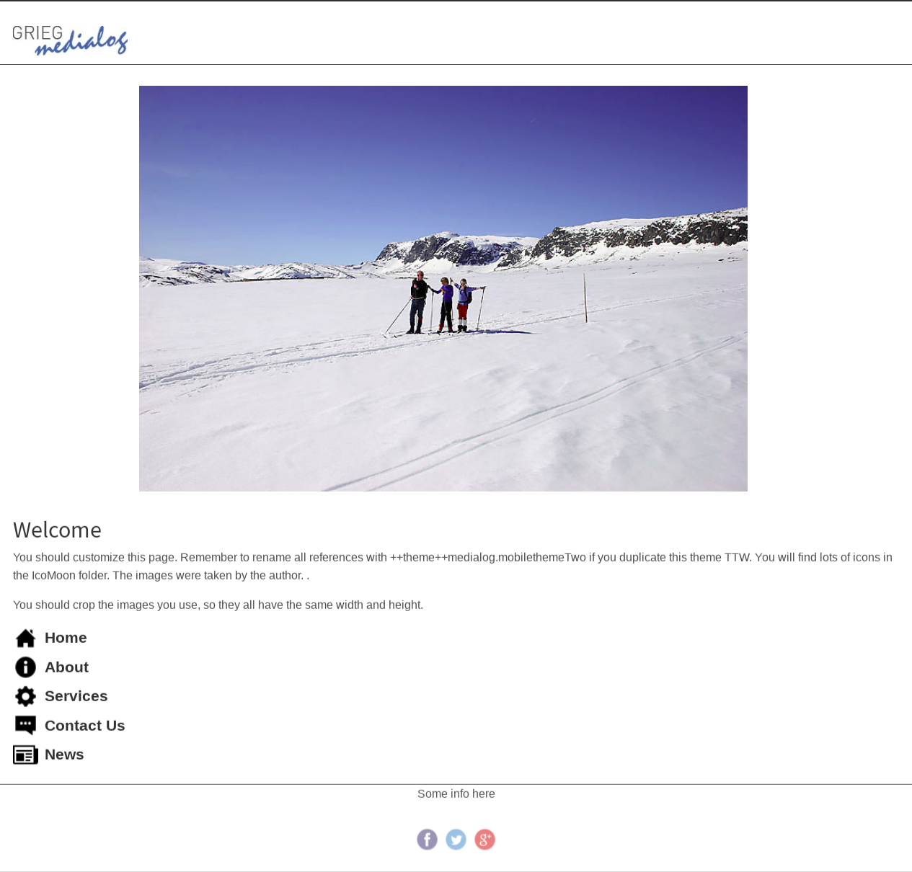

  ``medialog.mobilethemeTwo`` theme Demo Laptop device.

----

.. _medialog-mobilethemethree:

medialog.mobilethemeThree
^^^^^^^^^^^^^^^^^^^^^^^^^

The `medialog.mobilethemeThree <https://github.com/plone-ve/medialog.mobilethemeThree>`_ 
package is a mobile theme for :ref:`zettwerk.mobiletheming <zettwerk-mobiletheming>`, 
that include the following *Technical details*:

- **DOCTYPE HTML:** HTML5
- **Stylesheet:** CSS
- **JS support?:** :ref:`jQuery <jquery-library>`
- **Web fonts?:** Source Sans Pro :ref:`Google Fonts <google-fonts>`
- **Grid support?:** Yes
- **Responsive?:** Yes
- **CSS framework:** None
- **Supported versions:** Plone 4

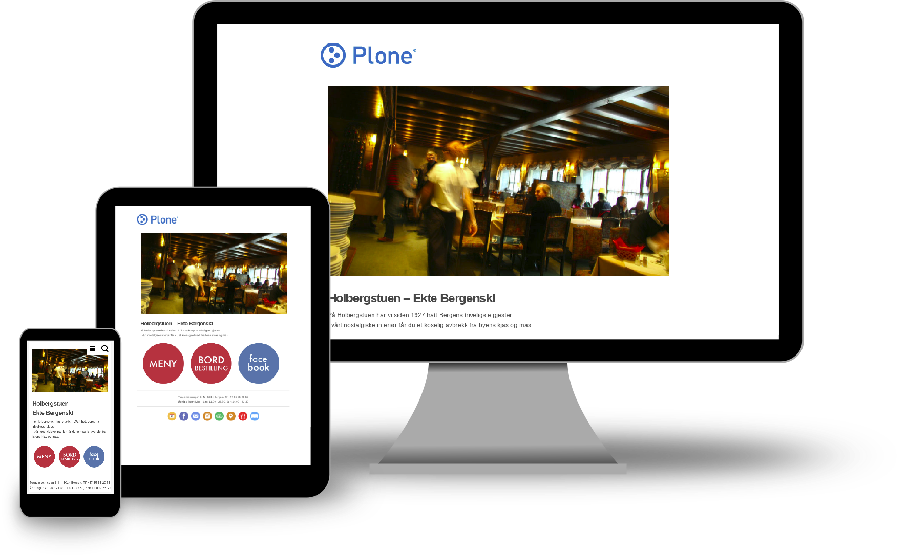

  ``medialog.mobilethemeThree`` Mobile Theme.

A demo using the ``medialog.mobilethemeThree`` add-on as a reduced view for Mobile device 
look like the following:

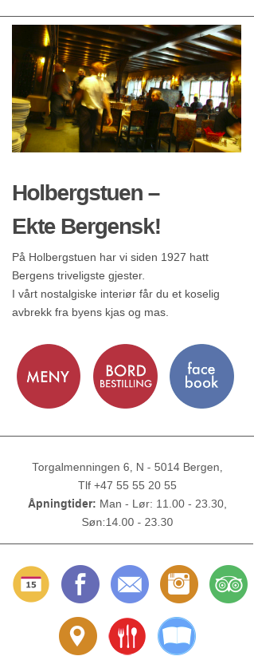

  ``medialog.mobilethemeThree`` theme Demo at Mobile device.

A demo using the ``medialog.mobilethemeThree`` add-on as a reduced view for Tablet device 
look like the following:

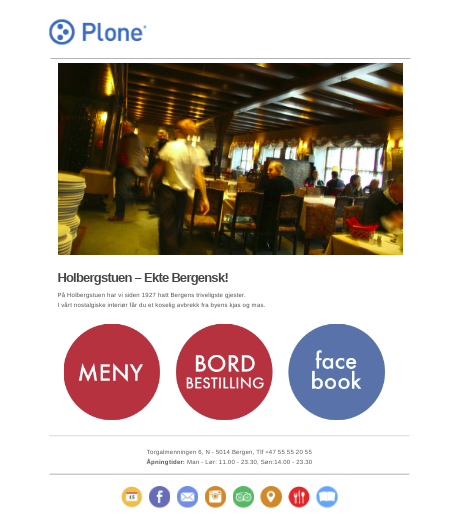

  ``medialog.mobilethemeThree`` theme Demo at Tablet device.

A demo using the ``medialog.mobilethemeThree`` add-on as a reduced view for Laptop device 
look like the following:

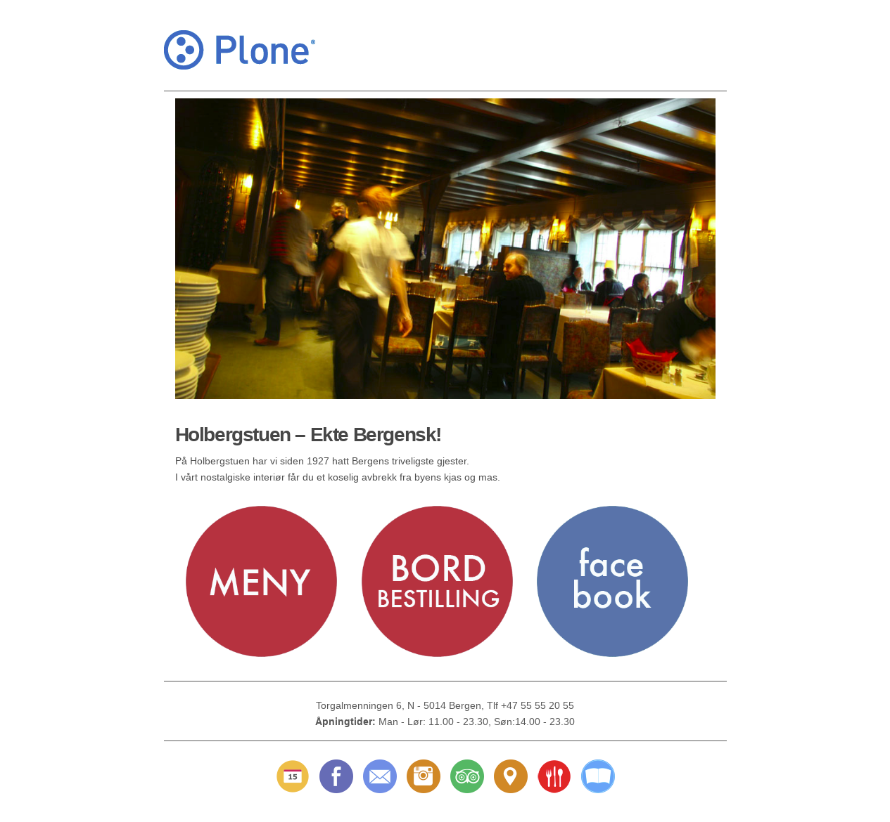

  ``medialog.mobilethemeThree`` theme Demo Laptop device.

----

..
    - `uwosh.mobile.tools <http://www.uwosh.edu/ploneprojects/software/uwosh.mobile.tools/>`_, 
      adds mobile tools, detection and libraries to Plone 4.3.x

    ----

.. _`MobileESP`: https://github.com/ahand/mobileesp