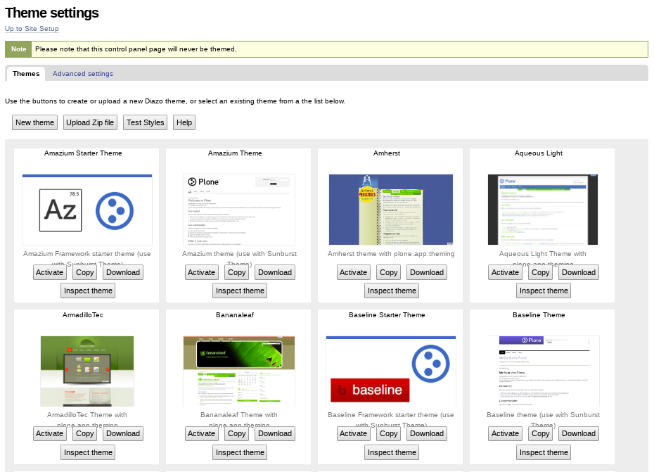
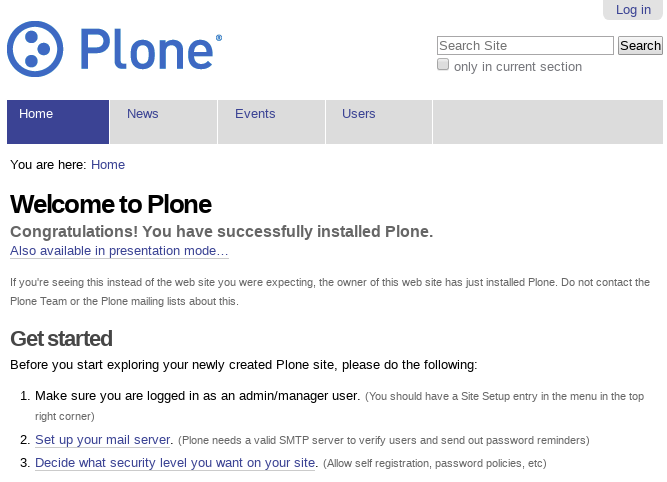

.. _using-theme-editor:


Plone theme editor
------------------


Enabling theme editor
^^^^^^^^^^^^^^^^^^^^^

The *theme editor* aka `plone.app.theming`_ is disable by default then you need enable 
for use and edit Diazo themes on-the-fly in Plone.

To enable the theme editor:

- at the top right corner of the page click on the :guilabel:`Admin` drop down menu 
- choose :guilabel:`Site Setup`
- click on :guilabel:`Add-ons`
- in the :guilabel:`Available add-ons` list at the top of the page, check the box next to the :guilabel:`Diazo theme support` for enable it
- scroll down and press the :guilabel:`Activate` button



  The "Theme settings" control panel.

This Add-on installs a control panel to allow on-the-fly theming with Diazo.

----

Using theme editor
^^^^^^^^^^^^^^^^^^

When you have ready installed the suite with a Plone site created and the 
theme editor add-on enabled, then you can do some operations like:


Enabling Themes
````````````````

A new Plone 4.3.x site uses the Sunburst theme by default.



Default Plone theme *plonetheme.sunburst*.

To enable the installed themes:

- at the top right corner of the page click on the :guilabel:`Admin` drop down menu 
- choose :guilabel:`Site Setup`
- click on :guilabel:`Add-ons`
- in the :guilabel:`Available add-ons` list at the top of the page, check the box next to the theme you want to enable
- scroll down and press the :guilabel:`Activate` button

Some Diazo themes may hide the editing or management pages of your site. In those cases, you will want to browse to your site using the URL http://127.0.0.1:8081/Plone. You may have to log in again using the same user name and password as above (this is because the Plone authentication cookie is dependent on the site URL, and it treats "localhost" and "127.0.0.1" as different sites).

Once you have enabled a Diazo theme, you can use the Diazo theming control panel to activate other Diazo themes:

- navigate to :guilabel:`Site Setup`
- click on the :guilabel:`Theming` control panel (alternatively, you can navigate to http://127.0.0.1:8081/Plone/@@theming-controlpanel or to http://localhost:8081/Plone/@@theming-controlpanel; the :guilabel:`Theming` control panel will always be unthemed)
- click the :guilabel:`Activate` button for the theme you want to enable


Disabling Themes
````````````````

You can disable a Diazo theme without having to deactivate it using the :guilabel:`Add-ons` panel:

To disable a Diazo theme:

- navigate to :guilabel:`Site Setup`
- click on the :guilabel:`Theming` control panel (alternatively, you can navigate to http://127.0.0.1:8081/Plone/@@theming-controlpanel or to http://localhost:8081/Plone/@@theming-controlpanel; the :guilabel:`Theming` control panel will always be unthemed)
- locate the Diazo theme which has a :guilabel:`Deactivate` button (you can use your browser's Find function, e.g. Control-F or Command-F, to search for :guilabel:`Deactivate`)
- click on the :guilabel:`Deactivate` button

"Classic", or non-Diazo, Plone themes must be disabled using the :guilabel:`Add-ons` control panel:

- navigate to :guilabel:`Site Setup`
- click on the :guilabel:`Add-ons` control panel (alternatively, you can navigate to http://127.0.0.1:8081/Plone/prefs_install_products_form or http://localhost:8081/Plone/prefs_install_products_form)
- in the :guilabel:`Activated add-ons` list at the bottom of the page, check the box next to the theme you want to disable
- scroll down and press the :guilabel:`Deactivate` button

.. _`plone.app.theming`: https://pypi.org/project/plone.app.theming/1.1.8/