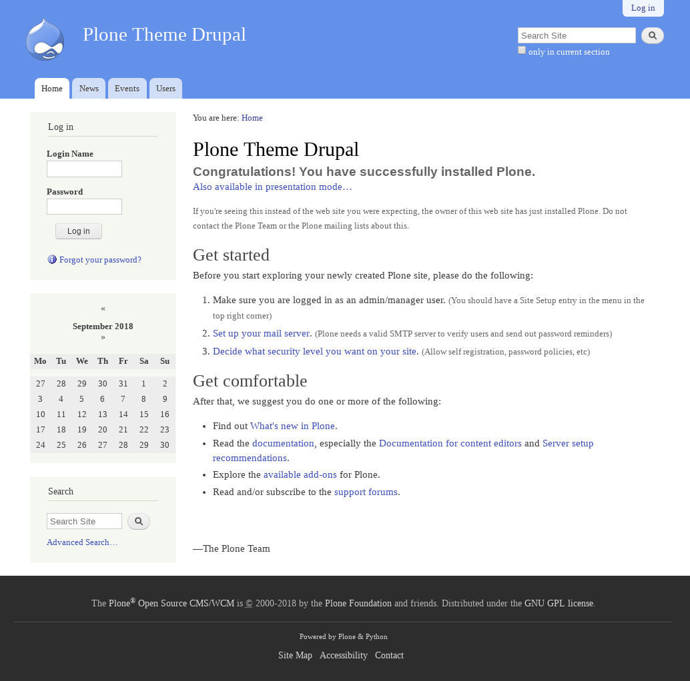
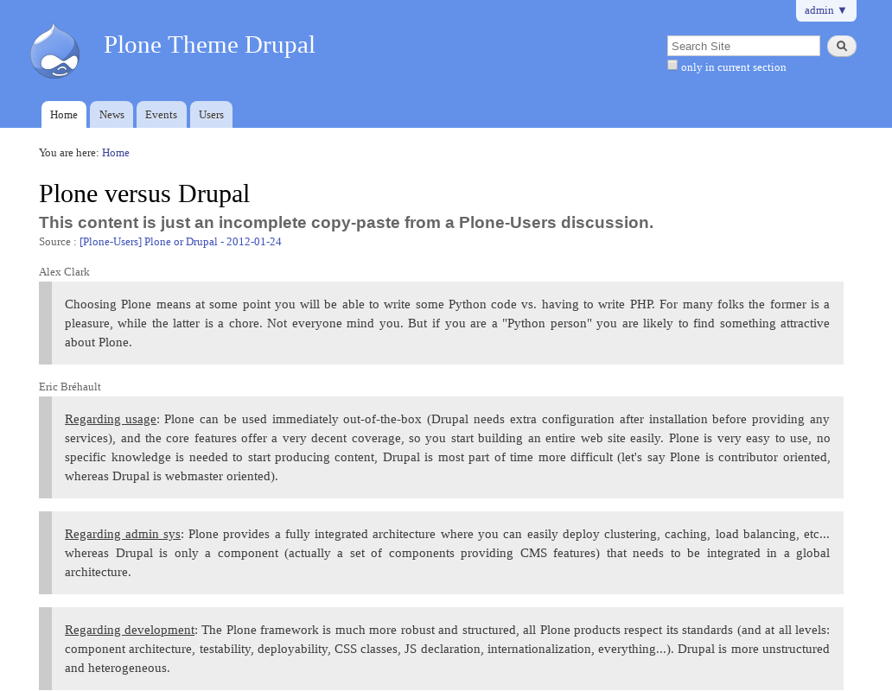

.. _drupal-themes:

Drupal Themes
-------------

There are *Drupal Themes* available:

plonetheme.drupal
^^^^^^^^^^^^^^^^^

The `plonetheme.drupal <https://github.com/sylvainb/plonetheme.drupal>`_ package was strongly 
inspired by the Drupal theme `Bartik`_ (default theme in Drupal 7), the goals is help sell 
Plone to PHP guys. This theme include the following *Technical details*:

- **DOCTYPE HTML:** HTML5
- **Stylesheet:** CSS
- **JS support?:** No
- **Web fonts?:** No
- **Grid support?:** Yes
- **Responsive?:** No
- **CSS framework:** None
- **Supported versions:** Plone 4

A demo using the ``plonetheme.drupal`` add-on look like the following:

  Plone Theme Drupal at Plone front-page.

Do you want to learn more about Plone versus Drupal? Install this theme and visit the 
URL: http://yoursite.com/@@plone-versus-drupal and looks like the following:

  Plone vs Drupal, an incomplete copy-paste from a Plone-Users discussion.

.. _`Bartik`: https://drupal.org/documentation/themes/bartik
