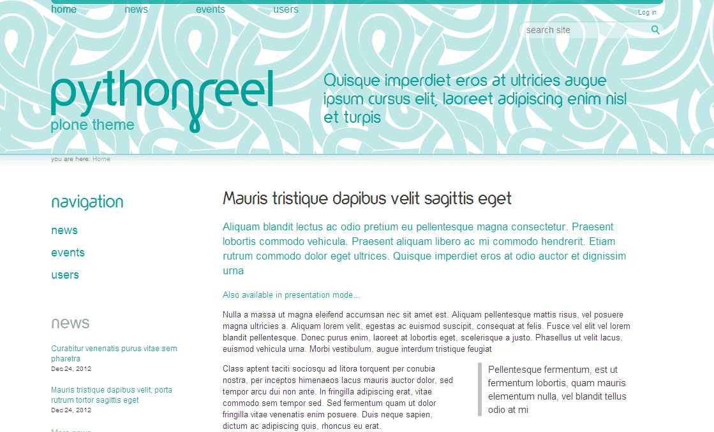
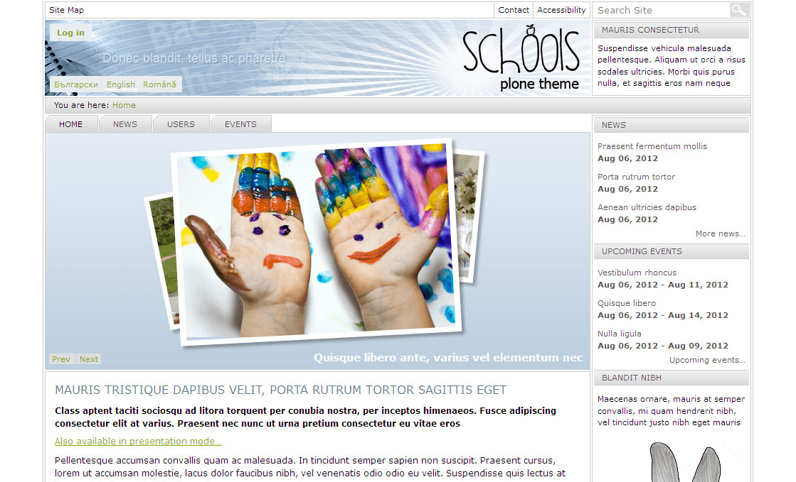
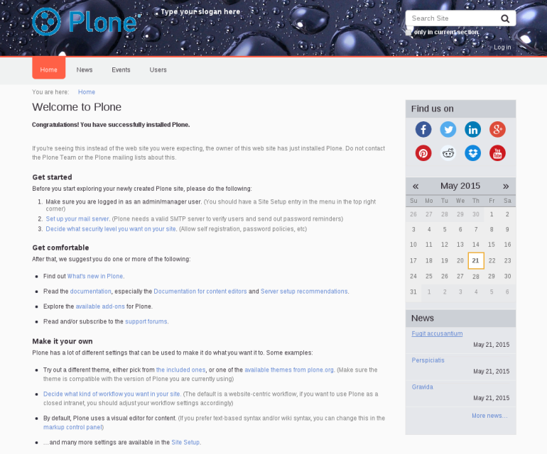

.. _quintagroup-theme-skins:

Quintagroup Themes
------------------

The `Quintagroup Themes`_ are design by `Quintagroup`_.

.. _quintagroup-theme-pythonreel:

quintagroup.theme.pythonreel
^^^^^^^^^^^^^^^^^^^^^^^^^^^^

The `quintagroup.theme.pythonreel <https://github.com/quintagroup/quintagroup.theme.pythonreel>`_ package 
include the following *Technical details*:

- **DOCTYPE HTML:** HTML5
- **Stylesheet:** CSS/:ref:`SASS/SCSS <sass>`
- **JS support?:** :ref:`jQuery <jquery-library>`
- **Web fonts?:** :ref:`Font Awesome <font-awesome>` 4.2.0, Yorkville
- **Grid support?:** Yes
- **Responsive?:** Yes
- **CSS framework:** None
- **Supported versions:** Plone 4

A demo using the ``quintagroup.theme.pythonreel`` add-on look like the following:

  Quintagroup Theme Pythonreel Demo at Plone front-page.

----

quintagroup.theme.schools
^^^^^^^^^^^^^^^^^^^^^^^^^

The `quintagroup.theme.schools <https://github.com/quintagroup/quintagroup.theme.schools>`_ package 
include the following *Technical details*:

- **DOCTYPE HTML:** XHTML 1.0 Transitional
- **Stylesheet:** CSS
- **JS support?:** No
- **Web fonts?:** No
- **Grid support?:** Yes
- **Responsive?:** No
- **CSS framework:** None
- **Supported versions:** Plone 4

A demo using the ``quintagroup.theme.schools`` add-on look like the following:

  Quintagroup Theme Schools Demo at Plone front-page.

----

.. _quintagroup-theme-sunrain:

quintagroup.theme.sunrain
^^^^^^^^^^^^^^^^^^^^^^^^^

The `quintagroup.theme.sunrain <https://github.com/quintagroup/quintagroup.theme.sunrain>`_ package 
include the following *Technical details*:

- **DOCTYPE HTML:** HTML5
- **Stylesheet:** CSS/:ref:`LESS <less>`
- **JS support?:** :ref:`jQuery <jquery-library>`
- **Web fonts?:** :ref:`Font Awesome <font-awesome>` 4.4.0, Roboto :ref:`Google Fonts <google-fonts>`
- **Grid support?:** Yes
- **Responsive?:** No
- **CSS framework:** None
- **Supported versions:** Plone 4

A demo using the ``quintagroup.theme.sunrain`` add-on look like the following:

  Quintagroup Theme Sunrain Demo at Plone front-page.

.. _`Quintagroup Themes`: https://themes.quintagroup.com/
.. _`Quintagroup Skins Themes`: http://skins.quintagroup.com/
.. _`Quintagroup`: https://quintagroup.com/
