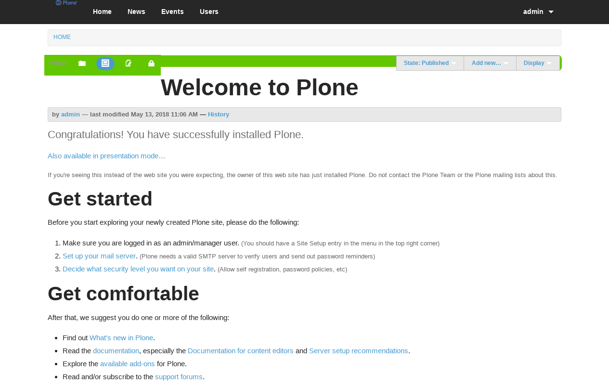
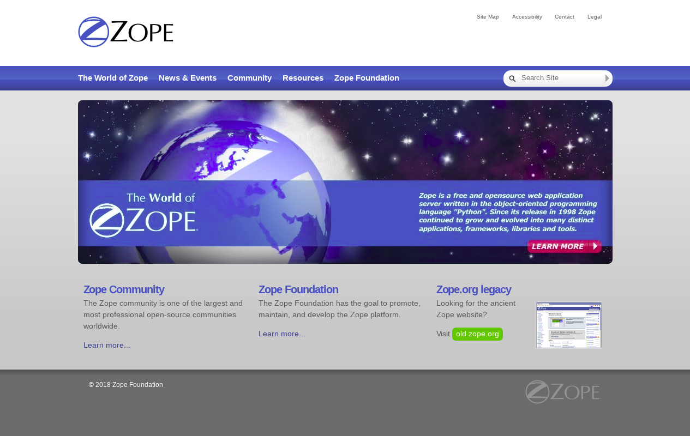

.. _skins-custom-theme:

Skins Custom Themes
-------------------

There are others Custom Themes available:

plonetheme.aclark_twitter
^^^^^^^^^^^^^^^^^^^^^^^^^

The `plonetheme.aclark_twitter <https://github.com/collective/plonetheme.aclark_twitter>`_ package include the following *Technical details*:

A demo using the ``plonetheme.aclark_twitter`` add-on look like the following:

  Plone Theme Aclark Twitter Demo at Plone front-page.

----

plonetheme.trantor
^^^^^^^^^^^^^^^^^^

The `plonetheme.trantor <https://github.com/tristanlt/plonetheme.trantor>`_ package include the following *Technical details*:

A demo using the ``plonetheme.trantor`` add-on look like the following:

  "Trantor Theme" using :ref:`Foundation <foundation-css-framework>` Framework theme based on 960 css.

----

plonetheme.zopeorg
^^^^^^^^^^^^^^^^^^

The `plonetheme.zopeorg <https://github.com/d2m/plonetheme.zopeorg>`_ package include the following *Technical details*:

A demo using the ``plonetheme.zopeorg`` add-on look like the following:

  "plonetheme.zopeorg" add-on theme Demo at Plone front-page.
